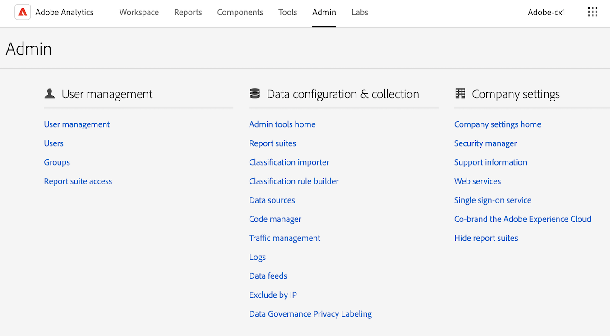

# Explicación de la interfaz de Analytics

La interfaz de Adobe Analytics consta de las siguientes áreas principales, que incluyen pestañas para gestionar proyectos en Analysis Workspace, componentes de administración, herramientas y funciones de administrador.

Las secciones siguientes describen cada área de Analysis Workspace:

## Pestaña Espacio de trabajo

La pestaña [!UICONTROL Espacio de trabajo] muestra de forma predeterminada el área [!UICONTROL Proyectos], que presenta la carpeta Compañía, cualquier carpeta personal que haya creado, sus proyectos y los cuadros de resultados móviles.

1. En Adobe Analytics, seleccione la pestaña [!UICONTROL **Espacio de trabajo**].

   

Para obtener más información acerca de las características y funciones disponibles en la pestaña [!UICONTROL Espacio de trabajo], consulte la [Página de aterrizaje de Adobe Analytics](/help/analyze/landing.md).

## Pestaña de informes

Utilice el [!UICONTROL **Informes**] área en el carril izquierdo de la [!UICONTROL **Workspace**] pestaña. Para obtener más información, consulte *Navegar por la pestaña Informes* en la [Página de aterrizaje de Adobe Analytics](/help/analyze/landing.md).

## Pestaña Componentes

La pestaña [!UICONTROL Componentes] incluye características que le ayudan a afinar y potenciar su análisis de datos.

1. En Adobe Analytics, seleccione la pestaña [!UICONTROL **Componentes**] y, a continuación, seleccione [!UICONTROL **Todos los componentes**].

   

2. Seleccione cualquiera de las siguientes características de producto para proceder a su configuración:

   | Funcionalidad del producto | Función | Más información |
   |---------|----------|----------|
   | Segmentos  | Adobe Analytics le permite generar, administrar, compartir y aplicar a sus informes potentes segmentos centrados en la audiencia utilizando capacidades de Analytics, Adobe Experience Cloud, Adobe Target y otros productos integrados de Adobe. | [Segmentación de Analytics](https://experienceleague.adobe.com/docs/analytics/components/segmentation/seg-home.html?lang=es) |
   | Métricas calculadas  | Las métricas calculadas y calculadas avanzadas (o derivadas) son métricas personalizadas que se pueden crear a partir de métricas existentes. Permiten a especialistas en marketing, gestores de productos y analistas hacer preguntas sobre los datos sin tener que cambiar la implementación de Analytics. | [Métricas calculadas y calculadas avanzadas (derivadas)](https://experienceleague.adobe.com/docs/analytics/components/calculated-metrics/cm-overview.html?lang=es) |
   | Intervalos de fechas | Analysis Workspace incluye una lista de intervalos de fechas predeterminados que se pueden utilizar al crear análisis. Además, puede crear intervalos de fechas personalizados y difundirlos en Analysis Workspace. | [Crear intervalos de fechas](https://experienceleague.adobe.com/docs/analytics/analyze/analysis-workspace/components/calendar-date-ranges/custom-date-ranges.html?lang=es) <!-- should create an article in the Components Guide for managing/creating date ranges. This article in the Tools Guide needs updating. --> |
   | Grupos de informes virtuales | Los grupos de informes virtuales segmentan los datos de Adobe Analytics de modo que pueda controlar el acceso a cada segmento. | [Resumen de los grupos de informes virtuales](https://experienceleague.adobe.com/docs/analytics/components/virtual-report-suites/vrs-about.html?lang=es) |
   | Alertas | Las alertas inteligentes permiten un control más granular sobre las alertas e integran la detección de anomalías en el sistema de alertas. | [Alertas inteligentes](https://experienceleague.adobe.com/docs/analytics/components/alerts/intellligent-alerts.html?lang=es) |
   | Anotaciones | Las anotaciones en Workspace le permiten comunicar de forma eficaz los matices y perspectivas de datos contextuales a su organización. Permiten enlazar los eventos de calendario con dimensiones y métricas específicas. | [Administración de anotaciones](https://experienceleague.adobe.com/docs/analytics/analyze/analysis-workspace/components/annotations/manage-annotations.html?lang=es) |
   | Conjuntos de clasificación | Los conjuntos de clasificación proporcionan una interfaz única para administrar las clasificaciones y las reglas. 
Las clasificaciones permiten aplicar categorías a los datos de variables de Analytics para mostrarlos de distintos modos cuando se generan los informes. Establece una relación entre un valor variable y los metadatos relacionados con ese valor. Las clasificaciones se pueden utilizar en la mayoría de las dimensiones personalizadas, como código de seguimiento, props y eVars.
 | [Información general sobre los conjuntos de clasificación](https://experienceleague.adobe.com/docs/analytics/components/classifications/sets/overview.html?lang=es) |
   | Ubicaciones | Para importar datos de clasificación de Adobe Analytics desde un destino en la nube, primero debe añadir y configurar la ubicación en la que desea que se recopilen los datos de clasificación. Puede crear, editar o eliminar ubicaciones. | [Administrador de ubicaciones](https://experienceleague.adobe.com/docs/analytics/components/locations/locations-manager.html?lang=es) |
   | Proyectos programados | Al administrar proyectos programados, puede editar y eliminar programaciones de proyectos recurrentes; buscar una programación en la barra de búsqueda o utilizando las opciones de filtro del carril izquierdo; y filtrar por etiqueta, programaciones aprobadas, propietarios y más. | [Proyectos programados](/help/components/scheduled-projects-manager.md) |
   | Paneles | Los paneles se crean para visualizar métricas y proporcionar funciones analíticas interactivas con los datos. Al hacer clic en los elementos de un panel, puede segmentar los datos de forma rápida y sencilla para derivar información de su análisis. 
Los paneles forman parte de Data Workbench. Lea más sobre el [Anuncio de fin de vida útil](https://experienceleague.adobe.com/docs/data-workbench/using/eol.html?lang=es) de Data Workbench. | [Administrador de paneles](https://experienceleague.adobe.com/docs/analytics/analyze/reports-analytics/dashboard-manage.html?lang=es) |
   | Informes programados | Con el nivel de administrador se puede ver y gestionar los informes programados de toda la organización. | [Cola de informes programados](https://experienceleague.adobe.com/docs/analytics/components/scheduled-reports-admin.html?lang=es) |
   | Configuración de informe | Esta configuración hace referencia a los productos Adobe Analytics heredados, que no incluyen Analysis Workspace y sus componentes relacionados. Para realizar ajustes en la configuración de Analysis Workspace, vaya a Componentes > Preferencias. |  |
   | Preferencias | Administre la configuración de Analysis Workspace y sus componentes relacionados para todos los proyectos o paneles nuevos que cree. Los proyectos y paneles existentes no se ven afectados. | [Preferencias](/help/analyze/analysis-workspace/user-preferences.md) |

   {style="table-layout:auto"}

## Pestaña Herramientas

<!-- The Tools tab ... -->

1. En Adobe Analytics, seleccione la pestaña [!UICONTROL **Herramientas**] y, a continuación, seleccione [!UICONTROL **Todas las herramientas**].

   

2. Seleccione cualquiera de las siguientes características de producto para proceder a su configuración:

   | Funcionalidad del producto | Función | Más información |
   |---------|----------|----------|
   | Data Warehouse | El Data Warehouse hace referencia a la copia de datos de Analytics para almacenarlos y elaborar informes personalizados, que se pueden ejecutar filtrando los datos. 
El administrador de solicitudes permite ver, duplicar y volver a priorizar solicitudes.
 | [Administrar solicitudes del Data Warehouse](https://experienceleague.adobe.com/docs/analytics/export/data-warehouse/data-warehouse-requests-manage.html?lang=es) |
   | Activity Map | Activity Map se ha diseñado para clasificar la actividad de los vínculos mediante superposiciones visuales y proporcionar un panel de análisis en tiempo real para monitorizar la participación de la audiencia en las páginas web. Permite configurar distintas vistas para identificar visualmente la aceleración de la actividad del cliente, cuantificar las iniciativas de marketing y actuar en función de las necesidades y comportamientos del público. | [Información general de Activity Map](https://experienceleague.adobe.com/docs/analytics/analyze/activity-map/activity-map.html?lang=es) |
   | Recommendations Classic | Recommendations es una característica de Adobe Target que muestra automáticamente productos, servicios o contenidos que podrían interesar a sus visitantes basándose en su actividad previa, sus preferencias u otros criterios. | [Recomendaciones](https://experienceleague.adobe.com/docs/target/using/recommendations/recommendations.html?lang=es) |
   | Search&amp;Promote | Esta funcionalidad ya no es compatible. |  |
   | Mobile Services | Esta funcionalidad ya no es compatible. |  |
   | Paneles de Analytics (aplicación móvil) | La aplicación de paneles de Adobe Analytics ofrece información de Adobe Analytics en cualquier momento y lugar. En la aplicación, se pueden ver Cuadros de resultados intuitivos creados con la IU de escritorio de Adobe Analytics. | La aplicación de paneles de Adobe Analytics en la tienda de aplicaciones iOS o en la tienda Google Play |
   | Report Builder | El Report Builder de Adobe es un complemento para Microsoft Excel. Le permite generar solicitudes personalizadas a partir de datos de Adobe Analytics, que se pueden insertar en sus hojas de cálculo de Excel. Las solicitudes pueden hacer referencia de forma dinámica a las celdas de las hojas de cálculo y es posible actualizar y personalizar el modo en el que Report Builder presenta los datos. | [¿Qué es Report Builder?](https://experienceleague.adobe.com/docs/analytics/analyze/report-builder/home.html?lang=es) |

   {style="table-layout:auto"}

## Pestaña Administración

La pestaña Administración incluye funciones y opciones de configuración para administrar Adobe Analytics.

1. En Adobe Analytics, seleccione la pestaña [!UICONTROL **Administración**] y, a continuación, seleccione [!UICONTROL **Todos los administradores**].

   

2. Seleccione cualquiera de las siguientes características de producto para proceder a su configuración:

   | Funcionalidad del producto | Función | Más información |
   |---------|----------|----------|
   | Usuarios y recursos de Analytics | Aunque la mayoría de las funciones de administración de usuarios y productos ahora solo están disponibles en [Adobe Admin Console](https://helpx.adobe.com/es/enterprise/using/admin-console.html), las funciones administrativas de transferencia de recursos de una persona a otro, así como el establecimiento de una fecha de caducidad para una cuenta de usuario, solo están disponibles desde el área de administración de Adobe Analytics. | [Transferir recursos de usuario o establecer caducidad de cuentas](https://experienceleague.adobe.com/docs/analytics/admin/admin-tools/user-product-management/users-assets.html?lang=es) |
   | Migración de ID de usuario | La migración de ID de usuarios de Analytics permite a los roles de administrador migrar fácilmente las cuentas de usuario de Administración de usuarios de Analytics a Admin Console de Adobe. | [Migración de usuarios de Analytics a Adobe Admin Console](https://experienceleague.adobe.com/docs/analytics/admin/admin-tools/user-product-management/migrate-users/c-migration-tool.html?lang=es) |
   | Inicio de User Management (heredado) | La administración de usuarios y productos se ha trasladado a Adobe Admin Console. Utilice Adobe Admin Console para empezar a administrar los permisos de usuario de Adobe Analytics. | [Analytics en Adobe Admin Console](https://experienceleague.adobe.com/docs/analytics/admin/admin-console/home.html?lang=es) |
   | Grupos (heredados) | La administración de grupos se ha trasladado a Adobe Admin Console. Utilice Adobe Admin Console para empezar a administrar grupos para Adobe Analytics. | [Analytics en Adobe Admin Console](https://experienceleague.adobe.com/docs/analytics/admin/admin-console/home.html?lang=es) |
   | Acceso al grupo de informes | El método para conceder acceso a las herramientas del grupo de informes se ha trasladado a Adobe Admin Console. Utilice Adobe Admin Console para conceder acceso al grupo de informes en Adobe Analytics. | [Permisos de perfil de productos para las herramientas de grupo de informes](https://experienceleague.adobe.com/docs/analytics/admin/admin-console/permissions/report-suite-tools.html?lang=es) |
   | Inicio de herramientas de administración | El área de herramientas de administración de Analytics es el área principal para administrar la instancia de Adobe Analytics; aquí es donde se pueden realizar la mayoría de las tareas administrativas. | [Información general sobre las herramientas de administración](https://experienceleague.adobe.com/docs/analytics/admin/admin-tools/-admin-tools.html?lang=es) |
   | Grupos de informes | Le permite definir las reglas que rigen el modo en que se procesan los datos en un grupo de informes. | [Administrador del grupo de informes](https://experienceleague.adobe.com/docs/analytics/admin/admin-tools/manage-report-suites/report-suites-admin.html?lang=es) |
   | Usuarios y recursos de Analytics | La administración de usuarios y recursos se ha trasladado a Adobe Admin Console. Utilice Adobe Admin Console para empezar a administrar los permisos de usuario de Adobe Analytics. | [Analytics en Adobe Admin Console](https://experienceleague.adobe.com/docs/analytics/admin/admin-console/home.html?lang=es) |
   | Importador de clasificaciones | Utilice el importador para cargar clasificaciones en Adobe Analytics. También puede exportar los datos para actualizarlos antes de importarlos. | [Resumen del importador de clasificaciones](https://experienceleague.adobe.com/docs/analytics/components/classifications/classifications-importer/c-working-with-saint.html?lang=es) |
   | Generador de reglas de clasificación | En lugar de mantener y cargar clasificaciones cada vez que cambien sus códigos de seguimiento, puede crear clasificaciones automáticas basadas en reglas y aplicarlas en varios grupos de informes. | [Flujo de trabajo del generador de reglas de clasificación](https://experienceleague.adobe.com/docs/analytics/components/classifications/classifications-rulebuilder/classification-rule-builder.html?lang=es) |
   | Fuentes de datos | Utilice el administrador de fuente de datos para crear, editar o desactivar fuentes de datos. También puede utilizar esta interfaz para realizar un seguimiento del estado de los archivos cargados en las ubicaciones FTP de las fuentes de datos. | [Administración de fuentes de datos](https://experienceleague.adobe.com/docs/analytics/import/data-sources/manage.html?lang=es) |
   | Administrador de códigos | El administrador de códigos le permite descargar códigos de recopilación de datos para plataformas web y móviles | [Administrador de códigos](https://experienceleague.adobe.com/docs/analytics/admin/admin-tools/code-manager-admin.html?lang=es) |
   | Administración del tráfico | La página Administración del tráfico permite especificar los cambios esperados en el volumen del tráfico. Esta configuración permite a Adobe asignar los recursos adecuados para garantizar un seguimiento y procesamiento adecuados del tráfico. | [Información general de administración de tráfico](https://experienceleague.adobe.com/docs/analytics/admin/admin-tools/manage-report-suites/edit-report-suite/traffic-management/traffic-management.html?lang=es) |
   | Uso de llamadas al servidor | Una llamada al servidor, también conocida como “visita individual” o “solicitud de imagen”, es una instancia en la que se envían datos a servidores de Adobe para su procesamiento. Dispone de un panel de uso de llamadas al servidor que realiza un seguimiento de los datos de consumo de llamadas al servidor y los compara con su límite contractual. Puede configurar alertas para evitar exceder el límite. | [Información general sobre Uso de llamadas al servidor](https://experienceleague.adobe.com/docs/analytics/admin/admin-tools/server-call-usage/overage-overview.html?lang=es) |
   | Registros | Los archivos de registro le permiten ver cuándo la gente inicia sesión, su uso, los accesos, los grupos de informes y los cambios de administración. | [Registros](https://experienceleague.adobe.com/docs/analytics/admin/admin-tools/logs.html?lang=es) |
   | Advertising Analytics | Configure Adobe Analytics para que muestre todos sus datos de búsqueda de pago de Google y Bing uno al lado del otro. | [Configuración de Advertising Analytics](https://experienceleague.adobe.com/docs/analytics/admin/admin-tools/manage-report-suites/edit-report-suite/advertising-analytics-config.html?lang=es) |
   | Fuentes de datos | Las fuentes de datos son una forma eficaz de obtener datos sin procesar de Adobe Analytics. Estos datos sin procesar se pueden utilizar en otras plataformas fuera de Adobe para su uso según convenga a su organización. | [Resumen de la fuente de datos de Analytics](https://experienceleague.adobe.com/docs/analytics/export/analytics-data-feed/data-feed-overview.html?lang=es) |
   | Excluir por dirección IP | Se pueden excluir datos de las direcciones IP específicas, por ejemplo, las actividades de sitio web internas, las pruebas del sitio y el uso por parte de los empleados, de los informes. La exclusión de datos elimina los datos de las direcciones IP para conseguir mayor precisión en los informes. También es posible eliminar datos de ataques de negación de servicio u otros eventos dañinos que pueden distorsionar los datos de los informes. Puede configurar la exclusión o utilizar el cortafuegos. | [Excluir por dirección IP](https://experienceleague.adobe.com/docs/analytics/admin/admin-tools/exclude-ip.html?lang=es) |
   | Administrador de actividades de creación de informes | El Administrador de actividades de creación de informes le permite ver la capacidad de creación de informes de cada grupo de informes de su organización. Proporciona una visibilidad detallada del consumo de creación de informes y le ayuda a diagnosticar y corregir fácilmente los problemas de capacidad durante las horas de mayor actividad de creación de informes. | [Administrador de actividades de creación de informes](https://experienceleague.adobe.com/docs/analytics/admin/admin-tools/reporting-activity.html?lang=es) |
   | Etiquetado de privacidad de administración de datos | Al etiquetar los datos de los grupos de informes, se asignan etiquetas de identidad, confidencialidad y administración de datos a cada variable de un grupo de informes determinado. | [Etiquetado de datos de grupos de informes](https://experienceleague.adobe.com/docs/analytics/admin/admin-tools/data-governance/data-labels/gdpr-setup-reportsuite.html?lang=es) |
   | Inicio de configuración de la compañía | La página Configuración de la empresa permite configurar opciones que se aplican a todos los grupos de informes que gestiona la organización. | [Información general de configuración de la compañía](https://experienceleague.adobe.com/docs/analytics/admin/admin-tools/company-settings/c-company-settings.html?lang=es) |
   | Administrador de seguridad | El Administrador de seguridad permite controlar el acceso a los datos de informes. Las opciones incluyen contraseñas seguras, caducidad de las contraseñas, restricciones de inicio de sesión de direcciones IP y restricciones de dominio de correo electrónico. | [Administrador de seguridad](https://experienceleague.adobe.com/docs/analytics/admin/admin-tools/company-settings/security-manager.html?lang=es) |
   | Servicios Web | Las API de servicios web proporcionan acceso mediante programación a los informes de marketing y a otros servicios de Suite que permiten duplicar y aumentar la funcionalidad disponible a través de la interfaz de Analytics. | [Servicios web](https://experienceleague.adobe.com/docs/analytics/admin/admin-tools/company-settings/web-services-admin.html?lang=es) |
   | Informes de Report Builder | Administre la licencia asignada a los usuarios de Report Builder. | [Informes del Report Builder](https://experienceleague.adobe.com/docs/analytics/admin/admin-tools/company-settings/report-builder-reports-admin.html?lang=es) |
   | Servicio de inicio de sesión único | El inicio de sesión único de Adobe Experience Cloud se implementa desde Admin Console. | [Analytics en Adobe Admin Console](https://experienceleague.adobe.com/docs/analytics/admin/admin-console/home.html?lang=es) |
   | Ocultamiento de grupos de informes | Le permite ocultar grupos de informes en la interfaz de usuario de Adobe Analytics si ya no desea que un grupo de informes esté disponible para usted y otras personas. | [Ocultar grupos de informes](https://experienceleague.adobe.com/docs/analytics/admin/admin-tools/company-settings/c-hide-report-suites.html?lang=es) |  |

   {style="table-layout:auto"}

## Analysis Workspace

Analysis Workspace le permite crear análisis rápidamente para recopilar información y luego compartirlas con otros. Mediante la interfaz del explorador arrastrar y soltar, puede crear su análisis, añadir visualizaciones para que los datos cobren vida, depurar un conjunto de datos, compartir y programar proyectos con cualquier persona de su organización.

En la siguiente imagen y en la tabla adjunta se explican algunas de las áreas principales de Analysis Workspace.

Para obtener información más detallada sobre Analysis Workspace, consulte [Información general de Analysis Workspace](/help/analyze/analysis-workspace/home.md).

| Ubicación en la imagen | Nombre y función |
|---------|----------|
| A | **Carril extremo izquierdo:** contiene pestañas para añadir paneles, visualizaciones y componentes a Analysis Workspace. También contiene el icono de Diccionario de datos que se utiliza para abrir el diccionario de datos. |
| B | **Carril izquierdo:** en función de la pestaña seleccionada en el carril del extremo izquierdo, esta área contiene paneles, visualizaciones o componentes individuales. |
| C | **Lienzo:** es el área principal donde se arrastra contenido desde los carriles izquierdos para crear el proyecto. El proyecto se actualiza dinámicamente a medida que se añaden paneles, visualizaciones y componentes al lienzo. |
| D | **Menú desplegable de grupo de informes:** para cada panel de Analysis Workspace, el menú desplegable del grupo de informes le permite elegir el grupo de informes que desea utilizar como fuente de datos. |
