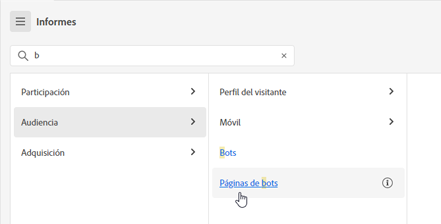

# Página de aterrizaje de Adobe Analytics

La página de aterrizaje de Adobe Analytics reúne a [!DNL Analysis Workspace] y [!DNL Reports & Analytics] en una sola interfaz y punto de acceso bajo el paraguas [!DNL Workspace]. Incluye una página de inicio del administrador de proyectos, un menú de informes actualizado e informes modernizados, así como una sección de aprendizaje que le ayudará a iniciarse de forma más eficaz. A continuación, se muestra un vídeo introductorio:

>[!VIDEO](https://video.tv.adobe.com/v/334278/?quality=12)

## Características de la nueva página de aterrizaje {#new-features}

| Función | Descripción | Captura de pantalla |
| --- | --- | --- |
| Expandir la tabla de [!UICONTROL Proyectos] a pantalla completa | Para expandir la tabla, haga clic en el icono de menú de hamburguesa. Esta acción contraerá las pestañas del carril izquierdo. |  |
| Personalizar anchura de columna | Anteriormente, la anchura de la columna era fija. Ahora puede ajustarla arrastrando el separador de columnas. |  |
| Reordenar elementos anclados | Para mover los elementos anclados hacia arriba y hacia abajo, haga clic en los puntos suspensivos junto al elemento anclado y seleccione **[!UICONTROL Subir]** o **[!UICONTROL Bajar]**. |  |
| Nuevas columnas de tabla | Haga clic en el icono [!UICONTROL Personalizar tabla] en la parte superior derecha de la tabla. Las nuevas columnas de la tabla incluyen las siguientes: <ul><li>**[!UICONTROL Programado]**: establecer como [!UICONTROL Activado] cuando un proyecto está programado o [!UICONTROL Desactivado] cuando no lo está. Al hacer clic en el vínculo [!UICONTROL Activado], permite ver información sobre el proyecto programado. También puede [editar la programación del proyecto](/help/analyze/analysis-workspace/curate-share/t-schedule-report.md) si es el propietario del proyecto.</li><li>**[!UICONTROL ID del proyecto]**: el ID de proyecto se puede usar para depurar proyectos.</li><li>**[!UICONTROL Intervalo de fecha más largo]**: los intervalos de fechas más largos aumentan la complejidad del proyecto y pueden aumentar los tiempos de procesamiento y carga. </li><li>**[!UICONTROL Número de consultas]**: el número total de solicitudes realizadas a Analytics cuando se carga el proyecto. Un número mayor de consultas de proyectos aumenta la complejidad del proyecto y puede aumentar los tiempos de procesamiento y carga. Estos datos solo están disponibles después de que se haya cargado un proyecto o de que se haya enviado un proyecto programado. </li></ul> |  |
| Un solo clic para abrir un informe | Anteriormente, se tenía que hacer doble clic. |  |
| Nuevos vínculos a informes de **[!UICONTROL Reports &amp; Analytics]** | <ul><li>**[!UICONTROL Informes]** > **[!UICONTROL Audiencia]** > **[!UICONTROL Bots]**</li><li>**[!UICONTROL Informes]** > **[!UICONTROL Audiencia]** > **[!UICONTROL Páginas de bots]**<li>**[!UICONTROL Informes]** > **[!UICONTROL Participación]** > **[!UICONTROL Tiempo real]**</li></ul> |  |
| Nuevos informes predeterminados | <ul><li>**[!UICONTROL Informes]** > **[!UICONTROL Más popular]** > **[!UICONTROL Página siguiente]**</li><li>**[!UICONTROL Informes]** > **[!UICONTROL Más popular]** > **[!UICONTROL Página anterior]**</li><li>**[!UICONTROL Informes]** > **[!UICONTROL Participación]** > **[!UICONTROL Análisis de página]** > **[!UICONTROL Resumen de la página]**</li></ul>Tenga en cuenta que estos informes se encuentran en el [!UICONTROL Espacio de trabajo] y requieren configuración y compilación. El resultado consiste en un panel de métricas de alto nivel, datos de tendencias, [!UICONTROL Flujo] visualización, etc. Puede modificar estos informes y cambiar dimensiones, elementos de las dimensiones, etc. Estos informes también están disponibles como paneles en los paneles del espacio de trabajo. |  |
| El modal **[!UICONTROL Crear proyecto]** está de vuelta | Al hacer clic en **[!UICONTROL Crear proyecto]** en el Espacio de trabajo, una vez más puede elegir entre un [!UICONTROL Proyecto en blanco] y un [!UICONTROL Cuadro de resultados móviles en blanco]. También puede elegir entre cualquier plantilla que haya creado su compañía. |  |
| También disponible en Customer Journey Analytics | Esta página de aterrizaje, en un formulario modificado, también está disponible en CJA. |  |

{style="table-layout:auto"}

## Estructura del menú superior {#top-menu}

* Menú Analytics principal: la mayoría de los informes se encuentran ahora en el menú [!UICONTROL Informes] en el carril izquierdo.
* El carril izquierdo tiene tres pestañas: [!UICONTROL Proyectos], [!UICONTROL Informes] y [!UICONTROL Aprendizaje].

### Terminología

* **[!UICONTROL Proyectos]** son diseños personalizados que combinan componentes de datos, tablas y visualizaciones que ha creado o que alguien más ha creado y compartido con usted. [!UICONTROL Proyectos] también hace referencia a proyectos y cuadros de resultados móviles en blanco.
* **[!UICONTROL Informes]** hace referencia a todo lo que haya generado previamente Adobe, como los informes de Reports &amp; Analytics y las plantillas del Espacio de trabajo.
* **[!UICONTROL Plantillas]** ya no se usa como término para los proyectos del Espacio de trabajo generados previamente por Adobe. Ahora se encuentran en [!UICONTROL Informes]. El término [!UICONTROL Plantillas] se sigue utilizando para plantillas creadas por su compañía.

## Vaya a la pestaña [!UICONTROL Proyectos] {#navigate-projects}

[!UICONTROL Proyectos] sirve como página de inicio de [!UICONTROL Workspace]. La pestaña Proyectos muestra la carpeta Compañía, las carpetas personales que ha creado, los proyectos y los informes de valoración móviles. Utilice esta página para ver, crear y modificar carpetas, proyectos e informes de valoración móviles. Para obtener más información, consulte [Acerca de las carpetas en Analytics](/help/analyze/analysis-workspace/build-workspace-project/workspace-folders/about-folders.md).

>[!NOTE]
>
>Varias de las siguientes configuraciones persisten durante la sesión y entre sesiones. Por ejemplo, la pestaña seleccionada, los filtros seleccionados, las columnas seleccionadas y la dirección de clasificación de las columnas. Los resultados de la búsqueda no son persistentes.

| Elemento de la IU | Definición |
| --- | --- |
| Editar preferencias | Le permite [!UICONTROL Ver tutoriales] y [Editar preferencias de usuario](/help/analyze/analysis-workspace/user-preferences.md). |
| [!UICONTROL Crear nuevo] | Abre el modal del proyecto, donde puede crear un proyecto del Espacio de trabajo o un informe de valoración móvil o abrir una plantilla de empresa. |
| [!UICONTROL Mostrar menos  Mostrar más] | Alterna entre no mostrar y mostrar el titular:  |
| [!UICONTROL Proyecto del Espacio de trabajo] | Crea un [proyecto del Espacio de trabajo](https://experienceleague.adobe.com/docs/analytics/analyze/analysis-workspace/home.html?lang=es) en blanco para que pueda diseñarlo y elaborarlo. |
| [!UICONTROL Informe de valoración móvil] | Crea un [informe de valoración móvil](https://experienceleague.adobe.com/docs/analytics/analyze/mobapp/curator.html?lang=es) en blanco para que pueda diseñarlo y elaborarlo. |
| [!UICONTROL Abrir tutorial de formación] | Abre el tutorial de formación del Espacio de trabajo que le guía a través del proceso de creación de un nuevo proyecto de inicio en un tutorial paso a paso. |
| [!UICONTROL Abrir notas de la versión] | Abre la sección Adobe Analytics de las últimas notas de la versión de Adobe Experience Cloud. |
| Icono de filtro | Filtre por etiquetas, grupos de informes, propietarios, tipos y otros filtros (Míos, Compartidos conmigo, Favoritos y Aprobados) |
| Barra de búsqueda | Busca todas las columnas de la tabla. |
| Cuadro de selección | Selecciona uno o varios proyectos para mostrar las acciones de administración de proyectos que puede realizar: **Eliminar**, **Compartir**, **Cambiar nombre**, **Copiar**, **Desanclar**, **Subir**, **Bajar**, **Etiqueta**, **Aprobar**, **Exportar CSV** y **Mover a**. Es posible que no tenga permisos para realizar todas estas acciones. |
| [!UICONTROL Favoritos] | Agrega una estrella junto a un proyecto o una carpeta favoritos que se puede usar como filtro. |
| [!UICONTROL Nombre] | Identifica el nombre del proyecto. |
| Icono de anclaje | Ancla elementos para que siempre aparezcan en la parte superior de la lista, pero puede volver a ajustar el orden moviéndolos hacia arriba o hacia abajo en el orden. Utilice el menú de opciones de puntos suspensivos y seleccione **Subir** o **Bajar** en la lista. |
| Icono de información (i) | Muestra la siguiente información sobre un proyecto: Escribir, Función del proyecto, Propietario, Descripción y con quién se comparte. También indica quién puede [editar o duplicar](https://experienceleague.adobe.com/docs/analytics/analyze/analysis-workspace/curate-share/share-projects.html?lang=es) este proyecto. |
| Puntos suspensivos (...) | Muestra las acciones de administración de proyectos que puede realizar: **Eliminar**, **Compartir**, **Cambiar nombre**, **Copiar**, **Desanclar**, **Subir**, **Bajar**, **Etiqueta**, **Aprobar**, **Exportar CSV** y **Mover a**. Es posible que no tenga permisos para realizar todas estas acciones. |
| [!UICONTROL Tipo] | Indica si este tipo es un proyecto del Espacio de trabajo, un informe de valoración móvil o una carpeta. |
| [!UICONTROL Etiquetas] | Etiqueta proyectos para organizarlos en grupos. |
| [!UICONTROL Función del proyecto] | Identifica las funciones de proyecto: si usted es el propietario del proyecto y si tiene permisos para editar o duplicar el proyecto. |
| [!UICONTROL Grupo de informes] | Identifica los grupos de informes asociados al proyecto. Las tablas y visualizaciones de un panel derivan datos del grupo de informes seleccionado en la parte superior derecha del panel. El grupo de informes también determina qué componentes están disponibles en el carril izquierdo. Dentro de un proyecto, puede utilizar uno o varios grupos de informes en función de los casos de uso del análisis. La lista de grupos de informes se ordena según la relevancia. Adobe define la relevancia en función del uso reciente y de la frecuencia con que el usuario actual ha utilizado el grupo, y en función de la frecuencia con la que el grupo se utiliza dentro de la organización. |
| [!UICONTROL Propietario] | Identifica la persona que creó el proyecto. |
| [!UICONTROL Última apertura] | Identifica la última fecha en que abrió el proyecto. |
| Icono Personalizar tabla | Selecciona qué columnas se verán en la tabla. Para agregar o quitar columnas de la lista de proyectos, haga clic en el icono de columna () en la parte superior derecha y, a continuación, seleccione o anule la selección de los títulos de las columnas. |
| MOSTRAR: Carpetas y proyectos o Todos los proyectos | Cambia la configuración de vista de la tabla para mostrar carpetas y proyectos según la organización de carpetas **o** mostrar todos los proyectos en una lista desorganizada. |
| &lt; (Botón Atrás) | Le devuelve a la configuración de página de aterrizaje más reciente de un proyecto o un informe del Espacio de trabajo. La configuración de la página que tenía cuando abandonó la página de aterrizaje se mantendrá cuando regrese. |

### Obsolescencia de la página Administrador de proyectos {#deprecate-pm-page}

Con el lanzamiento de la nueva página de aterrizaje, ha quedado en desuso el Administrador de proyectos como se muestra en el Administrador de componentes. La nueva página de aterrizaje gestiona todas las funciones de la antigua página Administrador de proyectos y más.

Un caso de uso común para la página Administrador de proyectos era ver todos sus proyectos.

Para ver todos los proyectos en la nueva página de aterrizaje mediante el carril de filtro, seleccione **OTROS FILTROS** y, a continuación, seleccione **Mostrar todo**.

Si está en la vista “Carpetas y proyectos”, aparecerá un modal en el que se le preguntará si desea cambiar a la vista “Todos los proyectos”, lo que facilita la visualización de todos los proyectos fuera de las carpetas en las que se puedan organizar.   Seleccione **Cambiar a la vista “Todos los proyectos”** para ver mejor todos los proyectos a los que tiene acceso.

Otro caso de uso para los administradores es administrar los informes de la empresa para eliminar, cambiar el nombre, etiquetar o aprobar informes. Para obtener información sobre la administración de informes, consulte [Administración de informes de la compañía](#manage-company-reports).

## Vaya a la pestaña [!UICONTROL Informes] {#navigate-reports}

La pestaña [!UICONTROL Informes] consolida tres conjuntos de informes:

* Las plantillas generadas previamente del [!UICONTROL Espacio de trabajo] que anteriormente se encontraban en [!UICONTROL Espacio de trabajo] > [!UICONTROL Proyecto] > [!UICONTROL Nuevo]. Adobe ya no utiliza la palabra “plantilla” en este contexto.
* La mayoría de los informes generados previamente estaban en el menú superior anterior de Adobe Analytics [!UICONTROL Informes]. Estos informes ahora se muestran en [Analysis Workspace](https://experienceleague.adobe.com/docs/analytics/analyze/analysis-workspace/home.html?lang=es).

>[!IMPORTANT]
>
>En Informes, la carpeta Favoritos aparece únicamente si marca un nuevo informe como favorito. No se arrastran los favoritos preexistentes de Reports &amp; Analytics.

Como se ha mencionado anteriormente, solo están disponibles aquí los informes más utilizados que antes se agrupaban en Reports &amp; Analytics. No se migraron algunos informes poco usados o que ya no son relevantes. Consulte las preguntas frecuentes a continuación para obtener más información.

### Menús y submenús {#menus}

Aquí están los menús y sus submenús. Si no encuentra un informe específico, haga una búsqueda en la página para encontrarlo.

| Elemento del menú | Informes bajo este elemento de menú |
| --- | --- |
| **[!UICONTROL Más populares]** | <ul><li>Tutorial de aprendizaje (plantilla del Espacio de trabajo preexistente)</li><li>Páginas (¿Cuáles son mis páginas principales?)</li><li>Vistas de página (¿Cuántas vistas de página estoy generando?)</li><li>Visitas (¿Cuántas visitas estoy teniendo?)</li><li>Visitantes (¿Cuántos visitantes estoy teniendo?)</li><li>Métricas clave (¿Cuál es el rendimiento de mis métricas más importantes?)</li><li>Secciones del sitio (¿Qué secciones de mi sitio generaron la mayor cantidad de vistas de página?)</li><li>Página siguiente (¿Cuáles son las páginas siguientes a las que van mis visitantes?)</li><li>Página anterior (¿Cuáles son las páginas anteriores a las que se dirigieron mis visitantes?)</li><li>Campañas (¿Qué campañas están impulsando mis métricas clave?)</li><li>Productos (¿Qué productos están impulsando mis métricas clave?)</li><li>Canal de último contacto (¿Qué canal de último contacto tiene el mejor rendimiento?</li><li>Detalles del canal de último contacto (¿Qué canal de último contacto específico supera a los demás?)</li><li>Ingresos (¿Cómo van mis ingresos?)</li><li>Pedidos (¿Cómo van mis pedidos?)</li><li>Unidades (¿Cuántas unidades estoy vendiendo?)</li></ul> |
| **[!UICONTROL Participación]** | <ul><li>Métricas clave (¿Cuál es el rendimiento de mis métricas más importantes?)</li><li>Vistas de página (¿Cuántas vistas de página estoy generando?)</li><li>Páginas (¿Cuáles son mis páginas principales?)</li><li>Visitas (¿Cuántas visitas estoy teniendo?)</li><li>Visitantes (¿Cuántos visitantes estoy teniendo?)</li><li>Tiempo empleado por visita (¿Cuánto tiempo invierten mis usuarios por visita?)</li><li>Tiempo previo al evento (¿Cuánto tiempo dedican mis usuarios antes de un evento de éxito?)</li><li>Secciones del sitio (¿Qué secciones de mi sitio generaron la mayor cantidad de vistas de página?)</li><li>Consumo de contenido web (¿Qué contenido se consume más y resulta más atractivo para los usuarios?)</li><li>Consumo de contenido multimedia (¿Qué contenido se consume más y resulta más atractivo para los usuarios?)</li><li>Flujo de página siguiente y anterior (¿Cuáles son/fueron las rutas siguientes/anteriores de mis visitantes?)</li><li>Visita en orden previsto (¿Dónde veo la visita en orden previsto en mis propiedades digitales?)</li><li>Análisis entre dispositivos (Uso del análisis entre dispositivos en Analysis Workspace)</li><li>Retención web (¿Quiénes son mis usuarios más fieles y qué hacen?)</li><li>Consumo de audio multimedia (¿Cuáles son las tendencias y las principales métricas de consumo de audio?)</li><li>Actualización, frecuencia y lealtad de medios (¿Quiénes son mis lectores más fieles?)</li><li>Análisis de página > Recargas (¿Qué páginas generan la mayor cantidad de recargas?)</li><li>Análisis de página > Tiempo empleado en la página (¿Cuánto tiempo dedican mis usuarios a mis páginas?)</li><li>Entradas y salidas > Páginas de entrada (¿Cuáles son mis páginas de entrada principales?)</li><li>Entradas y salidas > Páginas de entrada originales (¿desde qué página entró mi visitante originalmente?)</li><li>Entradas y salidas > Visitas de página única (¿Qué páginas generaron la mayor cantidad de visitas de página única?)</li><li>Entradas y salidas > Páginas de salida (¿Cuáles son mis páginas de salida principales?)</li></ul> |
| **[!UICONTROL Conversión]** | <ul><li>Productos > Productos (¿Qué productos dirigen mis métricas clave?)</li><li>Productos > Rendimiento del producto (¿Qué productos tienen el mejor rendimiento?)</li><li>Productos > Categorías (¿Cuáles son las categorías de productos que tienen un mejor rendimiento?)</li><li>Carro de compras > Carros de compras (¿Cuántos usuarios agregaron un producto al carro de compras?)</li><li>Carro de compras > Vistas del carro de compras (¿Cuántas veces vieron mis visitantes sus carros de compras?)</li><li>Carro de compras > Adiciones al carro de compras (¿Con qué frecuencia los usuarios agregan un producto al carro de compras?)</li><li>Carro de compras > Eliminaciones del carro de compras (¿Con qué frecuencia eliminan los usuarios un producto de su carro de compras?)</li><li>Compras > Ingresos (¿Cómo van mis ingresos?)</li><li>Compras > Pedidos (¿Cómo van mis pedidos?)</li><li>Compras > Unidades (¿Cuántas unidades estoy vendiendo?)</li><li>[Magento: marketing y comercio](https://experienceleague.adobe.com/docs/analytics/analyze/analysis-workspace/build-workspace-project/starter-projects.html?lang=es#commerce)</li></ul> |
| **[!UICONTROL Audiencia]** | <ul><li>Métrica de personas (¿Cuántas personas interactúan con mi marca?)</li><li>Perfil del visitante > Información general sobre la ubicación (Qué ubicaciones son las que más utilizan los usuarios)</li><li>Perfil del visitante > Segmentación geográfica > Condados geográficos, Estados de EE. UU. geográficos, Regiones geográficas, Ciudades geográficas, DMA de EE. UU. geográfico (¿Desde qué lugares geográficos me visitan mis usuarios?)</li><li>Perfil del visitante > Idiomas (¿Qué idioma prefieren mis usuarios?)</li><li>Perfil del visitante > Zonas horarias (¿De qué zonas horarias me están visitando mis usuarios?)</li><li>Perfil del visitante > Dominios (¿Qué ISP utilizan los visitantes para acceder a mi sitio?)</li><li>Perfil del visitante > Dominios de nivel superior (¿Qué dominios conducen el tráfico a mi sitio?)</li><li>Perfil del visitante > Tecnología > Descripción general de la tecnología (¿Qué tecnologías utilizan los visitantes para acceder a mi sitio?)</li><li>Perfil del visitante > Tecnología > Exploradores, Tipo de explorador, Anchura del explorador, Altura del explorador (¿Qué explorador de qué empresa, versión de explorador, y ancho y alto utilizan las personas para acceder a mi sitio?)</li><li>Perfil del visitante > Tecnología > Sistema operativo, tipos de sistema operativo (¿Qué sistema operativo y qué versión usan mis visitantes?)</li><li>Perfil del visitante > Tecnología > Operador de telefonía móvil (¿Qué operadores de telefonía móvil utilizan los visitantes para acceder a mi sitio?)</li><li>Retención de visitantes > Frecuencia de retorno (¿Cuánto tiempo transcurre entre la visita actual del usuario y las visitas anteriores?)</li><li>Retención de visitantes > Visitas de retorno (¿Cuántas de mis visitas son usuarios recurrentes?)</li><li>Retención de visitantes > Número de visitas (Qué bloque de número de visitas genera la mayoría de mis métricas clave)</li><li>Retención de visitantes > Ciclo de ventas > Lealtad del cliente (¿A qué segmento de lealtad pertenecen mis usuarios?)</li><li>Retención de visitantes > Ciclo de ventas > Días antes de la primera compra (¿Cuántos días transcurrieron entre la primera visita de mis usuarios y su primera compra?)</li><li>Retención de visitantes > Ciclo de ventas > Días transcurridos desde la última compra (¿Cuántos días han transcurrido entre la visita actual de mis usuarios y la última compra?) )</li><li>Retención de visitantes > Móvil > Dispositivos y tipos de dispositivos (¿Qué dispositivos y tipos de dispositivos utilizan mis visitantes?)</li><li>Retención de visitantes > Móvil > Fabricante (¿Qué fabricante de dispositivo móvil usan mis visitantes?)</li><li>Retención de visitantes > Móvil > Tamaño, altura y anchura de la pantalla (¿Qué tamaño/altura/anchura de la pantalla móvil tienen mis visitantes?)</li><li>Retención de visitantes > Móvil > [Uso de aplicaciones móviles](https://experienceleague.adobe.com/docs/analytics/analyze/analysis-workspace/build-workspace-project/starter-projects.html?lang=es#mobile)</li><li>Retención de visitantes > Móvil > [Recorridos de aplicaciones móviles](https://experienceleague.adobe.com/docs/analytics/analyze/analysis-workspace/build-workspace-project/starter-projects.html?lang=es#mobile)</li><li>Retención de visitantes > Móvil > [Métricas de aplicaciones móviles](https://experienceleague.adobe.com/docs/analytics/analyze/analysis-workspace/build-workspace-project/starter-projects.html?lang=es#mobile)</li><li>Retención de visitantes > Móvil > [Mensajería de aplicaciones móviles](https://experienceleague.adobe.com/docs/analytics/analyze/analysis-workspace/build-workspace-project/starter-projects.html?lang=es#mobile)</li><li>Retención de visitantes > Móvil > [Rendimiento de las aplicaciones móviles](https://experienceleague.adobe.com/docs/analytics/analyze/analysis-workspace/build-workspace-project/starter-projects.html?lang=es#mobile)</li><li>Retención de visitantes > Móvil > [Retención de aplicaciones móviles](https://experienceleague.adobe.com/docs/analytics/analyze/analysis-workspace/build-workspace-project/starter-projects.html?lang=es#mobile)</li></ul> |
| **[!UICONTROL Adquisición]** | <ul><li>Canales de marketing > Canal de primer contacto, Detalles de canal de primer contacto (¿Qué canal de primer contacto y qué canal de primer contacto específico está teniendo el mejor rendimiento?)</li><li>Canales de marketing > Primer canal, Detalle del último canal (¿Qué canal de último contacto y qué canal de último contacto específico está teniendo el mejor rendimiento?)</li><li>Campañas > Campañas (¿Qué campañas están impulsando mis métricas clave?)</li><li>Campañas > Rendimiento de la campaña (¿Qué campañas consiguen el máximo de los ingresos?)</li><li>Campañas > Código de seguimiento (¿Qué códigos de seguimiento de campaña funcionan mejor?)</li><li>[Adquisición web](https://experienceleague.adobe.com/docs/analytics/analyze/analysis-workspace/build-workspace-project/starter-projects.html?lang=es#web)</li><li>[Adquisición móvil](https://experienceleague.adobe.com/docs/analytics/analyze/analysis-workspace/build-workspace-project/starter-projects.html?lang=es#mobile)</li><li>[Advertising Analytics: búsqueda de pago](https://experienceleague.adobe.com/docs/analytics/analyze/analysis-workspace/build-workspace-project/starter-projects.html?lang=es#advertising)</li><li>Palabras clave de búsqueda: todas, pagadas, naturales (¿Qué palabras clave de búsqueda y palabras clave de búsqueda pagada/natural impulsan mejor mis métricas clave?)</li><li>Motores de búsqueda: todos, pagados, naturales (¿Qué motores de búsqueda y motores de búsqueda natural/pagada impulsan mejor mis métricas clave?)</li><li>Clasificación de todas las páginas de búsqueda (¿De qué página de búsqueda están visitando mis usuarios?)</li><li>Dominios de referencia (¿Qué dominios dirigen tráfico a mi sitio?)</li><li>Dominios de referencia originales (¿Cuál fue el primer dominio en el que se encontraban los usuarios antes de visitar mi sitio?)</li><li>Remitentes del reenvío (¿En qué URL estaban mis usuarios antes de hacer clic en mi sitio?)</li><li>Tipos de remitente del reenvío (¿A qué categoría pertenecen mis URL de referencia?)</li></ul> |

### Ubicación de las plantillas (ahora denominadas informes) {#templates}

| Nombre del informe (plantilla) | Ubicación del informe |
| --- | --- |
| Tutorial formativo | El más popular > Tutorial formativo |
| Consumo de contenido web | Participación > Consumo de contenido web |
| Consumo de contenido de medios | Participación > Consumo de contenido de medios |
| Análisis multidispositivo | Participación > Análisis multidispositivo |
| Retención web | Participación > Retención web |
| Consumo de audio de medios | Participación > Consumo de audio de medios |
| Actualización, frecuencia y fidelización de medios | Participación > Actualización, frecuencia y fidelización de medios |
| Impacto de ITP | Participación > Impacto de ITP |
| Rendimiento de producto | Conversión > Productos > Rendimiento de producto |
| Magento: marketing y comercio | Conversión > Magento: marketing y comercio |
| Métrica Personas | Audiencia > Métrica Personas |
| Información general de ubicación | Audiencia > Perfil del visitante > Información general de ubicación |
| Información general de tecnología | Audiencia > Perfil del visitante > Tecnología > Información general de tecnología |
| Uso de aplicaciones móviles | Audiencia > Móvil > Uso de aplicaciones móviles |
| Recorridos de aplicación móvil | Audiencia > Móvil > Recorridos de aplicación móvil |
| Métricas de aplicación móvil | Audiencia > Móvil > Mensajería de aplicación móvil |
| Rendimiento de aplicación móvil | Audiencia > Móvil > Rendimiento de aplicación móvil |
| Retención de aplicación móvil | Audiencia > Móvil > Retención de aplicación móvil |
| Rendimiento de la campaña | Adquisición > Campañas > Rendimiento de la campaña |
| Adquisición móvil | Adquisición > Adquisición móvil |
| Adquisición web | Adquisición > Adquisición web |
| Advertising Analytics: búsqueda de pago | Adquisición > Advertising Analytics: búsqueda de pago |

### Uso de la pestaña Informes {#use-reports}

Para los usuarios actuales de Reports &amp; Analytics, aquí tiene una breve introducción sobre cómo utilizar los informes a los que está acostumbrado y que ahora se muestran en Espacio de trabajo. Los informes funcionan como plantillas existentes: si realiza cambios en ellos, se le pedirá que guarde o descarte los cambios al desplazarse fuera o a otro informe. Y si desea guardar los cambios, se guarda el informe como un nuevo proyecto.

1. Vaya a la pestaña [!UICONTROL Informes]
1. Seleccione el informe que desee ver, por ejemplo, en [!UICONTROL El más popular], seleccione el informe [!UICONTROL Páginas].
1. A la derecha, haga clic en **[!UICONTROL Abrir informe]**.

   

1. El informe Páginas, tal como se muestra en Analysis Workspace, muestra dos [visualizaciones](/help/analyze/analysis-workspace/visualizations/freeform-analysis-visualizations.md) ([Gráfico de barras](/help/analyze/analysis-workspace/visualizations/bar.md) y [Número de resumen](/help/analyze/analysis-workspace/visualizations/summary-number-change.md)) y una [Tabla de forma libre](/help/analyze/analysis-workspace/visualizations/freeform-table/freeform-table.md). La métrica utilizada es Ocurrencias.
1. Desde aquí tiene varias opciones. Estas son algunas de estas opciones:

   * Puede usar el informe tal cual.
   * Puede arrastrar uno o más segmentos a la zona de colocación de Segmento en la parte superior. Por ejemplo, arrastre el segmento [!UICONTROL Clientes móviles] y observe cómo cambian los resultados.
   * Puede cambiar el intervalo de fechas en el calendario, en la parte superior derecha.
   * Puede agregar desgloses de dimensión, arrastrar otras métricas y, por lo general, personalizar el informe de la manera que desee.

### Creación de un informe de la compañía personalizado {#company-report}

Los informes personalizados creados y guardados para que los demás usuarios de su empresa de inicio de sesión los utilicen, se denominan informes de la compañía. Los informes de la compañía creados anteriormente y los recién creados se muestran en el modal Crear proyecto, como se muestra a continuación.

Para crear un nuevo Informe de la compañía:

1. Cree el Espacio de trabajo con el estado que desee.
1. Abra el menú [!UICONTROL Proyecto] y haga clic en **[!UICONTROL Guardar como informe de la compañía...]**

   

1. Añada todos los campos deseados al modal y guárdelo.

   El informe se añade a la lista de informes de la compañía en el modal Crear proyecto y está disponible para los usuarios de la empresa de inicio de sesión.

Más opciones de aprendizaje:

* Tenga en cuenta que puede acceder a un vídeo de información general de Analysis Workspace de 20 minutos en la parte superior izquierda de cualquier informe que abra.
* Para nuevos usuarios, recomendamos el vídeo del [Tutorial de aprendizaje](https://www.youtube.com/watch?v=lCH1Kl1q9Wk) que le enseñará a crear un nuevo proyecto.
* Aquí tiene un vínculo a la [documentación completa de Analysis Workspace](/help/analyze/analysis-workspace/home.md).
* Esta es la [lista de reproducción completa de YouTube de Analysis Workspace](https://www.youtube.com/playlist?list=PL2tCx83mn7GuNnQdYGOtlyCu0V5mEZ8sS).

### Administración de informes de la compañía {#manage-company-reports}

Los administradores pueden filtrar la lista de proyectos para mostrar y administrar los informes de la compañía. Los elementos anclados permanecen anclados seguidos de la lista de informes de la compañía que se identifican con el icono de informe  En esta vista, puede eliminar, cambiar el nombre, etiquetar o aprobar uno o más informes.

Para mostrar y administrar los informes de la compañía

1. En el carril de filtro, seleccione **OTROS FILTROS** y, a continuación, seleccione **Informes de la compañía**.
Se muestra una lista de los informes de la compañía. No se muestran todos los proyectos normales, a menos que estén anclados.

   

   Cuando se muestran los informes de la compañía, los administradores pueden eliminar, cambiar el nombre, añadir una etiqueta o aprobar el informe.

1. En la lista de informes, seleccione un solo informe o varios informes.

1. Haga clic en el icono de puntos suspensivos **…** junto a un informe para ver las opciones disponibles (Eliminar, Cambiar nombre, Etiquetar y Aprobar).

   

1. Seleccione una opción (Eliminar, Cambiar nombre, Etiquetar y Aprobar).

1. Para volver a la vista normal cuando haya terminado, en el carril de filtro, vuelva a desmarcar la opción Informes de la compañía.

### Eliminar un informe de la compañía

Los administradores pueden eliminar un informe mediante la opción Lista de informes de la compañía (descrita anteriormente) o eliminar un informe en el modal Crear proyecto.

## Vaya a la pestaña Aprendizaje {#navigate-learning}

La página Aprendizaje contiene tutoriales y recorridos en vídeo prácticos, además de vínculos a documentación.

* El recorrido [!UICONTROL Conceptos básicos de Workspace] le lleva directamente a Workspace, y le explica el diseño de Workspace y dónde encontrar y realizar las acciones más comunes. También se puede reiniciar en cualquier momento directamente en Workspace, en la ventana emergente de información del panel del encabezado.
* Al hacer clic en un vídeo/recorrido, se agrega la etiqueta **[!UICONTROL Visto]**. Esta etiqueta le ayuda a realizar un seguimiento del progreso por el contenido de aprendizaje. Puede hacer clic en la etiqueta y desaparece, en caso de que aún no haya completado el contenido.
* El botón **[!UICONTROL Más información]** del modo de vídeo le lleva a una página de documentación de Adobe Experience League con más contenido de ayuda relacionado con el vídeo que acaba de ver.  **[!UICONTROL Ver más vídeos]** le dirige a la lista de reproducción completa de YouTube de Analysis Workspace.

## Establecer una página de aterrizaje {#set-landing}

Los usuarios pueden establecer su página de aterrizaje preferida.

1. Vaya a Analytics > [!UICONTROL Componentes] > [!UICONTROL Preferencias] > [!UICONTROL General].
1. Compruebe qué página de aterrizaje preferiría:

   

## Pestaña Ocultar informes {#hide-reports}

Los administradores pueden ocultar la pestaña Informes para todos los usuarios de su organización.

1. Vaya a [!UICONTROL Analytics] > [!UICONTROL Componentes] > [!UICONTROL Preferencias] > [!UICONTROL Compañía].
1. Marque la **[!UICONTROL Pestaña Ocultar informes]**.

## Preguntas frecuentes sobre la página de aterrizaje {#landing-faq}

| Pregunta | Respuesta |
| --- | --- |
| ¿Dónde están las plantillas que estoy acostumbrado a ver en el [!UICONTROL espacio de trabajo]? | Esas plantillas se agrupan en la pestaña [!UICONTROL Informes]. |
| ¿El trabajo realizado en la IU del programa beta se transfiere a la experiencia de producción de [!UICONTROL Workspace]? | Sí, cualquier trabajo realizado en la versión beta se transfiere a la experiencia antigua/actual del [!UICONTROL Espacio de trabajo]. |
| ¿Se transfieren mis favoritos actuales de [!DNL Reports & Analytics]? | No, NO se transfieren. Sin embargo, todos los favoritos del proyecto del [!UICONTROL Espacio de trabajo] sí se transfieren. |
| ¿Hay un número máximo de proyectos que pueda fijar? | No, no hay límite en el número de proyectos que puede fijar. |
| ¿Pueden los administradores designar esta página de aterrizaje para sus usuarios? | No, los administradores no pueden designar la página de aterrizaje en nombre de los usuarios. Los usuarios individuales deben activar la opción ellos mismos. |
| ¿Siguen estando disponibles todos los informes que existen actualmente en [!DNL Reports & Analytics]? | No, los siguientes informes se eliminaron gradualmente según los datos de uso general: <ul><li>Cualquier eVar, props, eventos o clasificaciones personalizados<li>Informes recomendados</li><li>Visitantes únicos por hora/diarios/semanales/mensuales/trimestrales/anuales</li><li>Clientes únicos diarios/semanales/mensuales/trimestrales/anuales</li><li>Profundidad del nombre de la acción</li><li>Resumen del nombre de la acción</li><li>Añadir tablero</li><li>Edad</li><li>Compatibilidad con audio</li><li>Información de facturación</li><li>Clics hasta la página</li><li>Profundidad de color</li><li>Compatibilidad con cookies</li><li>Cookies</li><li>Tipos de conexión</li><li>Elementos creativos</li><li>Tipo de tarjeta de crédito</li><li>Venta cruzada</li><li>Canales de eventos personalizados</li><li>Vínculos personalizados</li><li>Customer ID</li><li>Día de la semana</li><li>Nombre de la acción de entrada</li><li>Nombre de la acción de salida</li><li>Vínculos de salida</li><li>Abandono</li><li>Descargas de archivos</li><li>Buscar en tienda</li><li>Rutas completas</li><li>Sexo</li><li>Tipo de visita Regla VISTA</li><li>Compatibilidad con imagen</li><li>Java</li><li>JavaScript</li><li>JavaScript versión</li><li>Administrar marcadores</li><li>Administrar tableros</li><li>Profundidad de color del monitor</li><li>Resoluciones de monitor</li><li>Suscripciones al boletín</li><li>Nombre de la acción siguiente</li><li>Flujo de nombre de acción siguiente</li><li>Búsquedas nulas</li><li>Sistema operativo</li><li>Revisión del pedido</li><li>Página del día</li><li>Páginas no encontradas</li><li>Pathfinder</li><li>Longitud de ruta</li><li>Nombre de la acción anterior</li><li>Flujo de nombre de acción anterior</li><li>Actividad del producto</li><li>Coste del producto</li><li>Departamento de productos</li><li>Categoría de inventario de productos</li><li>Nombre del producto</li><li>Opiniones del producto</li><li>Temporada del producto</li><li>Recursos compartidos de productos</li><li>Zoom de producto</li><li>Recarga</li><li>Búsquedas</li><li>Servidores</li><li>Visitas de página única</li><li>Información de envío</li><li>Jerarquía del sitio</li><li>Menciones en redes sociales</li><li>Hora del día</li><li>Tiempo empleado en el nombre de la acción</li><li>Compatibilidad con vídeo</li><li>Estado del visitante</li></ul> |
