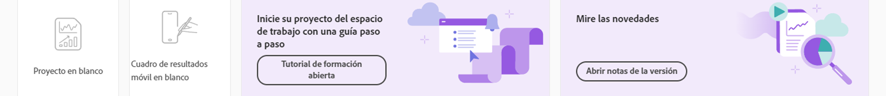

# Página de destino de Adobe Analytics

La página de destino de Adobe Analytics reúne a [!DNL Analysis Workspace] y [!DNL Reports & Analytics] (final de su vida útil) en una sola interfaz y punto de acceso bajo el paraguas [!DNL Workspace]. Incluye una página de inicio del administrador de proyectos, una sección de plantillas, así como una sección de aprendizaje que le ayudará a empezar de forma más eficaz.

>[!BEGINSHADEBOX]

Consulte  [Página de aterrizaje de Adobe Analytics](https://video.tv.adobe.com/v/334278/?quality=12&learn=on){target="_blank"} para ver un vídeo de demostración.

>[!ENDSHADEBOX]

La página de destino de Adobe Analytics consta de las siguientes subpestañas: Proyectos, Informes y Aprendizaje.

**[!UICONTROL Proyectos]** son diseños personalizados que combinan componentes de datos, tablas y visualizaciones que ha creado o que alguien más ha creado y compartido con usted. [!UICONTROL Proyectos] también hace referencia a proyectos y cuadros de resultados móviles en blanco.

**[!UICONTROL Plantillas]** incluye plantillas proporcionadas por Adobe y cualquier plantilla específica de su organización.

La pestaña **[!UICONTROL Aprendizaje]** contiene tutoriales y recorridos en vídeo prácticos, además de vínculos a documentación.

## Vaya a la pestaña [!UICONTROL Proyectos] {#navigate-projects}

La pestaña [!UICONTROL Proyectos] sirve como página de inicio de [!UICONTROL Workspace]. Muestra la carpeta Compañía, las carpetas personales que ha creado, los proyectos y los informes de valoración móviles. Utilice esta página para ver, crear y modificar carpetas, proyectos e informes de valoración móviles. Para obtener más información, consulte [Acerca de las carpetas en Analytics](/help/analyze/analysis-workspace/build-workspace-project/workspace-folders/about-folders.md).

>[!NOTE]
>
>Varias de las siguientes configuraciones persisten durante la sesión y entre sesiones. Por ejemplo, la pestaña seleccionada, los filtros seleccionados, las columnas seleccionadas y la dirección de clasificación de las columnas. Los resultados de la búsqueda no son persistentes.

### Personalizar columnas de tabla

Para personalizar los anchos de columna, arrastre la barra vertical que separa cada columna.

Para añadir o quitar columnas de la lista de proyectos, haga clic en el icono de columna () en la parte superior derecha y, a continuación, seleccione o anule la selección de los títulos de las columnas.

Las opciones disponibles son:

| Nombre de la columna | Descripción |
|---------|----------|
| [!UICONTROL **Nombre**] | Identifica el nombre del proyecto. |
| [!UICONTROL **Tipo**] | Indica si este tipo es un proyecto del Espacio de trabajo, un informe de valoración móvil o una carpeta. |
| [!UICONTROL **Etiquetas**] | Etiqueta proyectos para organizarlos en grupos. |
| [!UICONTROL **Programado**] | Se puede establecer como [!UICONTROL Activado] cuando un proyecto está programado o [!UICONTROL Desactivado] cuando no lo esté. Al hacer clic en [!UICONTROL Activado], se puede ver información sobre el proyecto programado. También puede [editar la programación del proyecto](/help/analyze/analysis-workspace/curate-share/t-schedule-report.md) si es el propietario del proyecto. |
| [!UICONTROL **Función del proyecto**] | Identifica las funciones de proyecto: si usted es el propietario del proyecto y si tiene permisos para editar o duplicar el proyecto. |
| [!UICONTROL **Grupo de informes**] | Identifica los grupos de informes asociados al proyecto. Las tablas y visualizaciones de un panel derivan datos del grupo de informes seleccionado en la parte superior derecha del panel. El grupo de informes también determina qué componentes están disponibles en el carril izquierdo. Dentro de un proyecto, puede utilizar uno o varios grupos de informes en función de los casos de uso del análisis. La lista de grupos de informes se ordena según la relevancia. Adobe define la relevancia en función del uso reciente y de la frecuencia con que el usuario actual ha utilizado el grupo, y en función de la frecuencia con la que el grupo se utiliza dentro de la organización. |
| [!UICONTROL **Propietario**] | Identifica la persona que creó el proyecto. |
| [!UICONTROL **Compartido con**] | Muestra con quién se comparte actualmente el proyecto. |
| [!UICONTROL **Última modificación**] | Fecha y hora de última modificación del proyecto. |
| [!UICONTROL **Última apertura**] | Identifica la fecha en la que el usuario que está viendo la página Proyectos abrió por última vez un proyecto. |
| [!UICONTROL **Último uso**] | Ayuda a determinar si un proyecto es valioso para los usuarios de su organización, ya que muestra la fecha y la hora en que cualquier usuario de la organización abrió el proyecto por última vez.
Tenga en cuenta lo siguiente cuando vea esta columna:
<ul><li>La información de uso está disponible a partir de septiembre de 2023.</li><li>Esta columna solo está disponible para los administradores del sistema.</li></ul> |
| [!UICONTROL **ID del proyecto**] | Puede utilizarse para depurar proyectos. |
| [!UICONTROL **El intervalo de fecha más largo**] | Los intervalos de fechas más largos aumentan la complejidad del proyecto y pueden aumentar los tiempos de procesamiento y carga. |
| [!UICONTROL **Cantidad de consultas**] | El número total de solicitudes realizadas a Analytics cuando se carga el proyecto. Un número mayor de consultas de proyectos aumenta la complejidad del proyecto y puede aumentar los tiempos de procesamiento y carga. Estos datos solo están disponibles después de que se haya cargado un proyecto o de que se haya enviado un proyecto programado. |
| [!UICONTROL **Ubicación**] | Muestra la carpeta donde se encuentra el proyecto. |

### Otros elementos de la IU en la página Proyectos

| Elemento de la IU | Definición |
| --- | --- |
| Editar preferencias | Le permite [!UICONTROL Ver tutoriales] y [Editar preferencias de usuario](/help/analyze/analysis-workspace/user-preferences.md). |
| [!UICONTROL Crear nuevo] | Abre el modal del proyecto, donde puede crear un proyecto del Espacio de trabajo o un informe de valoración móvil o abrir una plantilla de empresa. |
| [!UICONTROL Mostrar menos  Mostrar más] | Alterna entre no mostrar y mostrar el titular:  |
| [!UICONTROL Proyecto del Espacio de trabajo] | Crea un [proyecto del Espacio de trabajo](/help/analyze/analysis-workspace/home.md) en blanco para que pueda diseñarlo y elaborarlo. |
| [!UICONTROL Informe de valoración móvil] | Crea un [informe de valoración móvil](/help/analyze/mobile-app/curator.md) en blanco para que pueda diseñarlo y elaborarlo. |
| [!UICONTROL Abrir tutorial de formación] | Abre el tutorial de formación del Espacio de trabajo que le guía a través del proceso de creación de un nuevo proyecto de inicio en un tutorial paso a paso. |
| [!UICONTROL Abrir notas de la versión] | Abre la sección Adobe Analytics de las últimas notas de la versión de Adobe Experience Cloud. |
| Icono de filtro | Filtre por etiquetas, grupos de informes, propietarios, tipos y otros filtros (Míos, Compartidos conmigo, Favoritos y Aprobados) |
| Barra de búsqueda | Busca todas las columnas de la tabla. |
| Cuadro de selección | Selecciona uno o varios proyectos para mostrar las acciones de administración de proyectos que puede realizar: **Eliminar**, **Compartir**, **Cambiar nombre**, **Copiar**, **Desanclar**, **Subir**, **Bajar**, **Etiqueta**, **Aprobar**, **Exportar CSV** y **Mover a**. Es posible que no tenga permisos para realizar todas estas acciones. |
| [!UICONTROL Favoritos] | Agrega una estrella junto a un proyecto o una carpeta favoritos que se puede usar como filtro. |
| [!UICONTROL Nombre] | Identifica el nombre del proyecto. |
| Icono de anclaje | Ancla elementos para que siempre aparezcan en la parte superior de la lista, pero puede volver a ajustar el orden moviéndolos hacia arriba o hacia abajo en el orden. Utilice el menú de opciones de puntos suspensivos y seleccione **Subir** o **Bajar** en la lista. |
| Icono de información (i) | Muestra la siguiente información sobre un proyecto: Escribir, Función del proyecto, Propietario, Descripción y con quién se comparte. También indica quién puede [editar o duplicar](/help/analyze/analysis-workspace/curate-share/share-projects.md) este proyecto. |
| Puntos suspensivos (...) | Muestra las acciones de administración de proyectos que puede realizar: **Eliminar**, **Compartir**, **Cambiar nombre**, **Copiar**, **Desanclar**, **Subir**, **Bajar**, **Etiqueta**, **Aprobar**, **Exportar CSV** y **Mover a**. Es posible que no tenga permisos para realizar todas estas acciones. |
| MOSTRAR: Carpetas y proyectos o Todos los proyectos | Cambia la configuración de vista de la tabla para mostrar carpetas y proyectos según la organización de carpetas **o** mostrar todos los proyectos en una lista desorganizada. |
| &lt; (Botón Atrás) | Le devuelve a la configuración de página de destino más reciente de un proyecto o un informe del Espacio de trabajo. La configuración de la página que tenía cuando abandonó la página de destino se mantendrá cuando regrese. |

## Vaya a la pestaña [!UICONTROL Plantillas]  {#navigate-reports}

Para obtener información sobre el uso de plantillas en Adobe Analytics, consulte los siguientes recursos:

* [Uso de plantillas](/help/analyze/analysis-workspace/templates/use-templates.md)

* [Creación y administración de plantillas](/help/analyze/analysis-workspace/templates/create-templates.md)

## Uso de la pestaña Aprendizaje {#navigate-learning}

La página Aprendizaje contiene vídeos prácticos, tutoriales y vínculos a la documentación.

Utilice la página Aprendizaje en Adobe Analytics para aprender las funciones y casos de uso para el nivel de principiante, intermedio o avanzado en Adobe Analytics.

### Acceso a la página Aprendizaje

1. En Adobe Analytics, seleccione [!UICONTROL **Espacio de trabajo**] > [!UICONTROL **Aprendizaje**].

### Funciones de la página Aprendizaje

* **Filtrar contenido:** el icono Filtro en el carril izquierdo le permite filtrar el contenido de aprendizaje por nivel de experiencia (principiante, intermedio o avanzado) y por tipo de contenido (documento, vídeo o recorridos y tutoriales).
* **Seguimiento del progreso:** después de seleccionar un fragmento de contenido, aparece una etiqueta **[!UICONTROL Visto]**. Esta etiqueta le ayuda a realizar un seguimiento del progreso por el contenido de aprendizaje. Puede seleccionar la etiqueta **[!UICONTROL Visto]** para eliminarla de un fragmento de contenido.
* **Ver contenido adicional:** mientras ve cualquier vídeo, seleccione el botón **[!UICONTROL Más información]** para ver el contenido de la documentación relacionado en Experience League. O bien, en la página Aprendizaje, seleccione cualquiera de las siguientes opciones para ver contenido adicional:
   * **[!UICONTROL Visitar YouTube]:** vea la lista de reproducción completa en YouTube de Analysis Workspace.
   * [!UICONTROL **Visitar Experience League**]: vea el conjunto completo de documentación de Adobe Analytics sobre Experience League.
* **Elementos fundamentales para nuevos usuarios:** se recomienda a los nuevos usuarios la visita guiada [!UICONTROL Elementos fundamentales de Workspace]. Este recorrido le lleva directamente a Workspace y le explica las acciones más comunes. También se puede reiniciar en cualquier momento directamente en Workspace en la ventana emergente de información del panel del encabezado.

## Establecer una página de destino {#set-landing}

Los usuarios pueden establecer su página de destino preferida.

1. Vaya a Analytics > [!UICONTROL Componentes] > [!UICONTROL Preferencias] > [!UICONTROL General].
1. Compruebe qué página de destino preferiría:

   

## Preguntas frecuentes sobre la página de destino {#landing-faq}

| Pregunta | Respuesta |
| --- | --- |
| ¿Dónde están las plantillas que estoy acostumbrado a ver en el [!UICONTROL espacio de trabajo]? | Esas plantillas se agrupan en la pestaña [!UICONTROL Plantillas]. |
| ¿El trabajo realizado en la IU del programa beta se transfiere a la experiencia de producción de [!UICONTROL Workspace]? | Sí, cualquier trabajo realizado en la versión beta se transfiere a la experiencia antigua/actual de [!UICONTROL Workspace]. |
| ¿Se transfieren mis favoritos actuales de Reports &amp; Analytics? | No, NO se transfieren. Sin embargo, todos los favoritos del proyecto del [!UICONTROL Espacio de trabajo] sí se transfieren. |
| ¿Hay un número máximo de proyectos que pueda fijar? | No, no hay límite en el número de proyectos que puede fijar. |
| ¿Pueden los administradores designar esta página de destino para sus usuarios? | No, los administradores no pueden designar la página de destino en nombre de los usuarios. Los usuarios individuales deben activar la opción ellos mismos. |
