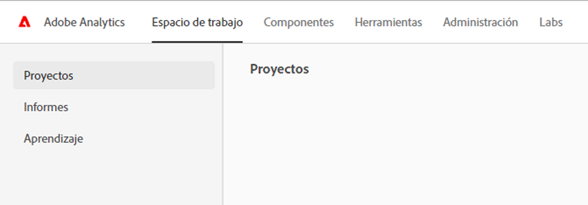

# Página de aterrizaje de Adobe Analytics

La página de aterrizaje de Adobe Analytics reúne a [!DNL Analysis Workspace] y [!DNL Reports & Analytics] en una sola interfaz y punto de acceso bajo el paraguas [!DNL Workspace]. Incluye una página de inicio del administrador de proyectos, un menú de informes actualizado e informes modernizados, así como una sección de aprendizaje que le ayudará a iniciarse de forma más eficaz. A continuación, se muestra un vídeo introductorio:

>[!VIDEO](https://video.tv.adobe.com/v/334278/?quality=12)

## Características de la nueva página de aterrizaje {#new-features}

| Función | Descripción | Captura de pantalla |
| --- | --- | --- |
| Expandir la tabla de [!UICONTROL Proyectos] a pantalla completa | Para expandir la tabla, haga clic en el icono de menú de hamburguesa. Esta acción contraerá las pestañas del carril izquierdo. |  |
| Personalizar anchura de columna | Anteriormente, la anchura de la columna era fija. Ahora puede ajustarla arrastrando el separador de columnas. |  |
| Reordenar elementos anclados | Para mover los elementos anclados hacia arriba y hacia abajo, haga clic en los puntos suspensivos junto al elemento anclado y seleccione **[!UICONTROL Subir]** o **[!UICONTROL Bajar]**. |  |
| Nuevas columnas de tabla | Haga clic en el icono [!UICONTROL Personalizar tabla] en la parte superior derecha de la tabla. Las nuevas columnas de la tabla incluyen las siguientes: <ul><li>**[!UICONTROL Programado]**: establecer como [!UICONTROL Activado] cuando un proyecto está programado o [!UICONTROL Desactivado] cuando no lo está. Al hacer clic en el vínculo [!UICONTROL Activado], permite ver información sobre el proyecto programado. También puede [editar la programación del proyecto](/help/analyze/analysis-workspace/curate-share/t-schedule-report.md) si es el propietario del proyecto.</li><li>**[!UICONTROL ID del proyecto]**: el ID de proyecto se puede usar para depurar proyectos.</li><li>**[!UICONTROL Intervalo de fecha más largo]**: los intervalos de fechas más largos aumentan la complejidad del proyecto y pueden aumentar los tiempos de procesamiento y carga. </li><li>**[!UICONTROL Número de consultas]**: el número total de solicitudes realizadas a Analytics cuando se carga el proyecto. Un número mayor de consultas de proyectos aumenta la complejidad del proyecto y puede aumentar los tiempos de procesamiento y carga. Estos datos solo están disponibles después de que se haya cargado un proyecto o de que se haya enviado un proyecto programado. </li></ul> |  |
| Un solo clic para abrir un informe | Anteriormente, se tenía que hacer doble clic. |  |
| Nuevos vínculos a informes de **[!UICONTROL Reports &amp; Analytics]** | <ul><li>**[!UICONTROL Informes]** > **[!UICONTROL Audiencia]** > **[!UICONTROL Bots]**</li><li>**[!UICONTROL Informes]** > **[!UICONTROL Audiencia]** > **[!UICONTROL Páginas de bots]**<li>**[!UICONTROL Informes]** > **[!UICONTROL Participación]** > **[!UICONTROL Tiempo real]**</li></ul> |  |
| Nuevos informes predeterminados | <ul><li>**[!UICONTROL Informes]** > **[!UICONTROL Más popular]** > **[!UICONTROL Página siguiente]**</li><li>**[!UICONTROL Informes]** > **[!UICONTROL Más popular]** > **[!UICONTROL Página anterior]**</li><li>**[!UICONTROL Informes]** > **[!UICONTROL Participación]** > **[!UICONTROL Análisis de página]** > **[!UICONTROL Resumen de la página]**</li></ul>Tenga en cuenta que estos informes se encuentran en el [!UICONTROL Espacio de trabajo] y requieren configuración y compilación. El resultado consiste en un panel de métricas de alto nivel, datos de tendencias, [!UICONTROL Flujo] visualización, etc. Puede modificar estos informes y cambiar dimensiones, elementos de las dimensiones, etc. Estos informes también están disponibles como paneles en los paneles del espacio de trabajo. |  |
| El modal **[!UICONTROL Crear proyecto]** está de vuelta | Al hacer clic en **[!UICONTROL Crear proyecto]** en el Espacio de trabajo, una vez más puede elegir entre un [!UICONTROL Proyecto en blanco] y un [!UICONTROL Cuadro de resultados móviles en blanco]. También puede elegir entre cualquier plantilla que haya creado su compañía. |  |
| También disponible en Customer Journey Analytics | Esta página de aterrizaje, en un formulario modificado, también está disponible en Customer Journey Analytics. |  |

{style="table-layout:auto"}

## Estructura del menú superior {#top-menu}

* Menú Analytics principal: la mayoría de los informes se encuentran ahora en el menú [!UICONTROL Informes] en el carril izquierdo.
* El carril izquierdo tiene tres pestañas: [!UICONTROL Proyectos], [!UICONTROL Informes] y [!UICONTROL Aprendizaje].

### Terminología

* **[!UICONTROL Proyectos]** son diseños personalizados que combinan componentes de datos, tablas y visualizaciones que ha creado o que alguien más ha creado y compartido con usted. [!UICONTROL Proyectos] también hace referencia a proyectos y cuadros de resultados móviles en blanco.
* **[!UICONTROL Informes]** hace referencia a todo lo que haya generado previamente Adobe, como los informes de Reports &amp; Analytics y las plantillas del Espacio de trabajo.
* **[!UICONTROL Plantillas]** ya no se usa como término para los proyectos del Espacio de trabajo generados previamente por Adobe. Ahora se encuentran en [!UICONTROL Informes]. El término [!UICONTROL Plantillas] se sigue utilizando para plantillas creadas por su compañía.

## Vaya a la pestaña [!UICONTROL Proyectos] {#navigate-projects}

[!UICONTROL Proyectos] sirve como página de inicio de [!UICONTROL Workspace]. La pestaña Proyectos muestra la carpeta Compañía, las carpetas personales que ha creado, los proyectos y los informes de valoración móviles. Utilice esta página para ver, crear y modificar carpetas, proyectos e informes de valoración móviles. Para obtener más información, consulte [Acerca de las carpetas en Analytics](/help/analyze/analysis-workspace/build-workspace-project/workspace-folders/about-folders.md).

>[!NOTE]
>
>Varias de las siguientes configuraciones persisten durante la sesión y entre sesiones. Por ejemplo, la pestaña seleccionada, los filtros seleccionados, las columnas seleccionadas y la dirección de clasificación de las columnas. Los resultados de la búsqueda no son persistentes.

| Elemento de la IU | Definición |
| --- | --- |
| Editar preferencias | Le permite [!UICONTROL Ver tutoriales] y [Editar preferencias de usuario](/help/analyze/analysis-workspace/user-preferences.md). |
| [!UICONTROL Crear nuevo] | Abre el modal del proyecto, donde puede crear un proyecto del Espacio de trabajo o un informe de valoración móvil o abrir una plantilla de empresa. |
| [!UICONTROL Mostrar menos  Mostrar más] | Alterna entre no mostrar y mostrar el titular:  |
| [!UICONTROL Proyecto del Espacio de trabajo] | Crea un [proyecto del Espacio de trabajo](https://experienceleague.adobe.com/docs/analytics/analyze/analysis-workspace/home.html?lang=es) en blanco para que pueda diseñarlo y elaborarlo. |
| [!UICONTROL Informe de valoración móvil] | Crea un [informe de valoración móvil](https://experienceleague.adobe.com/docs/analytics/analyze/mobapp/curator.html?lang=es) en blanco para que pueda diseñarlo y elaborarlo. |
| [!UICONTROL Abrir tutorial de formación] | Abre el tutorial de formación del Espacio de trabajo que le guía a través del proceso de creación de un nuevo proyecto de inicio en un tutorial paso a paso. |
| [!UICONTROL Abrir notas de la versión] | Abre la sección Adobe Analytics de las últimas notas de la versión de Adobe Experience Cloud. |
| Icono de filtro | Filtre por etiquetas, grupos de informes, propietarios, tipos y otros filtros (Míos, Compartidos conmigo, Favoritos y Aprobados) |
| Barra de búsqueda | Busca todas las columnas de la tabla. |
| Cuadro de selección | Selecciona uno o varios proyectos para mostrar las acciones de administración de proyectos que puede realizar: **Eliminar**, **Compartir**, **Cambiar nombre**, **Copiar**, **Desanclar**, **Subir**, **Bajar**, **Etiqueta**, **Aprobar**, **Exportar CSV** y **Mover a**. Es posible que no tenga permisos para realizar todas estas acciones. |
| [!UICONTROL Favoritos] | Agrega una estrella junto a un proyecto o una carpeta favoritos que se puede usar como filtro. |
| [!UICONTROL Nombre] | Identifica el nombre del proyecto. |
| Icono de anclaje | Ancla elementos para que siempre aparezcan en la parte superior de la lista, pero puede volver a ajustar el orden moviéndolos hacia arriba o hacia abajo en el orden. Utilice el menú de opciones de puntos suspensivos y seleccione **Subir** o **Bajar** en la lista. |
| Icono de información (i) | Muestra la siguiente información sobre un proyecto: Escribir, Función del proyecto, Propietario, Descripción y con quién se comparte. También indica quién puede [editar o duplicar](https://experienceleague.adobe.com/docs/analytics/analyze/analysis-workspace/curate-share/share-projects.html?lang=es) este proyecto. |
| Puntos suspensivos (...) | Muestra las acciones de administración de proyectos que puede realizar: **Eliminar**, **Compartir**, **Cambiar nombre**, **Copiar**, **Desanclar**, **Subir**, **Bajar**, **Etiqueta**, **Aprobar**, **Exportar CSV** y **Mover a**. Es posible que no tenga permisos para realizar todas estas acciones. |
| [!UICONTROL Tipo] | Indica si este tipo es un proyecto del Espacio de trabajo, un informe de valoración móvil o una carpeta. |
| [!UICONTROL Etiquetas] | Etiqueta proyectos para organizarlos en grupos. |
| [!UICONTROL Función del proyecto] | Identifica las funciones de proyecto: si usted es el propietario del proyecto y si tiene permisos para editar o duplicar el proyecto. |
| [!UICONTROL Grupo de informes] | Identifica los grupos de informes asociados al proyecto. Las tablas y visualizaciones de un panel derivan datos del grupo de informes seleccionado en la parte superior derecha del panel. El grupo de informes también determina qué componentes están disponibles en el carril izquierdo. Dentro de un proyecto, puede utilizar uno o varios grupos de informes en función de los casos de uso del análisis. La lista de grupos de informes se ordena según la relevancia. Adobe define la relevancia en función del uso reciente y de la frecuencia con que el usuario actual ha utilizado el grupo, y en función de la frecuencia con la que el grupo se utiliza dentro de la organización. |
| [!UICONTROL Propietario] | Identifica la persona que creó el proyecto. |
| [!UICONTROL Última apertura] | Identifica la última fecha en que abrió el proyecto. |
| Icono Personalizar tabla | Selecciona qué columnas se verán en la tabla. Para agregar o quitar columnas de la lista de proyectos, haga clic en el icono de columna () en la parte superior derecha y, a continuación, seleccione o anule la selección de los títulos de las columnas. |
| MOSTRAR: Carpetas y proyectos o Todos los proyectos | Cambia la configuración de vista de la tabla para mostrar carpetas y proyectos según la organización de carpetas **o** mostrar todos los proyectos en una lista desorganizada. |
| &lt; (Botón Atrás) | Le devuelve a la configuración de página de aterrizaje más reciente de un proyecto o un informe del Espacio de trabajo. La configuración de la página que tenía cuando abandonó la página de aterrizaje se mantendrá cuando regrese. |

### Obsolescencia de la página Administrador de proyectos {#deprecate-pm-page}

Con el lanzamiento de la nueva página de aterrizaje, ha quedado en desuso el Administrador de proyectos como se muestra en el Administrador de componentes. La nueva página de aterrizaje gestiona todas las funciones de la antigua página Administrador de proyectos y más.

Un caso de uso común para la página Administrador de proyectos era ver todos sus proyectos.

Para ver todos los proyectos en la nueva página de aterrizaje mediante el carril de filtro, seleccione **OTROS FILTROS** y, a continuación, seleccione **Mostrar todo**.

Si está en la vista “Carpetas y proyectos”, aparecerá un modal en el que se le preguntará si desea cambiar a la vista “Todos los proyectos”, lo que facilita la visualización de todos los proyectos fuera de las carpetas en las que se puedan organizar.   Seleccione **Cambiar a la vista “Todos los proyectos”** para ver mejor todos los proyectos a los que tiene acceso.

Otro caso de uso para los administradores es administrar los informes de la empresa para eliminar, cambiar el nombre, etiquetar o aprobar informes. Para obtener información sobre la administración de informes, consulte [Administración de informes de la compañía](#manage-company-reports).

## Vaya a la pestaña [!UICONTROL Informes] {#navigate-reports}

La pestaña [!UICONTROL Informes] consolida los siguientes conjuntos de informes:

* Las plantillas generadas previamente del [!UICONTROL Espacio de trabajo] que anteriormente se encontraban en [!UICONTROL Espacio de trabajo] > [!UICONTROL Proyecto] > [!UICONTROL Nuevo]. Adobe ya no utiliza la palabra “plantilla” en este contexto.
* La mayoría de los informes generados previamente estaban en el menú superior anterior de Adobe Analytics [!UICONTROL Informes]. Estos informes ahora se muestran en [Analysis Workspace](https://experienceleague.adobe.com/docs/analytics/analyze/analysis-workspace/home.html?lang=es).

>[!NOTE]
>
>Tenga en cuenta lo siguiente al utilizar informes:
>* En Informes, la carpeta Favoritos aparece únicamente si marca un nuevo informe como favorito. No se arrastran los favoritos preexistentes de Reports &amp; Analytics.
>* Solo están disponibles los informes más utilizados que antes se agrupaban en Reports &amp; Analytics. Ya no están disponibles algunos informes poco utilizados o que ya no son relevantes. Consulte las [Preguntas frecuentes sobre la página de aterrizaje](#landing-page-faq) que se muestra a continuación para obtener más información.

Para obtener más información sobre la pestaña Informes en Analysis Workspace, incluida la visualización y el guardado de informes, consulte [Uso de informes generados previamente](/help/analyze/analysis-workspace/reports/use-reports.md).

Para obtener información sobre la creación y administración de informes de empresa personalizados, consulte [Creación y administración de informes de empresa](/help/analyze/analysis-workspace/reports/create-company-reports.md).

## Uso de la pestaña Aprendizaje {#navigate-learning}

La página Aprendizaje contiene vídeos prácticos, tutoriales y vínculos a la documentación.

Utilice la página Aprendizaje en Adobe Analytics para aprender las funciones y casos de uso para el nivel de principiante, intermedio o avanzado en Adobe Analytics.

### Acceso a la página Aprendizaje

1. En Adobe Analytics, seleccione [!UICONTROL **Espacio de trabajo**] > [!UICONTROL **Aprendizaje**].

### Funciones de la página Aprendizaje

* **Filtrar contenido:** el icono Filtro en el carril izquierdo le permite filtrar el contenido de aprendizaje por nivel de experiencia (principiante, intermedio o avanzado) y por tipo de contenido (documento, vídeo o recorridos y tutoriales).
* **Seguimiento del progreso:** después de seleccionar un fragmento de contenido, aparece una etiqueta **[!UICONTROL Visto]**. Esta etiqueta le ayuda a realizar un seguimiento del progreso por el contenido de aprendizaje. Puede seleccionar la etiqueta **[!UICONTROL Visto]** para eliminarla de un fragmento de contenido.
* **Ver contenido adicional:** mientras ve cualquier vídeo, seleccione el botón **[!UICONTROL Más información]** para ver el contenido de la documentación relacionado en Experience League. O bien, en la página Aprendizaje, seleccione cualquiera de las siguientes opciones para ver contenido adicional:
   * **[!UICONTROL Visitar YouTube]:** vea la lista de reproducción completa en YouTube de Analysis Workspace.
   * [!UICONTROL **Visitar Experience League**]: vea el conjunto completo de documentación de Adobe Analytics sobre Experience League.
* **Elementos fundamentales para nuevos usuarios:** se recomienda a los nuevos usuarios la visita guiada [!UICONTROL Elementos fundamentales de Workspace]. Este recorrido le lleva directamente a Workspace y le explica las acciones más comunes. También se puede reiniciar en cualquier momento directamente en Workspace en la ventana emergente de información del panel del encabezado.

## Establecer una página de aterrizaje {#set-landing}

Los usuarios pueden establecer su página de aterrizaje preferida.

1. Vaya a Analytics > [!UICONTROL Componentes] > [!UICONTROL Preferencias] > [!UICONTROL General].
1. Compruebe qué página de aterrizaje preferiría:

   

## Pestaña Ocultar informes {#hide-reports}

Los administradores pueden ocultar la pestaña Informes para todos los usuarios de su organización.

1. Vaya a [!UICONTROL Analytics] > [!UICONTROL Componentes] > [!UICONTROL Preferencias] > [!UICONTROL Compañía].
1. Marque la **[!UICONTROL Pestaña Ocultar informes]**.

## Preguntas frecuentes sobre la página de aterrizaje {#landing-faq}

| Pregunta | Respuesta |
| --- | --- |
| ¿Dónde están las plantillas que estoy acostumbrado a ver en el [!UICONTROL espacio de trabajo]? | Esas plantillas se agrupan en la pestaña [!UICONTROL Informes]. |
| ¿El trabajo realizado en la IU del programa beta se transfiere a la experiencia de producción de [!UICONTROL Workspace]? | Sí, cualquier trabajo realizado en la versión beta se transfiere a la experiencia antigua/actual del [!UICONTROL Espacio de trabajo]. |
| ¿Se transfieren mis favoritos actuales de [!DNL Reports & Analytics]? | No, NO se transfieren. Sin embargo, todos los favoritos del proyecto del [!UICONTROL Espacio de trabajo] sí se transfieren. |
| ¿Hay un número máximo de proyectos que pueda fijar? | No, no hay límite en el número de proyectos que puede fijar. |
| ¿Pueden los administradores designar esta página de aterrizaje para sus usuarios? | No, los administradores no pueden designar la página de aterrizaje en nombre de los usuarios. Los usuarios individuales deben activar la opción ellos mismos. |
| ¿Siguen estando disponibles todos los informes que existen actualmente en [!DNL Reports & Analytics]? | No, los siguientes informes se eliminaron gradualmente según los datos de uso general: <ul><li>Cualquier eVar, props, eventos o clasificaciones personalizados<li>Informes recomendados</li><li>Visitantes únicos por hora/diarios/semanales/mensuales/trimestrales/anuales</li><li>Clientes únicos diarios/semanales/mensuales/trimestrales/anuales</li><li>Profundidad del nombre de la acción</li><li>Resumen del nombre de la acción</li><li>Añadir tablero</li><li>Edad</li><li>Compatibilidad con audio</li><li>Información de facturación</li><li>Clics hasta la página</li><li>Profundidad de color</li><li>Compatibilidad con cookies</li><li>Cookies</li><li>Tipos de conexión</li><li>Elementos creativos</li><li>Tipo de tarjeta de crédito</li><li>Venta cruzada</li><li>Canales de eventos personalizados</li><li>Vínculos personalizados</li><li>Customer ID</li><li>Día de la semana</li><li>Nombre de la acción de entrada</li><li>Nombre de la acción de salida</li><li>Vínculos de salida</li><li>Abandono</li><li>Descargas de archivos</li><li>Buscar en tienda</li><li>Rutas completas</li><li>Sexo</li><li>Tipo de visita Regla VISTA</li><li>Compatibilidad con imagen</li><li>Java</li><li>JavaScript</li><li>JavaScript versión</li><li>Administrar marcadores</li><li>Administrar tableros</li><li>Profundidad de color del monitor</li><li>Resoluciones de monitor</li><li>Suscripciones al boletín</li><li>Nombre de la acción siguiente</li><li>Flujo de nombre de acción siguiente</li><li>Búsquedas nulas</li><li>Sistema operativo</li><li>Revisión del pedido</li><li>Página del día</li><li>Páginas no encontradas</li><li>Pathfinder</li><li>Longitud de ruta</li><li>Nombre de la acción anterior</li><li>Flujo de nombre de acción anterior</li><li>Actividad del producto</li><li>Coste del producto</li><li>Departamento de productos</li><li>Categoría de inventario de productos</li><li>Nombre del producto</li><li>Opiniones del producto</li><li>Temporada del producto</li><li>Recursos compartidos de productos</li><li>Zoom de producto</li><li>Recarga</li><li>Búsquedas</li><li>Servidores</li><li>Visitas de página única</li><li>Información de envío</li><li>Jerarquía del sitio</li><li>Menciones en redes sociales</li><li>Hora del día</li><li>Tiempo empleado en el nombre de la acción</li><li>Compatibilidad con vídeo</li><li>Estado del visitante</li></ul> |
