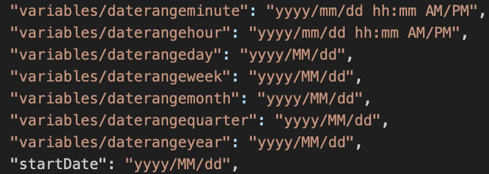

# Fechas de una celda

{{legacy-arb}}

Es posible especificar un intervalo de fechas seleccionando celdas de una hoja de cálculo que contenga una solicitud. Report Builder utiliza la información del intervalo de fechas concretas en esas solicitudes. Si selecciona la fecha actual obtendrá datos parciales según la hora del día en que se ejecute la solicitud.

**Para configurar fechas de una celda**

1. En el [!UICONTROL Asistente para solicitudes: Paso 1], seleccione **[!UICONTROL Fechas de celda]**.
1. Escriba referencias de celda en los campos **[!UICONTROL Desde]** y **[!UICONTROL Hasta]**, o bien haga clic en el selector y seleccione las celdas que contengan las solicitudes con las fechas de inicio y finalización.

   Por ejemplo, cree una solicitud de Report Builder con el intervalo de fechas establecido en “ayer” y el resultado de la fecha de solicitud en la misma celda en “hoy()-1”.

Esta es una lista de formatos de fecha admitidos:

