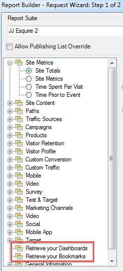

# Importación de informes marcados e informes del panel de control

{{legacy-arb}}

Todos los informes marcados y los informes del tablero ahora se enumeran como dimensiones en el paso 1 del Asistente para solicitudes y se pueden importar como solicitudes de Report Builder.

Cuando selecciona un informe marcado, el Asistente para solicitudes rellena todas las dimensiones y métricas que definen este informe marcado. El intervalo de fechas, la granularidad y el segmento seleccionado también se actualizan en función del marcador seleccionado.

Así es como el Asistente para solicitudes: Paso 1 muestra un tablero y sus informes breves:

Al hacer clic en **[!UICONTROL Recuperar los paneles]** o **[!UICONTROL Recuperar los marcadores]**, los datos del panel o marcador existentes se recuperarán y pegarán en la hoja de cálculo.

>[!NOTE]
>
>Solo se importan los datos, de modo que si un marcador contiene un gráfico o si el informe breve del tablero consiste únicamente en un gráfico, solo se importarán los datos utilizados para rellenar el gráfico.

Una vez que haya creado una solicitud importando un informe breve del tablero (o un marcador), la solicitud se asociará a la dimensión principal del informe breve (o marcador). Como resultado, si edita la solicitud, la vista de árbol ya no selecciona el nodo de vista de árbol del informe breve del tablero (o nodo de marcador): selecciona su dimensión principal en su lugar.

