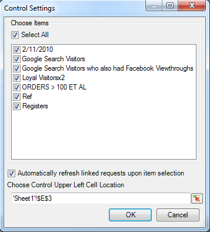

# Administración de segmentos

Cómo añadir, editar, aplicar y filtrar los segmentos de Adobe Analytics en Report Builder.

Report Builder incluye un panel de segmentación en el paso 1 del Asistente para solicitudes que le permite crear y administrar segmentos.

## Adición o edición de segmentos {#section_B2BC136F9A53498D90C7C2ECC5DB892B}

>[!NOTE]
>
>Para añadir o editar segmentos, la interfaz de segmentos de Report Builder inicia el Creación de segmentos de Analytics en una ventana de Microsoft Internet Explorer. Su sesión de Report Builder permanecerá activa. Otros exploradores que no sean Internet Explorer no son compatibles con esta operación.

1. En el panel de segmento del paso 1 del Asistente para solicitudes, haga clic en **[!UICONTROL Añadir]**.
1. Se inicia una ventana de Internet Explorer que abre la interfaz del Creador de segmentos de Analytics. Para obtener información sobre cómo crear segmentos, consulte la [segmentación de Analytics](https://experienceleague.adobe.com/docs/analytics/components/segmentation/seg-home.html?lang=es).
1. Una vez que haya definido y guardado el segmento, vuelva al Asistente para solicitudes.
1. Haga clic en el icono de actualizar para actualizar la lista de segmentos.

>[!IMPORTANT]
>
>La lista se almacena en caché y el segmento recién creado no aparecerá a menos que la actualice.

## Creación de segmentos en contexto {#section_6DD2C663B2854469AA1075438F907678}

Es posible que tenga combinaciones específicas de dimensiones de informe que desee convertir en un segmento. Puede crear estos segmentos desde la interfaz de Report Builder. Por ejemplo, seleccione algunas páginas de un resultado de solicitud de Página y cree un segmento basado en esos valores.

1. Seleccione los elementos de resultado del informe que desee convertir en un segmento.
1. Haga clic con el botón derecho para seleccionar **[!UICONTROL Crear segmento en contexto en]** y especifique el contenedor derecho (Contenedor de visita, Contenedor de visitas, Contenedor de visitantes).

   

   Si desea información acerca de los contenedores, consulte la [Guía de segmentación](https://experienceleague.adobe.com/docs/analytics/components/segmentation/seg-home.html?lang=es).

1. Se iniciará la interfaz de usuario del creador de segmentos en Internet Explorer. La interfaz de usuario del creador de segmentos se iniciará con el contenedor y el filtro que haya especificado.
1. Añada un nombre y una descripción al segmento y, a continuación, guárdelo.
1. Vuelva al Report Builder y haga clic en el botón Actualizar para actualizar la lista de segmentos.
1. Ahora está listo para aplicar este segmento.

## Buscar y aplicar segmentos {#search}

Cualquier segmento que se haya creado en Reports &amp; Analytics (ahora al final de su vida útil), Report Builder o Data Warehouse aparecerá en esta lista de segmentos. Para actualizar la lista, haga clic en el icono Actualizar .

Puede aplicar uno o varios segmentos a una solicitud determinada. Esto incluye segmentos secuenciales.

1. Vaya a la lista desplegable de **[!UICONTROL Segmento]** y haga clic en la pequeña flecha hacia abajo en el cuadro **[!UICONTROL Elegir segmento]** para mostrar todos los segmentos.

1. Marque los segmentos que desee aplicar.

   

>[!NOTE]
>
>Tanto si es un administrador como si no, en Report Builder podrá ver solo aquellos segmentos que le pertenecen y aquellos que se han compartido con usted.

## Filtrar segmentos. {#filter}

**Filtrar** segmentos haciendo clic en el icono Filtro: 

Los filtros disponibles incluyen:

| Nombre del filtro | Descripción |
|---|---|
| Etiquetas | Le permite filtrar los segmentos con etiquetas específicas. Tenga en cuenta que los filtros de etiqueta utilizan el operador AND. Si marca dos etiquetas, el panel derecho muestra los segmentos etiquetados con **ambas** etiquetas. |
| Propietarios | Le permite filtrar segmentos por propietario. Tenga en cuenta que los filtros de Propietario utilizan el operador OR. Si marca dos propietarios, el panel de la derecha muestra los segmentos que son propiedad de **uno** de los propietarios. |
| Otros filtros > Solo el *nombre del grupo de informes* | Si aplica el filtro &quot;Solo *nombre del grupo de informes*&quot; en el Generador de segmentos en Adobe Analytics y, a continuación, muestra el Filtro avanzado en [!DNL Report Builder], el Filtro avanzado solo mostrará el segmento para el grupo de informes seleccionado. |
| Otros filtros > Míos | Muestra todos los segmentos de su propiedad. |
| Otros filtros > Compartidos conmigo | Muestra todos los segmentos que otros comparten con usted. |
| Otros filtros > Favoritos | Muestra todos los segmentos que haya marcado como Favoritos. |
| Otros filtros > Aprobados | Muestra todos los segmentos aprobados oficialmente. |

## Adición de un control de segmento a un libro {#segment-control}

Añadir un control de segmento le permite conmutar segmentos dentro de un libro en lugar de tener que ir al Asistente para solicitudes.

1. Haga clic en el icono de control  que se encuentra junto a la lista desplegable de segmentos.

1. Marque todos los segmentos que desee que aparezcan en el control de segmentos o marque **[!UICONTROL Seleccionar todo]**.

   

1. Tenga en cuenta la opción para **[!UICONTROL Actualizar automáticamente las solicitudes vinculadas al seleccionar el elemento]**.

   * Si esta opción está activada, se actualizan todas las solicitudes que utilizan este control.
   * Si no está activada, los parámetros de solicitud asociados se actualizan, pero las solicitudes no se actualizan.

1. Especifique la ubicación de la celda superior izquierda del control de segmentos.

1. Haga clic en **[!UICONTROL Aceptar]** y aparecerá el control de segmento en la ubicación especificada.

   

## Actualizar la lista de segmentos {#refresh}

Siempre que agregue un segmento nuevo o edite uno existente, debería hacer clic en el icono Actualizar  para actualizar la lista almacenada en caché de segmentos.

## Administración de segmentos entre solicitudes {#manage}

Antes de la versión 5.4, Report Builder permitía a los usuarios cambiar segmentos en varias solicitudes. No obstante, este proceso siempre sustituía los segmentos que ya existían. Los usuarios que deseen añadir un nuevo segmento para cada solicitud no podrán hacerlo, ya que al añadir el segmento se eliminaría el conjunto de segmentos previo ya asignado a cada solicitud.

Report Builder 5.4 permite añadir, eliminar, reemplazar y reemplazar todos los segmentos dentro de varias solicitudes.

1. Seleccione varias solicitudes en un libro.
1. Haga clic con el botón derecho y seleccione **[!UICONTROL Editar solicitudes]** > **[!UICONTROL Por segmento]**.

   

1. En el cuadro de diálogo Editar grupo, seleccione una de las cuatro opciones:

   | Opción | Descripción |
   |---|---|
   | Añadir segmento | Permite elegir uno o más segmentos para añadirlos a la lista de segmentos actuales. |
   | Reemplazar segmentos | Permite elegir los segmentos que se reemplazarán por uno o más segmentos. |
   | Reemplazar todos los segmentos por | Permite elegir uno o más segmentos para reemplazar por ellos los segmentos actuales. |
   | Eliminar segmentos | Permite eliminar los segmentos de las solicitudes. |
