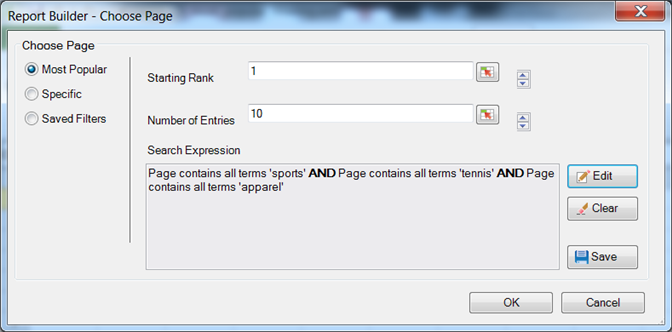

# Filtros más utilizados

{{legacy-arb}}

Filtros condicionales y de clasificación que se configuran mediante la lógica booleana con las expresiones de búsqueda Y/O.

Los filtros más utilizados son filtros de expresión que se configuran mediante la lógica booleana con las condiciones AND/OR como, por ejemplo, [!UICONTROL La página no contiene &#x200B;]*`<product name>`* con condiciones o grupos de condiciones como [!UICONTROL Incluye todo], [!UICONTROL Incluye cualquiera] o [!UICONTROL Excluye todo]. Puede [guardar](/help/analyze/legacy-report-builder/layout/c-filter-dimensions/saved-filters.md) estas expresiones para otra solicitud de este libro u otros libros de trabajo.

**Para crear un filtro de este tipo**

1. Cree o edite una solicitud y avance en el [!UICONTROL Asistente para solicitudes: Paso 2].

1. En el [!UICONTROL Asistente para solicitudes: Paso 2], haga clic en el vínculo situado junto a la dimensión en la cuadrícula y, a continuación, seleccione **[!UICONTROL Filtro]**.

   

1. En el formulario [!UICONTROL Elegir página], habilite **[!UICONTROL Más populares]** y después configure las siguientes opciones:

   **Clasificación de inicio:** La clasificación de inicio de una dimensión. La clasificación predeterminada de 1 indica el elemento principal de la lista de datos obtenidos. Por ejemplo, para la dimensión [!UICONTROL Página], una marca de inicio de 1 indica la única página más solicitada de su sitio. Se puede especificar 10 u otro valor como celda de clasificación de inicio, lo que genera un informe que comienza con 10 como valor más alto. La métrica se organiza en orden descendente, por lo que los elementos de línea con la mayor actividad aparecen primero en la lista. Si se requieren más de 50 000 nombres de página en una solicitud, pero se dispone de miles de páginas en las que informar, se puede copiar la solicitud y cambiar la clasificación de inicio para recuperar los datos adecuados en bloques de 50 000.

   **Número de entradas:** (Solo [!UICONTROL diseño de tabla dinámica]) Define la cantidad de elementos obtenidos para una métrica concreta respecto a un intervalo de fechas. Algunas métricas pueden incluir cientos de entradas para una métrica, mientas que otras pueden mostrar solamente unas cuantas entradas. Por ejemplo, para la dimensión [!UICONTROL Sección del sitio], un número de entradas de 25 indica que el informe muestra las 25 páginas más visitadas.

   Las flechas permiten cambiar la [!UICONTROL clasificación de inicio] y el [!UICONTROL número de entradas] del primer punto de datos en la hoja. De forma predeterminada, la [!UICONTROL clasificación de inicio] se establece en 1 y el [!UICONTROL número de entradas] en 10. Estos valores se pueden ajustar a partir de un mínimo de uno hasta un máximo de 50 000 para determinadas métricas. Cada métrica tiene su propio límite en el [!UICONTROL número de entradas]. No se permiten valores negativos o de cero en estos campos. Si se selecciona una [!UICONTROL clasificación de inicio] de 15 y un [!UICONTROL número de entradas] de 10, las solicitudes de datos para la métrica devuelven las 10 páginas más visitadas, donde la primera página más visitada es el número 15 de la lista para el intervalo de fechas específico. Las páginas más solicitadas del 15 al 25 se incluyen en orden descendente.

   >[!NOTE]
   >
   >La aplicación de filtros a solicitudes existentes produce cambios en los datos presentados. Supongamos que ha asignado las principales diez [!UICONTROL páginas] a las celdas $A$1 a $A$10, con el valor de 1 para la [!UICONTROL clasificación de inicio] y de 10 para el [!UICONTROL número de entradas]. Si se modifican estos valores para que muestren 1 en la [!UICONTROL clasificación de inicio] y solo 3 en el [!UICONTROL número de entradas], ya no aparecerán las celdas de datos rellenadas previamente $A$4 a $A$10.

1. Para crear una expresión de búsqueda, haga clic en **[!UICONTROL Añadir]**.

1. En el formulario [!UICONTROL Definir filtro], configure las condiciones adecuadas para sus necesidades.

   

   El icono de selección de celda permite localizar una condición definida en el valor de una celda. 

   El vínculo **Agregar condición** le permite agregar una condición a la expresión. No existe límite en la cantidad de condiciones que se pueden añadir.

1. Haga clic en **[!UICONTROL Aceptar]**.

   

1. En el formulario [!UICONTROL Seleccionar página], haga clic en **[!UICONTROL Guardar]** para guardar la expresión.
1. Haga clic en **[!UICONTROL Aceptar]**.
