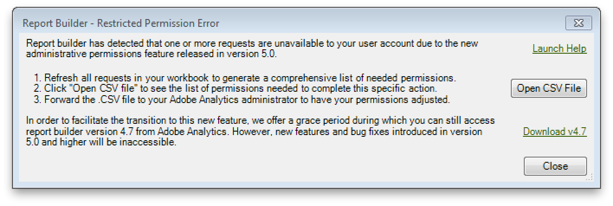

# Permisos de acceso del usuario para dimensiones y métricas

Adobe Report Builder presenta una configuración de permisos similar a la de las Herramientas de administración de Analytics.

Es posible que haya creado libros anteriormente con solicitudes dirigidas a dimensiones y métricas a las que no tiene acceso al no ser administrador. Estos permisos ahora son obligatorios.

Por ejemplo, si actualiza una solicitud que incluye dimensiones o métricas a las que no tiene acceso, obtendrá un error de permiso restringido. El mensaje de error indica que una solicitud no está disponible para su cuenta de usuario debido a permisos administrativos.

Siga estas instrucciones para **cada uno** de los libros de Report Builder que mantiene:

1. Abra el libro.
1. Actualice todas las solicitudes.
1. Si le aparece un error de permisos de acceso de usuario, haga clic en **[!UICONTROL Abrir archivo CSV]** para obtener acceso a la lista de errores de permisos restringidos.
1. Cree un archivo “AllRestrictedPermissionErrors.xlsx” y copie/pegue la lista de errores de permisos restringidos del archivo CSV en este archivo.
1. Cierre el libro de Report Builder.

Una vez que haya procesado todos los libros, debe tener una lista completa de errores de permisos restringidos en “AllRestrictedPermissionErrors.xlsx”. Envíe esta lista a su administrador de acceso del usuario de Adobe Analytics y solicítele que le conceda acceso a las métricas y dimensiones.
