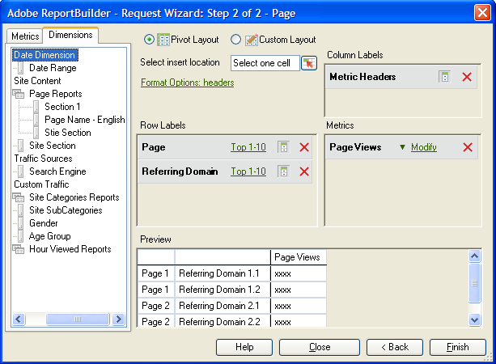

# Agregar métricas y dimensiones

{{legacy-arb}}

Pasos para agregar métricas y dimensiones a una solicitud.

1. Use el formulario [!UICONTROL Asistente para solicitudes: paso 1] para [crear la solicitud de datos](/help/analyze/legacy-report-builder/data-requests/data-requests.md) y luego haga clic en **[!UICONTROL Siguiente]**.
1. En el formulario [!UICONTROL Asistente para solicitudes: Paso 2], haga doble clic en las métricas o arrástrelas a la posición que desee.

   

   Cuando se añaden métricas, éstas no se eliminan de la ficha [!UICONTROL Métrica], ya que las métricas pueden aparecer varias veces en una solicitud. Por ejemplo, se puede mostrar el subtotal de la métrica junto con cada valor. Sin embargo, la lista de las métricas disponibles cambia cada vez que se añade o se elimina una dimensión.

   Solo se pueden añadir métricas a la sección de diseño [!UICONTROL Métrica]. Las métricas se añaden al diseño de la [!UICONTROL etiqueta de columna] como [!UICONTROL encabezados de métrica]. Si se mueve un [!UICONTROL encabezado de métrica] de un [!UICONTROL diseño de columna] a un [!UICONTROL diseño de fila], se mostrará allí y se utilizará como una métrica para desglose.

   Tenga en cuenta que se muestra una barra de búsqueda en la pestaña Métricas, justo encima de la lista Métrica.

   

## Directrices

Tenga en cuenta las siguientes directrices cuando añada métricas y dimensiones.

* Al introducir un término de búsqueda, la lista se actualiza automáticamente para mostrar las métricas que tienen etiquetas que coinciden con el término de búsqueda.
* La coincidencia distingue entre mayúsculas y minúsculas y equivale a una búsqueda *contiene*.
* Búsquedas de palabras completas y otros indicadores de búsqueda especial (comienza con, termina con, AND, OR, etc.) no son compatibles.

El término de búsqueda se borra al salir del Asistente para solicitudes al hacer clic en [!UICONTROL Finalizar] o [!UICONTROL Cancelar], al volver al Paso 1 del Asistente para solicitudes o al cambiar la categoría de Métrica.

No se borra el término de búsqueda:

* Al arrastrar y soltar (o hacer doble clic) en un elemento de métrica de la lista, de modo que se agregue al Panel de métricas Diseño de tabla dinámica/Diseño personalizado.
* Al eliminar un elemento de métrica del Panel de métricas Diseño de tabla dinámica/Diseño personalizado.
* Al hacer clic en la pestaña Dimension, vuelva a la pestaña Métrica.
* Cuando invoca otros subformularios (modales o sin modo) que al salir, vuelven al Paso 2 del Asistente para solicitudes. Varios ejemplos de estos formularios son

   * Formularios de filtro de dimensión
   * Formularios de formato de rango de fecha
   * Formularios de opciones de formato
   * Formularios de anteponer/posponer texto
   * Formularios de ubicación del rango de salida

## Ordenar una solicitud por métrica

Si lo desea, puede ordenar una solicitud por métrica.

Para ordenar una solicitud por métrica

1. Haga clic en la etiqueta de métrica.
1. Añada dimensiones. Añada las dimensiones del mismo modo que agrega las métricas. Consulte los pasos 1 y 2 anteriores.

   En la ficha [!UICONTROL Dimension], el sistema muestra las dimensiones que se desglosan o son una clasificación de cualquier informe base seleccionado en el [!UICONTROL Asistente para solicitudes: Paso 1], y en la configuración del grupo de informes. Cuando se coloca una dimensión en las cuadrículas de diseño, esta se elimina de la vista de árbol y se vuelve a calcular la lista de dimensiones restantes disponibles.

   La dimensión [!UICONTROL Fecha] se añade automáticamente. Las dimensiones de fecha disponibles cambian según la granularidad seleccionada en el [!UICONTROL Asistente para solicitudes: paso 1]. Los valores válidos son:

   * Hora
   * Día
   * Semana
   * Mes
   * Año
   * Intervalo de fecha (cuando no se especifica granularidad)

1. Modifique las métricas y las dimensiones configurando las [opciones y los filtros de formato](/help/analyze/legacy-report-builder/layout/t-format-display-headers.md).
1. Haga clic en **[!UICONTROL Finalizar]**.
En el ejemplo siguiente, las dimensiones están relacionadas con la métrica [!UICONTROL Página]. La dimensión [!UICONTROL Dominio de referencia] crea un informe de desglose entre [!UICONTROL Página] y [!UICONTROL Dominio de referencia]. La ficha [!UICONTROL Dimensión] solo se actualiza con dimensiones que se pueden añadir a un informe de desglose.

   
