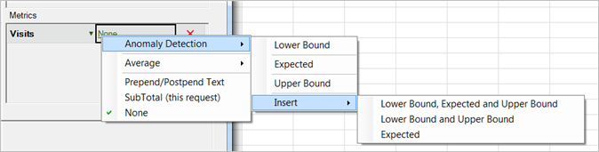

# Configuración de una solicitud de detección de anomalías

{{legacy-arb}}

Para crear una solicitud de detección de anomalías en Report Builder:

1. Seleccione un informe de tendencias, como por ejemplo el informe **[!UICONTROL Métricas del sitio]** > **[!UICONTROL Tráfico]**.
1. En el menú [!UICONTROL Aplicar granularidad], seleccione **[!UICONTROL Día]**.

   >[!NOTE]
   >
   >El menú [!UICONTROL Detección de anomalías] está disponible únicamente cuando selecciona la granularidad de día. Los 30 días previos de datos se utilizan como período de prueba de datos estadístico, independientemente del intervalo de fechas que haya seleccionado.

1. Tras configurar los intervalos de fechas, haga clic en **[!UICONTROL Siguiente]**.

   En el Asistente para solicitudes: paso 2 de 2, añada una métrica como por ejemplo **[!UICONTROL Visitas]**.

   En la métrica añadida, haga clic en el vínculo **[!UICONTROL Ninguno]**.

   

1. Seleccione **[!UICONTROL Detección de anomalías]** > **[!UICONTROL `<selection>`]**.

   

   Al seleccionar una de estas opciones, el sistema crea copias de Detección de anomalías de la métrica original. Por ejemplo, para la métrica Visitas, se agrega una métrica Visitas de límite inferior al grupo [!UICONTROL Métrica].
1. Haga clic en **[!UICONTROL Finalizar]** y seleccione la celda para los resultados de Excel.

   Consulte [Detección de anomalías](/help/analyze/analysis-workspace/c-anomaly-detection/anomaly-detection.md) para ver las definiciones.
