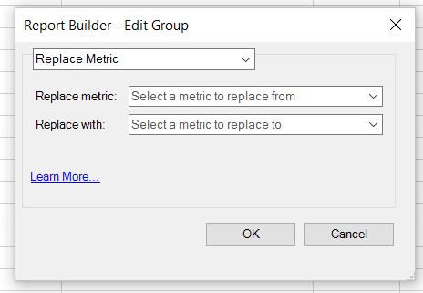

# Editar métricas en varias solicitudes

{{legacy-arb}}

Agregar, quitar o reemplazar métricas en una solicitud preexistente o en un grupo de solicitudes.

## Agregación de métricas {#section_3FBDA9668039404895059618D70FCBCD}

Cuando agregue métricas, tenga en cuenta las siguientes directrices:

* Las métricas solo se pueden agregar a solicitudes de diseño de tabla dinámica.
Si algunas de las solicitudes seleccionadas son diseños personalizados, no se pueden añadir métricas. Si el diseño es personalizado, Report Builder no sabe en qué parte de la hoja de cálculo colocar la nueva métrica.
* Si selecciona solamente solicitudes de diseño personalizado, la opción **[!UICONTROL Agregar métricas]** no estará disponible.
* Añadir métricas aumenta el tamaño de una solicitud y puede hacer que se superponga con otra solicitud. Asegúrese de que la solicitud tenga espacio suficiente alrededor para permitir la adición de métricas.
* Si la métrica agregada ya está presente en una de las solicitudes seleccionadas, no se agregará a esa solicitud.

Para agregar una o más métricas

1. Seleccione una o más solicitudes en Excel y haga clic con el botón derecho para seleccionar **[!UICONTROL Editar métricas]**. También puede hacer clic en **[!UICONTROL Administrar]** > **[!UICONTROL Editar varios]** > `<choose metric>` > **[!UICONTROL Editar grupo]** para seleccionar el grupo de solicitudes que quiere modificar.
1. Seleccione **[!UICONTROL Agregar métricas]** y elija las que le interesan.

   

1. Actualice la solicitud para ver los datos reales. Los datos sin conexión se muestran hasta que se actualizan los datos.

## Reemplazo de métricas

Cuando reemplace métricas, tenga en cuenta las siguientes directrices:

* Solo se permiten 1:1 sustituciones. No se permiten 1:many o varios:1.
* Si la métrica seleccionada no está presente en una de las solicitudes seleccionadas, la solicitud se deja sin cambios.
* La nueva métrica se coloca en la misma ubicación que la métrica sustituida.

   * **En un diseño de tabla dinámica**, si una solicitud de diseño de tabla dinámica genera fechas, visitas, visitantes, visitantes únicos diarios y *visitantes* son reemplazados por *ingresos*, el diseño de solicitud actualizado será: fecha, visita, ingresos y únicos diarios.
   * **En un diseño personalizado**, si la métrica de *visitantes* se mostraba en la celda F11, el diseño de solicitud actualizado mostrará *ingresos* en la misma celda F11.

* Si a la métrica sustituida se le ha aplicado alguna operación (promedio, texto prependiente, texto pospendiente, micrográficos), estas operaciones también se aplicarán a la nueva métrica.

Para reemplazar una métrica

1. Seleccione una o más solicitudes en Excel y haga clic con el botón derecho para seleccionar **[!UICONTROL Editar métricas]**. También puede hacer clic en **[!UICONTROL Administrar]** > **[!UICONTROL Editar varias]** > **`<choose metric>`** > **[!UICONTROL Editar grupo]** para seleccionar el grupo de solicitudes que desea modificar.

1. Seleccione **[!UICONTROL Reemplazar métrica]**.

   

1. Seleccione la métrica que desea reemplazar y la métrica de reemplazo.
1. Actualice la solicitud. Los datos sin conexión se muestran hasta que se actualizan los datos.

## Eliminación de métricas {#section_D3CD5BAC7670416593B633B2B8423C60}

Cuando elimine métricas, tenga en cuenta las siguientes directrices:

* Si alguna de las métricas que selecciona para eliminar no está presente en una de las solicitudes seleccionadas, la solicitud se deja sin cambios.
* En un diseño dinámico, la eliminación de una métrica hace que el diseño cambie para las métricas que se encuentran después de la métrica eliminada. Por ejemplo, si una solicitud de diseño dinámico genera fechas, visitas, visitantes y visitas únicas diarias, y elimina *visitas*, el diseño actualizado para la solicitud mostrará: fecha, visitantes y visitas únicas diarias.

Para eliminar métricas

1. Seleccione una o más solicitudes en Excel y haga clic con el botón derecho para seleccionar **[!UICONTROL Editar métricas]**. También puede hacer clic en **[!UICONTROL Administrar]** > **[!UICONTROL Editar varias]** > **`<choose metric>`** > **[!UICONTROL Editar grupo]** para seleccionar el grupo de solicitudes que desea modificar.

1. Seleccione **[!UICONTROL Quitar métricas]**.

   

1. Seleccione una o varias métricas para eliminarlas de la solicitud.
1. Actualice la solicitud. Hasta que actualice, verá datos sin conexión.
