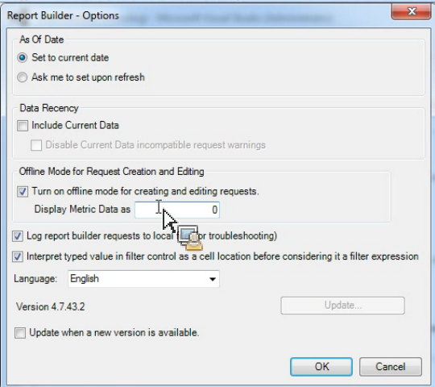

# Modo sin conexión para crear y editar solicitudes

{{legacy-arb}}

El modo sin conexión devuelve datos de marcador de posición para acelerar el proceso de creación y edición de solicitudes.

Al crear o editar una nueva solicitud, se realizan llamadas a la API de informes para recuperar la respuesta. A veces, estas llamadas ralentizan el proceso de creación de solicitudes porque tiene que esperar a que se devuelvan los datos antes de pasar al siguiente paso. El modo sin conexión solo devuelve datos de marcador de posición y no se realizan API.

Para habilitar el modo sin conexión

1. Haga clic en **[!UICONTROL Opciones]** en el menú de Report Builder.

   

1. Active la casilla junto a **[!UICONTROL Activar el modo fuera de línea para la creación y edición de solicitudes]**.
1. En el campo **[!UICONTROL Mostrar los datos de métrica como]**, introduzca los datos del marcador de posición que desee que se devuelvan en su solicitud. Por ejemplo, introduzca &quot;1&quot;.
1. Haga clic en **[!UICONTROL Aceptar]**.
1. Cree y ejecute la solicitud en modo sin conexión mediante el Asistente para solicitudes. La siguiente captura de pantalla muestra un ejemplo de una solicitud con &quot;1&quot; como datos de marcador de posición.

   

   >[!IMPORTANT]
   >
   >Asegúrese de desactivar el modo sin conexión antes de ejecutar sus solicitudes con datos reales.
