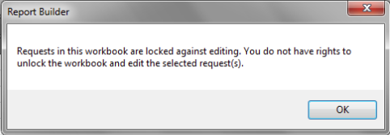

# Bloquear y desbloquear libros

{{legacy-arb}}

Puede proteger todas las solicitudes en un libro contra las solicitudes para añadir y editar si bloquea el libro. Esto permite la edición de libros sin conexión al pausar todas las solicitudes de informe para una edición más eficiente.

Como analista, bloquear un libro le permite proteger sus solicitudes de libros contra la manipulación por parte de otros usuarios dentro de su organización. Al mismo tiempo, estos usuarios aún pueden actualizar las solicitudes del libro.

Para proteger un libro contra la edición, haga clic en **[!UICONTROL Bloqueado]** en la barra de herramientas de Report Builder ( ).

Para desproteger un libro, haga clic en **[!UICONTROL Desbloqueado]** ( ).

Puede desbloquear un libro bloqueado si cuenta con uno de los siguientes permisos:

* Es administrador o
* Es la persona que ha bloqueado el libro en primer lugar. En este caso, no tiene que ser administrador.

>[!NOTE]
>
>No puede agregar una solicitud a un libro protegido a menos que tenga los permisos para desbloquear el libro.

Cuando un libro está bloqueado contra la edición de solicitudes,

* Los usuarios no pueden crear ni agregar solicitudes.
* Los usuarios no pueden editar solicitudes a través del Asistente para solicitudes.
* Los usuarios no pueden editar solicitudes con las funciones de Editar múltiples solicitudes.
* Los usuarios no pueden cortar, copiar o pegar solicitudes. Sin embargo, los usuarios aún pueden utilizar el menú contextual de cortar/copiar/pegar nativo de Excel para cortar/copiar/pegar el contenido de las solicitudes.
* Los usuarios pueden actualizar las solicitudes de forma individual o como parte de un grupo.
* Si la solicitud utiliza valores de entrada de las celdas (intervalo de fechas, segmento, filtros), los usuarios pueden cambiar estos valores en las celdas y, por tanto, editar de forma indirecta las solicitudes actualizándolas.

Si intenta editar un libro protegido a través del menú contextual, o **[!UICONTROL Administrador de solicitudes]** o **[!UICONTROL Editar varias solicitudes]**, puede que tenga o no permiso para hacerlo:

* Si no tiene permisos para desbloquear una solicitud, verá un mensaje que indica que no tiene derechos para desbloquear y editar el libro.

  

## Flujo de trabajo {#section_260D05FF632B41DB97DB43E2ADBE2E75}

Supongamos que el libro A tiene una solicitud que está bloqueada y que la creó el usuario A.

**Ejemplo 1: usuario administrador (o usuario A)**

1. El usuario inicia sesión en Report Builder y abre el libro
1. El libro A está bloqueado actualmente, por lo que el botón “Crear solicitud” está desactivado en la barra de herramientas, junto con todos los demás botones cuyas funciones están desactivadas por el bloqueo.
1. Si el usuario intenta utilizar uno de los botones desactivados, aparece el mensaje que el libro está bloqueado actualmente.
1. El usuario puede desbloquear el libro, lo cual activa completamente la función de edición.
1. Tras el desbloqueo, el libro permanece desbloqueado hasta que se vuelve a bloquear explícitamente.

**Ejemplo 2: usuario no administrador (usuario B)**

1. El usuario inicia sesión en Report Builder y abre el libro
1. El usuario no puede añadir/editar la solicitud.
1. El usuario no puede desbloquear el libro.
