# Creación de un cuadro de resultados móvil

La siguiente información enseña a los depuradores de datos de Adobe Analytics cómo configurar y presentar cuadros de resultados móviles para los usuarios ejecutivos. Para empezar, puede ver el vídeo del generador de informes de valoración de paneles de Adobe Analytics:

>[!VIDEO](https://video.tv.adobe.com/v/34544)

Un cuadro de resultados de Adobe Analytics muestra visualizaciones de datos clave para los usuarios ejecutivos en un diseño en mosaico, tal y como se muestra a continuación:

Como gestor de este informe de valoración, puede utilizar el generador de informes de valoración para configurar qué mosaicos aparecen en el informe de valoración para su consumidor ejecutivo. También puede configurar cómo se pueden ajustar las vistas detalladas o los desgloses cuando se pulsen los mosaicos. A continuación se muestra la interfaz del generador de informes de valoración:

Para crear el informe de valoración, debe hacer lo siguiente:

1. Acceda a la plantilla [!UICONTROL informe de valoración móvil en blanco].
1. Configure el cuadro de resultados con datos y guárdelo.

## Acceda a la plantilla [!UICONTROL informe de valoración móvil en blanco] {#template}

Puede acceder a la plantilla del [!UICONTROL cuadro de resultados móvil en blanco] al crear un nuevo proyecto o desde el menú Herramientas.

### Creación de un nuevo proyecto {#create}

1. Abra Adobe Analytics y haga clic en la ficha **[!UICONTROL Espacio de trabajo]**.
1. Haga clic en **[!UICONTROL Crear proyecto]** y seleccione **[!UICONTROL Informe de valoración móvil en blanco]** plantilla de proyecto.
1. Haga clic en **[!UICONTROL Crear]**.

### Menú Herramientas

1. En el menú **[!UICONTROL Herramientas]**, seleccione **[!UICONTROL Paneles de Analytics (aplicación móvil)]**.
1. En la pantalla siguiente, haga clic en **[!UICONTROL Crear nuevo informe de valoración]**.

## Configure el informe de valoración con datos y guárdelo {#configure}

Para implementar la plantilla del informe de valoración:

1. En **[!UICONTROL Propiedades]** (en el carril derecho), especifique un **[!UICONTROL grupo de informes de proyecto]** cuyos datos quiera utilizar.

   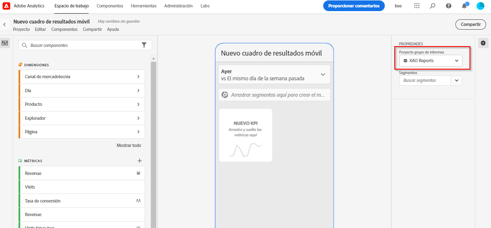

1. Para agregar un nuevo mosaico al informe de valoración, arrastre una métrica desde el panel izquierdo y suéltela en el **[!UICONTROL Arrastrar y soltar métricas aquí]** zona. También puede insertar una métrica entre dos mosaicos del mismo modo.

   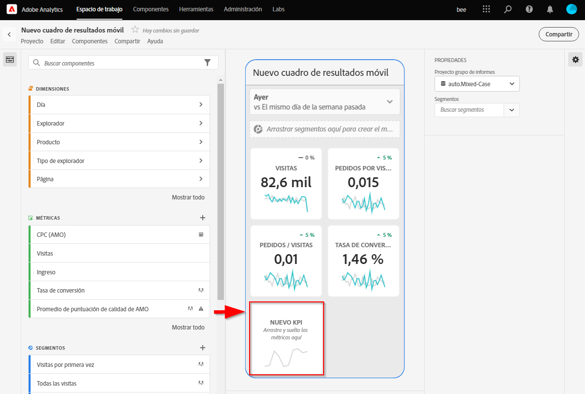

1. Desde cada mosaico puede acceder a una vista detallada que muestra información adicional sobre la métrica, como los elementos principales de una lista de dimensiones relacionadas.

## Adición de dimensiones o métricas {#dimsmetrics}

Para agregar una dimensión relacionada a una métrica, arrastre una dimensión desde el panel izquierdo y suéltela en un mosaico.

Por ejemplo, puede añadir dimensiones adecuadas (como **[!DNL Marketing Channel]**, en este ejemplo) a la métrica **[!UICONTROL Visitantes únicos]** arrastrándolas y soltándolas en el mosaico. Los desgloses de las dimensiones aparecen en la sección [!UICONTROL Aumentar detalle] de la diapositiva de detalle **[!UICONTROL Propiedades]** específica. Puede agregar varias dimensiones a cada mosaico.

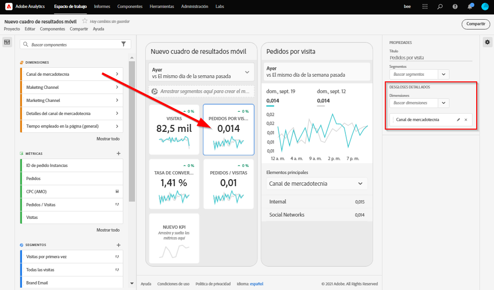

## Aplicar segmentos {#segments}

Para aplicar segmentos a mosaicos individuales, arrastre un segmento desde el panel izquierdo y suéltelo directamente sobre el mosaico.

Si desea aplicar el segmento a todos los mosaicos del informe de valoración, suelte el mosaico encima del informe de valoración. O bien, también puede aplicar segmentos seleccionando segmentos en el menú de filtro debajo de los intervalos de fechas. You [configurar y aplicar filtros para los informes de valoración](https://experienceleague.adobe.com/docs/analytics-learn/tutorials/analysis-workspace/using-panels/using-drop-down-filters.html?lang=es) del mismo modo que lo haría en Adobe Analytics Workspace.

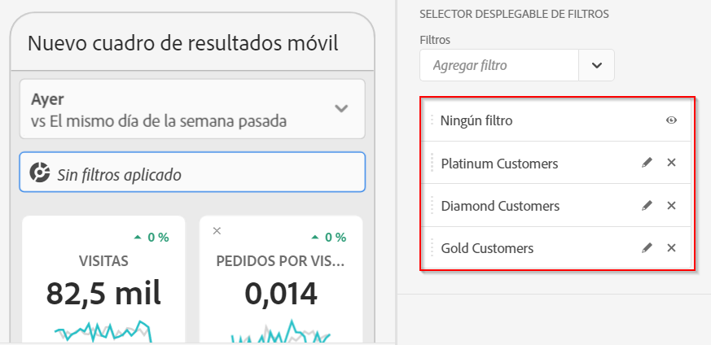

## Adición de intervalos de fechas {#dates}

Añada y quite combinaciones de intervalos de fechas que se puedan seleccionar en el cuadro de resultados seleccionando la lista desplegable de intervalo de fechas.

Cada nuevo cuadro de resultados comienza con 6 combinaciones de intervalo de fechas que se centran en los datos de hoy y ayer. Puede quitar intervalos de fechas innecesarios haciendo clic en la x o puede editar cada combinación de intervalos de fechas haciendo clic en el lápiz.

Para crear o cambiar una fecha principal, utilice la lista desplegable para seleccionar entre intervalos de fechas disponibles o arrastre y suelte un componente de fecha del carril derecho en la zona de colocación.

Para crear una fecha de comparación, puede seleccionar entre cómodos preconjuntos para comparaciones de tiempo comunes en el menú desplegable. También puede arrastrar y soltar un componente de fecha desde el carril derecho.

Si el intervalo de fechas que desea aún no se ha creado, puede crear uno nuevo haciendo clic en el icono de calendario.

Esto le llevará al generador de intervalos de fechas, donde puede crear y guardar un nuevo componente de intervalo de fechas.

### Mostrar/ocultar comparación de intervalos de fechas {#show-comparison-dates}

Para mostrar u ocultar intervalos de fechas de comparación, active la configuración **Incluir fechas de comparación**.

La configuración está *activada* de forma predeterminada. Anule la selección de la opción si no desea ver las fechas de comparación.

## Aplicación de visualizaciones {#viz}

Vea un vídeo sobre visualizaciones para cuadros de resultados móviles:

>[!VIDEO](https://video.tv.adobe.com/v/337570/?quality=12&learn=on)

Los paneles de Analytics ofrecen cuatro visualizaciones que le proporcionan interesantes conocimientos de los elementos y las métricas de dimensión. Cambie a una visualización diferente al variar el [!UICONTROL tipo de gráfico] de las [!UICONTROL propiedades] de un mosaico. Seleccione el mosaico derecho y cambie el tipo de gráfico.

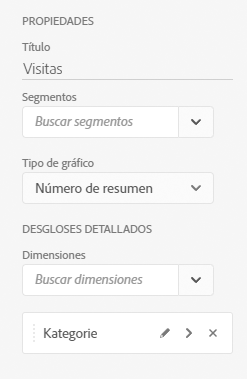

O bien, haga clic en el botón [!UICONTROL Visualizaciones] en el carril izquierdo y arrastre y suelte la visualización derecha en el mosaico:

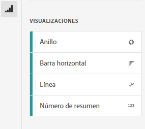

### [!UICONTROL Número de resumen]

Utilice la visualización Número de resumen para resaltar un número elevado que es importante en un proyecto.

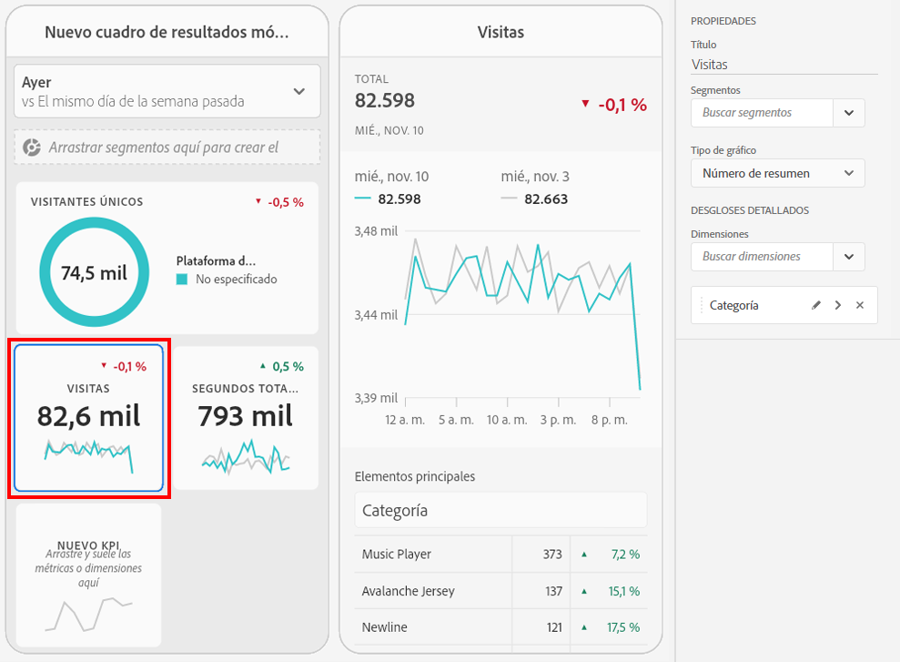

### [!UICONTROL Anillo]

Similar a un gráfico circular, esta visualización muestra los datos como partes o segmentos de un todo. Utilice un gráfico de anillo para comparar porcentajes de un total. Por ejemplo, supongamos que desea ver qué plataforma de publicidad contribuyó al número total de visitantes únicos:

### [!UICONTROL Líneas]

La visualización de línea representa las métricas con una línea para mostrar cómo cambian los valores con el paso del tiempo. Un gráfico de líneas muestra las dimensiones a lo largo del tiempo, pero funciona con cualquier visualización. En este ejemplo se visualiza la dimensión de la categoría del producto.

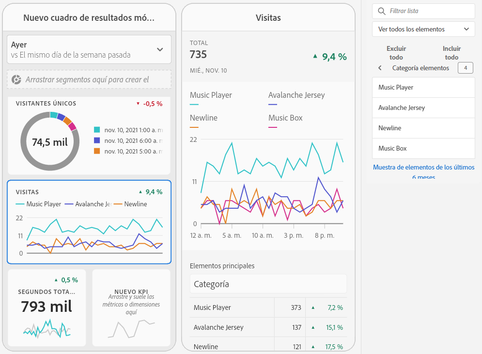

### [!UICONTROL Barra horizontal]

Esta visualización muestra las barras horizontales que representan los distintos valores de una o varias métricas. Por ejemplo, para ver fácilmente cuáles son sus productos principales, utilice las [!UICONTROL Barras horizontales] para su visualización preferida.

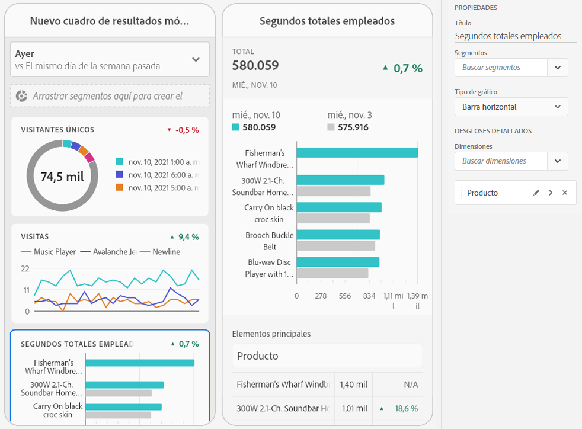

### Eliminación de elementos de dimensión [!UICONTROL No especificados]

Si desea quitar los elementos de dimensión [!UICONTROL No especificados] de los datos, haga lo siguiente:

1. Seleccione el mosaico correcto.
1. En el carril derecho, debajo de **[!UICONTROL Profundizar en]**, seleccione la flecha derecha junto al elemento de dimensión cuyos elementos **[!UICONTROL No especificados]** desea eliminar.

   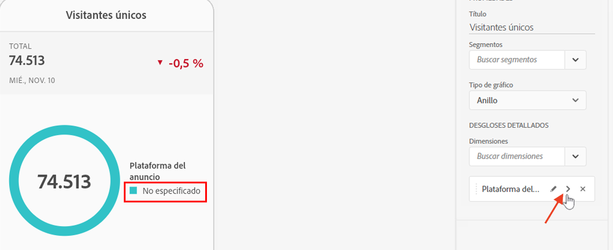

1. Haga clic en el icono situado junto a **[!UICONTROL No especificado]** para eliminar los datos no especificados de los informes. También puede eliminar cualquier otro elemento de dimensión.

## Vista y configuración de propiedades de mosaico {#tiles}

Al hacer clic en un mosaico en el generador de informes de valoración, el carril derecho muestra las propiedades y características asociadas con ese mosaico y su diapositiva de detalle. En este carril, puede proporcionar un nuevo **Título** para el mosaico y, alternativamente, configurar el mosaico aplicando segmentos.

## Ver diapositivas de detalles {#view-detail-slides}

Cuando hace clic en un mosaico, la ventana emergente dinámica le muestra cómo aparece la diapositiva de detalle para el usuario ejecutivo en la aplicación. Puede agregar dimensiones para desglosar los datos según sus necesidades específicas. Si no se ha aplicado ninguna dimensión, la dimensión de desglose será **hora** o **días**, según el intervalo de fecha predeterminado.

Los desgloses afinan el análisis al desglosar las métricas por elementos de dimensión como los siguientes:

* Métrica Visitantes únicos desglosada por plataforma de publicidad (AMO ID)
* Visitas desglosadas por categoría de producto (venta minorista)
* Ingresos totales desglosados por nombre del producto

Cada dimensión agregada a la diapositiva de detalle se mostrará en una lista desplegable de la vista de la diapositiva de detalle de la aplicación. El usuario ejecutivo puede elegir entre las opciones que se muestran en la lista desplegable.

## Personalización de diapositivas de detalle {#customize-detail-slide}

Las diapositivas de detalles personalizadas le permiten centrarse aún más en la información que comparte con su audiencia.

>[!VIDEO](https://video.tv.adobe.com/v/3410002)

Puede modificar el diseño de cada diapositiva de detalle y añadir texto para explicar mejor lo que el usuario final puede ver en los datos. También puede cambiar el tipo de gráfico mediante el menú desplegable.

### Cambio del diseño de la diapositiva

Cambie el diseño de la diapositiva para centrarse en la información más importante. Por ejemplo, puede cambiar el diseño para mostrar solo un gráfico o una tabla. Para cambiar el diseño de la diapositiva, seleccione uno de los formatos prediseñados.

También puede cambiar el diseño de la diapositiva arrastrando y soltando los componentes de visualización del carril izquierdo al lienzo. Cada diapositiva de detalle solo puede admitir dos visualizaciones a la vez.

### Adición de texto descriptivo a una diapositiva

Puede agregar texto para proporcionar información significativa acerca de lo que contienen los gráficos o matices sobre los datos.

Para agregar texto a una diapositiva de detalles, seleccione un diseño que muestre el símbolo `T` o arrastre y suelte el componente de visualización Texto desde el carril izquierdo. El editor de texto se abrirá automáticamente al agregar una nueva visualización de texto o al elegir un diseño de diapositiva con texto. El editor de texto proporciona todas las opciones estándar para dar formato al texto. Puede aplicar estilos de texto como párrafo, encabezados y subencabezados, y aplicar negrita y cursiva. Puede justificar el texto, agregar listas con números y viñetas y agregar vínculos. Cuando haya terminado de editar, seleccione el botón minimizar en la esquina superior derecha del editor de texto para cerrarlo. Para editar el texto que ya añadió, seleccione el icono de lápiz para abrir de nuevo el editor de texto.

## Eliminación de componentes {#remove}

Del mismo modo, para eliminar un componente que se aplique a todo el informe de valoración, haga clic en cualquier lugar del informe de valoración fuera de los mosaicos y, a continuación, elimínelo haciendo clic en el **x** que aparece al pasar el ratón por encima del componente, como se muestra a continuación para el **Visitas por primera vez** segmento:

## Creación de historias de datos {#create-data-story}

Una historia basada en datos es una colección de puntos de datos de apoyo, contexto empresarial y métricas relacionadas creada en torno a un tema o métrica central.

Por ejemplo, si se centra en el tráfico web, la métrica más importante puede ser las visitas, pero también es posible que le interesen los visitantes nuevos y los únicos, o que desee ver los datos desglosados por página web o por el tipo de dispositivo desde el que proviene el tráfico. Las historias basadas en datos en proyectos de cuadros de resultados móviles le permiten poner sus métricas más importantes en primer plano y, al mismo tiempo, contar toda la historia que hay detrás con múltiples diapositivas detalladas.

Vea el vídeo para obtener más información acerca de la creación de historias basadas en datos en los proyectos de cuadro de resultados móviles en Analysis Workspace.

>[!VIDEO](https://video.tv.adobe.com/v/3416392/?quality=12&learn=on)

**Para crear una historia basada en datos**

Cree su historia basada en datos al agregar varias diapositivas de detalles a un mosaico.

1. Comience con un proyecto de cuadro de resultados móvil.
1. Seleccione un mosaico desde el que desee crear una historia.

   

   {width=".50%"}

1. Agregue diapositivas para generar la historia basada en datos. La primera diapositiva se genera de forma predeterminada.

   Para agregar nuevas diapositivas, pase el ratón sobre una o haga clic en ella y, a continuación, seleccione una de las opciones disponibles:

   * Pulse el signo [!UICONTROL +] para crear una nueva diapositiva.

   * Pulse el icono de duplicado para duplicar la diapositiva existente.

1. Si crea una diapositiva en blanco, arrastre y suelte los componentes desde el carril izquierdo o elija un diseño para llenarla automáticamente con los datos del mosaico.

   

Para eliminar una diapositiva, pulse el icono de papelera.

### Personalización de una historia basada en datos {#customize-data-story}

Las historias basadas en datos le permiten personalizar todos los elementos para que pueda compartir la información que desee y excluir lo que no necesite. Puede personalizar mosaicos y diapositivas individuales para agregar filtros, mostrar desgloses, cambiar el diseño y modificar las visualizaciones.

**Para personalizar mosaicos**

1. Toque un mosaico. El mosaico seleccionado se resalta en azul y el panel derecho muestra las propiedades.
1. Cambie el título, el tipo de gráfico y otras opciones del mosaico.
1. Arrastre un componente al mosaico.

   

   Cuando arrastra y suelta un componente como una visualización en un mosaico, este se aplica a todas las diapositivas de historias basadas en datos.

1. Para aplicar un cambio solo al título, mantenga pulsada la tecla Mayús.

   

>[!NOTE]
>Las diapositivas heredan los componentes del mosaico, pero los mosaicos no.

**Para personalizar las diapositivas individuales**

Puede cambiar la visualización de diapositivas individuales en una historia basada en datos. Por ejemplo, puede cambiar una barra horizontal por un gráfico de anillos para una diapositiva específica. También puede cambiar el diseño. Consulte [los detalles de personalización de diapositivas](#customize-detail-slide).

### Vista previa de una historia basada en datos {#preview-data-story}

Después de crear una historia basada en datos, use el botón **Vista previa** para verla e interactuar con ella como si fuera un usuario de la aplicación. Para obtener información acerca de la vista previa de la historia basada en datos, consulte [Vista previa del cuadro de resultados](#preview)

### Navegación entre mosaicos y diapositivas {#navigate-tiles-slides}

La barra de navegación muestra iconos que representan lo que hay en cada diapositiva. Si hay muchas, la barra de navegación facilita el desplazamiento a una diapositiva específica.

Para moverse entre los mosaicos y las diapositivas, pulse la barra de navegación.

{width="25%"}

También puede navegar hacia atrás y hacia adelante utilizando las flechas del teclado o seleccionando un componente y manteniéndolo a la izquierda o a la derecha de la pantalla para desplazarse.

## Vista previa del cuadro de resultados {#preview}

Puede obtener una vista previa del aspecto y el funcionamiento del cuadro de resultados una vez que se publique en la aplicación de paneles de Analytics.

1. Haga clic en **[!UICONTROL Vista previa]** en la esquina superior derecha de la pantalla.

   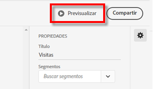

1. Para ver el aspecto que tendrá el cuadro de resultados en distintos dispositivos, seleccione un dispositivo del menú desplegable [!UICONTROL Vista previa del dispositivo].

   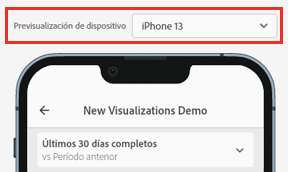

1. Para interactuar con la vista previa, puede hacer lo siguiente:

   * Haga clic con el botón izquierdo para simular los toques en la pantalla del teléfono.

   * Utilice la función de desplazamiento del equipo para simular el desplazamiento por la pantalla del teléfono con el dedo.

   * Haga clic y mantenga presionado para simular el efecto del dedo en la pantalla del teléfono. Esto resulta útil para interactuar con las visualizaciones en la vista detallada.

## Nombrar un cuadro de resultados {#name}

Para asignar un nombre al informe de valoración, haga clic en el área de nombres en la parte superior izquierda de la pantalla y escriba el nuevo nombre.

## Uso compartido de un cuadro de resultados {#share}

Para compartir el informe de valoración con un usuario ejecutivo:

1. Haga clic en el menú **[!UICONTROL Compartir]** y seleccione **[!UICONTROL Compartir informe de valoración]**.

1. En el formulario **[!UICONTROL Compartir informe de valoración móvil]**, rellene los campos con:

   * Proporción del nombre del cuadro de resultados
   * Proporción de la descripción del cuadro de resultados
   * Añada las etiquetas relevantes
   * Especificación de los destinatarios del cuadro de resultados

1. Haga clic en **[!UICONTROL Compartir]**.

Una vez que haya compartido un cuadro de resultados, los destinatarios podrán acceder a él en sus paneles de Analytics. Si realiza cambios posteriores en el informe de valoración en el generador de informes de valoración, estos se actualizarán automáticamente en el informe compartido. Los usuarios ejecutivos verán los cambios después de actualizar el informe de valoración en su aplicación.

Si actualiza el cuadro de resultados con nuevos componentes, es posible que desee volver a compartirlo (marque la opción **[!UICONTROL Compartir componentes incrustados]**) para asegurarse de que los usuarios ejecutivos tengan acceso a estos cambios.

### Compartir informes de valoración mediante un vínculo que se puede compartir

El uso de un vínculo que se puede compartir facilita el uso compartido de un informe de valoración en una aplicación de correo electrónico, documento o mensaje de texto. El vínculo que se puede compartir permite a los destinatarios abrir el informe de valoración en su escritorio o en la aplicación móvil de paneles. La vinculación profunda que se puede compartir facilita aún más el uso compartido de los proyectos e incrementa la participación con las partes interesadas.

Para compartir un informe de valoración mediante un vínculo que se puede compartir

1. Haga clic en el menú **[!UICONTROL Compartir]** y seleccione **[!UICONTROL Compartir informe de valoración]**.

   

1. Copie el vínculo y péguelo en una aplicación de correo electrónico, documento o mensajería instantánea.

   Cuando un destinatario utiliza una aplicación de escritorio o un explorador para abrir el vínculo, el proyecto del informe de valoración móvil se abrirá en Workspace.

   Cuando un destinatario abre el vínculo en un dispositivo móvil, el informe de valoración se abre directamente en la aplicación de paneles de Analytics.

   Si un destinatario no ha descargado la aplicación móvil, se le dirigirá al listado de aplicaciones de App Store o Google Play Store donde puede descargarla.

