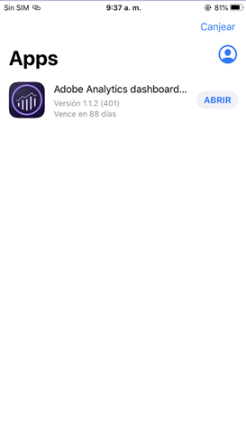
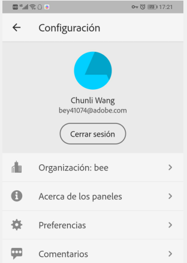
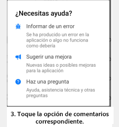

# BETA: Guía del curador para la aplicación móvil de Analytics

## Primeros pasos

La aplicación móvil de Adobe Analytics proporciona perspectivas de Adobe Analytics en cualquier momento y lugar.   La aplicación permite a los usuarios acceder desde dispositivos móviles a cuadros de mandos intuitivos que se crean y comparten desde la interfaz de usuario de escritorio de Adobe Analytics. Los cuadros de mando son una colección de métricas clave y otros componentes presentados en un diseño en mosaico que puede tocar para obtener desgloses e informes de tendencias más detallados. Puede adaptar los cuadros de mandos según los datos más importantes. La aplicación móvil es compatible con los sistemas operativos iOS y Android.

## Acerca de esta guía

Esta guía está pensada para ayudar a los curadores de datos de Adobe Analytics a configurar Scorecards para sus usuarios ejecutivos en la aplicación móvil de Analytics. Los curadores pueden ser administradores de la organización o personas con otras funciones responsables de la configuración de los cuadros de mandos de la aplicación, lo que permite a los usuarios ejecutivos ver una amplia representación de datos de resumen importantes de forma rápida y sencilla en sus propios dispositivos móviles. Aunque los usuarios ejecutivos son los usuarios finales de la aplicación móvil de Analytics, esta guía ayudará a los curadores de datos a configurar la aplicación de forma eficaz para esos usuarios.

## Glosario de términos

En la tabla siguiente se describen los términos para comprender la audiencia, las funciones y el funcionamiento de la aplicación móvil de Analytics.

| Término | Definición |
|--- |--- |
| Consumidor | Persona ejecutiva que ve métricas clave y perspectivas de Analytics en un dispositivo móvil |
| Curador | Persona alfabetizada de datos que busca y distribuye perspectivas de Analytics y configura los cuadros de mandos para que los vea el consumidor |
| Revisión | Acto de crear o editar un cuadro de mandos móvil que contenga métricas, dimensiones y otros componentes relevantes para el cliente |
| Cuadro de mandos | Vista de aplicación móvil que contiene uno o más mosaicos |
| Mosaico | Representación de una métrica dentro de una vista Cuadro de mandos |
| Desglosar | Una vista secundaria a la que se puede acceder tocando un mosaico en el cuadro de mandos. Esta vista se expande en la métrica mostrada en el mosaico y, opcionalmente, informa sobre dimensiones de desglose adicionales. |
| Intervalo de fechas | El intervalo de fechas principal para los informes de aplicaciones móviles |
| Intervalo de fechas de comparación | Intervalo de fechas que se compara con el intervalo de fechas principal |

 
## Creación de un cuadro de mandos para usuarios ejecutivos

Un cuadro de mandos móvil muestra visualizaciones de datos clave para los usuarios ejecutivos en un diseño en mosaico, como se muestra a continuación:

Como curador de este cuadro de mandos, puede utilizar el Generador de cuadros de mando para configurar los mosaicos que aparecen en el cuadro de mandos para su consumidor. También puede configurar cómo se pueden ajustar las vistas detalladas o los desgloses una vez tocados los mosaicos. La interfaz del Generador de cuadros de mando se muestra a continuación:

Para crear el cuadro de mandos, deberá hacer lo siguiente:

1. Acceda a la plantilla Cuadro de mandos móvil en blanco.
2. Configure el cuadro de mandos con datos y guárdelo.

### Acceso a la plantilla Cuadro de mandos móvil en blanco

Puede acceder a la plantilla Cuadro de mandos móvil en blanco de una de las siguientes formas:

**Crear un nuevo proyecto**

1. Abra Adobe Analytics y haga clic en la ficha **Espacio de trabajo** .
2. Haga clic en el botón **Crear nuevo proyecto** y seleccione la plantilla de proyecto de cuadro de mando móvil **en blanco** .
3. Click the **Create** button.

*Nota: Si no ve la plantilla Cuadro de mandos móvil en blanco, como se muestra a continuación, su empresa aún no se ha activado para la versión beta. Comuníquese con el administrador de servicio al cliente.*

**Agregar un proyecto**

En la pantalla **Proyectos** , en la ficha **Componentes** , haga clic en el botón **Agregar** y seleccione Cuadro de mandos **móvil**.

**Uso de las herramientas de Analytics**

En Analytics, haga clic en el menú **Herramientas** y seleccione Aplicación **móvil**. En la pantalla siguiente, haga clic en el botón **Crear cuadro de mandos** .

### Configurar el cuadro de mandos con datos y guardarlo

Para implementar la plantilla Cuadro de mandos:

1. En **Propiedades** (en el carril derecho), especifique un grupo **de informes de** proyecto desde el que desee utilizar los datos.

   

2. Para agregar un nuevo mosaico al cuadro de mandos, arrastre una métrica desde el panel izquierdo y suéltela en la zona **Arrastrar y soltar métricas aquí** . También puede insertar una métrica entre dos mosaicos mediante un flujo de trabajo similar.

   

   *Desde cada mosaico, puede acceder a una vista detallada que muestra información adicional sobre la métrica, como elementos principales para una lista de dimensiones relacionadas.*

3. Para agregar una dimensión relacionada a una métrica, arrastre una dimensión desde el panel izquierdo y suéltela en un mosaico. Por ejemplo, puede agregar dimensiones adecuadas (como Región **** DMA, en este ejemplo) a la métrica Visitantes **** únicos arrastrándola y soltándola en el mosaico; las dimensiones que agregue aparecerán en la sección de desglose de **Propiedades** específicas del mosaico. Puede agregar varias dimensiones a cada mosaico.

   

   *Nota: También puede agregar una dimensión a todos los mosaicos soltándola en el lienzo Cuadro de mandos.*

   Al hacer clic en un mosaico en el Generador de cuadros de mandos, el carril derecho muestra las propiedades y características asociadas con ese mosaico. En este carril, puede proporcionar un nuevo **Título** para el mosaico y, de forma alternativa, configurar el mosaico especificando componentes en lugar de arrastrarlos y soltarlos desde el carril izquierdo.

   Además, si hace clic en mosaicos, una ventana emergente dinámica mostrará cómo el usuario ejecutivo de la aplicación verá la vista Desglose. Si no se ha aplicado ninguna dimensión al mosaico, la dimensión de desglose será **hora** o **días**, según el intervalo de fechas predeterminado.

   

   *Observe cómo cada dimensión agregada al mosaico se mostrará en una lista desplegable en la vista detallada de la aplicación. El usuario ejecutivo puede elegir entre las opciones enumeradas en la lista desplegable.*

4. Para aplicar segmentos a mosaicos individuales, arrastre un segmento desde el panel izquierdo y suéltelo directamente sobre el mosaico. Si desea aplicar el segmento a todos los mosaicos del cuadro de mandos, coloque el mosaico encima del cuadro de mandos.

5. Del mismo modo, para eliminar un componente que se aplique a todo el cuadro de mandos, haga clic en cualquier lugar del cuadro de mandos fuera de los mosaicos y, a continuación, elimínelo haciendo clic en la **x** que aparece al pasar el ratón sobre el componente, como se muestra a continuación para el segmento Clientes **** móviles:

   

6. En **Propiedades** de cuadro de mandos, también puede especificar de forma opcional lo siguiente:

   * Un Intervalo **De Fechas** Predeterminado. Los intervalos que especifique aquí serán los mismos que se aplican al primer acceso del usuario ejecutivo al cuadro de mandos en su aplicación.

   * Intervalo de fechas de **comparación**

   * Cualquier **segmento** que se aplique a todo el cuadro de mandos

7. Para asignar un nombre al cuadro de mandos, haga clic en el espacio de nombres en la parte superior izquierda de la pantalla y escriba el nuevo nombre.

   

## Compartir el cuadro de mandos

Para compartir cuadro de mandos con un usuario ejecutivo:

1. Haga clic en el menú **Compartir** y seleccione **Compartir cuadro de mandos**.

2. En el formulario **Compartir** , complete los campos de la siguiente manera:

   * Proporcionar el nombre del cuadro de mandos
   * Proporcionar una descripción del cuadro de mandos
   * Adición de etiquetas relevantes
   * Especificación de los destinatarios para el cuadro de mandos
   * Seleccione la opción para **compartir componentes incrustados con destinatarios** para asegurarse de que el usuario ejecutivo tiene acceso a todos los componentes del cuadro de mandos.

3. Haga clic en **Compartir**.

Una vez que haya compartido un cuadro de mandos, los destinatarios podrán acceder a él en su aplicación móvil de Analytics. Si realiza cambios posteriores en el cuadro de mandos en el Generador de cuadros de mando, se actualizarán automáticamente en el cuadro de mando compartido. Los usuarios ejecutivos verán los cambios después de actualizar el cuadro de mandos en su aplicación.

*Nota: Si actualiza el cuadro de mandos agregando nuevos componentes, es posible que desee volver a compartir el cuadro de mandos (y marcar la opción Compartir **automáticamente componentes incrustados con destinatarios**) para asegurarse de que los usuarios ejecutivos tengan acceso a estos cambios.*

## Configurar usuarios ejecutivos con la aplicación

En algunos casos, los usuarios ejecutivos pueden necesitar asistencia adicional para acceder a la aplicación y utilizarla. Esta sección proporciona información para ayudarle a proporcionar esa asistencia.

### Ayudar a los usuarios ejecutivos a obtener acceso

Para ayudar a los usuarios ejecutivos a acceder a sus cuadros de mandos en la aplicación, asegúrese de que:

* Los requisitos mínimos del sistema operativo móvil en sus dispositivos son iOS versión 10 o superior, o Android versión 4.4 (KitKat) o superior
* Tienen un inicio de sesión válido en Adobe Analytics
* Ha creado correctamente cuadros de mandos móviles para ellos y comparte estos cuadros de mandos con ellos.
* Tienen acceso a Analysis Workspace y al grupo de informes en el que se basa el cuadro de mandos
* Tienen acceso a los componentes que incluye el cuadro de mandos. Nota: Puede seleccionar una opción al compartir los cuadros de mandos para compartir **automáticamente los componentes incrustados con los destinatarios**.

### Ayudar a los usuarios ejecutivos a utilizar la aplicación

Durante la fase beta y antes de que la aplicación se muestre al público, puede controlar quién tiene acceso a la aplicación.

1. Ayuda a los usuarios ejecutivos a descargar e instalar la aplicación. Para ello, proporcione los siguientes pasos para ampliar el acceso a los usuarios ejecutivos, en función de si utilizan un iOS o un dispositivo Android.

   **Para usuarios ejecutivos en iOS:**

   1. Haga clic en el siguiente vínculo público (también está disponible en Analytics en **Herramientas** &gt; Aplicación **** móvil):

      [Vínculo](https://testflight.apple.com/join/WtXMQxlI)de iOS: `https://testflight.apple.com/join/WtXMQxlI`

      Después de hacer clic en el vínculo, aparece la siguiente pantalla de prueba:

      

   2. Toque el vínculo **Ver en App Store** en la pantalla para descargar la aplicación Testflight.

   3. Después de instalar la aplicación Testflight, busque e instale la aplicación móvil de Adobe Analytics en Testflight, como se muestra a continuación:

      
   **Para usuarios ejecutivos en Android:**

   1. Toque el siguiente vínculo de Play Store en el dispositivo del usuario (también está disponible en Analytics en **Herramientas** &gt; Aplicación **** móvil):

      [Android](https://play.google.com/apps/testing/com.adobe.analyticsmobileapp): `https://play.google.com/apps/testing/com.adobe.analyticsmobileapp`

      Después de tocar el vínculo, toque el vínculo Convertir en probador en la siguiente pantalla:

      

   2. Toque el vínculo **descargarlo en Google Play** en la siguiente pantalla:

      

   3. Descargue e instale la aplicación.
   Una vez descargado e instalado, los usuarios ejecutivos pueden iniciar sesión en la aplicación con sus credenciales de Adobe Analytics existentes; admitimos Adobe ID y Enterprise ID.

   

2. Ayudarles a acceder a su cuadro de mandos. Después de que los usuarios ejecutivos inicien sesión en la aplicación, aparece la pantalla **Elegir una empresa** . Esta pantalla enumera las empresas de inicio de sesión a las que pertenece el usuario ejecutivo. Para ayudarles a acceder al cuadro de mandos:

   * Toque el nombre de la empresa de inicio de sesión o de la organización de Experience Cloud que se aplica al cuadro de mandos que ha compartido. A continuación, la lista Cuadro de mandos muestra todos los cuadros de mando que se han compartido con el ejecutivo en esa empresa de inicio de sesión.
   * Ayudarles a ordenar esta lista por **Últimas modificaciones**, si corresponde.
   * Toque el nombre del cuadro de mandos para verlo.
   

   Nota: Si el usuario ejecutivo inicia sesión y ve un mensaje que dice que no se ha compartido nada:

   * Es posible que el usuario ejecutivo haya seleccionado una instancia incorrecta de Analytics
   * Es posible que el cuadro de mandos no se haya compartido con el usuario ejecutivo

      
   Compruebe que el usuario ejecutivo puede iniciar sesión en la instancia de Analytics correcta y que se ha compartido el cuadro de mandos.

3. Explicar al usuario ejecutivo cómo aparecen los mosaicos en los cuadros de mandos compartidos.

   

   Información adicional sobre mosaicos:

   * La granularidad de los minigráficos depende de la longitud del intervalo de fechas:
      * Un día muestra una tendencia por hora
      * Más de un día y menos de un año muestran una tendencia diaria
      * Un año o más muestra una tendencia semanal
   * La fórmula de cambio de valor porcentual es el total de la métrica (intervalo de fechas actual) - total de la métrica (intervalo de fechas de comparación) / total de la métrica (intervalo de fechas de comparación).
   * Puede bajar la pantalla para actualizar el cuadro de mandos.

4. Toque un mosaico para mostrar el funcionamiento de un desglose detallado del mosaico.

   

5. Para cambiar los intervalos de fechas del cuadro de mandos:

   

   *Nota: También puede cambiar los intervalos de fechas dentro de la vista Desglosar que se muestra arriba de la misma manera.*

   Según el intervalo que toque (**Día**, **Semana**, **Mes** o **Año**), verá dos opciones para los intervalos de fechas: el intervalo de tiempo actual o el que le preceda inmediatamente. Toque una de estas dos opciones para seleccionar el primer rango. En la lista **COMPARAR con** , toque una de las opciones presentadas para comparar los datos de este período de tiempo con el primer intervalo de fechas seleccionado. Puntee **Listo** en la parte superior derecha de la pantalla. El campo **Intervalos** de fechas y los mosaicos Cuadro de mandos se actualizan con los nuevos datos de comparación de los nuevos rangos seleccionados.

6. Para dejar comentarios sobre esta aplicación:

   1. Toque el icono de usuario en la parte superior derecha de la pantalla de la aplicación.
   2. En la pantalla **Mi cuenta** , toque la opción **Comentarios** .
   3. Toque para ver las opciones para dejar comentarios.
   
   

**Para informar de un error**:

Toque la opción y elija una subcategoría del error. En el formulario para informar de un error, proporcione su dirección de correo electrónico en el campo superior y su descripción del error en el campo debajo. Se adjunta automáticamente al mensaje una captura de pantalla de la información de la cuenta, pero puede eliminarla si lo desea tocando la **X** en la imagen adjunta. También tiene opciones para grabar una pantalla, agregar más capturas de pantalla o adjuntar archivos. Para enviar el informe, toque el icono del plano de papel en la parte superior derecha del formulario.

**Para sugerir una mejora**:

Toque la opción y elija una subcategoría para la sugerencia. En el formulario de sugerencias, proporcione su dirección de correo electrónico en el campo superior y su descripción del error en el campo debajo. Se adjunta automáticamente al mensaje una captura de pantalla de la información de la cuenta, pero puede eliminarla si lo desea tocando la **X** en la imagen adjunta. También tiene opciones para grabar una pantalla, agregar más capturas de pantalla o adjuntar archivos. Para enviar la sugerencia, toque el icono de plano de papel en la parte superior derecha del formulario.

**Para hacer una pregunta**:

Puntee en la opción y proporcione su dirección de correo electrónico en el campo superior y su pregunta en el campo inferior. Se adjunta automáticamente una captura de pantalla al mensaje, pero puede eliminarla si lo desea tocando la **X** en la imagen adjunta. También tiene opciones para grabar una pantalla, agregar más capturas de pantalla o adjuntar archivos. Para enviar la pregunta, toque el icono de plano de papel en la parte superior derecha del formulario.
