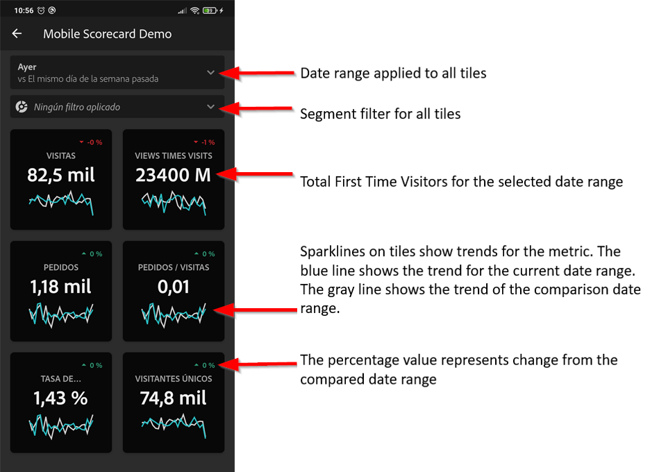

# Aplicación móvil de Analytics: Guía de inicio rápido del usuario ejecutivo

## Primeros pasos

La aplicación móvil de Adobe Analytics proporciona perspectivas de Adobe Analytics en cualquier momento y lugar.  La aplicación permite que los usuarios tengan acceso móvil a cuadros de mandos intuitivos. Los cuadros de mando son una colección de métricas clave y otros componentes presentados en un diseño en mosaico que puede tocar para obtener desgloses e informes de tendencias más detallados. La aplicación móvil es compatible con los sistemas operativos iOS y Android.

## Acerca de esta guía

 Esta guía está pensada para ayudar a los usuarios ejecutivos a leer e interpretar cuadros de mando en la aplicación móvil de Analytics. La aplicación permite a los usuarios ejecutivos ver una amplia representación de datos de resumen importantes de forma rápida y sencilla en sus propios dispositivos móviles.

## Glosario de términos

| Término | Definición |
|--- |--- |
| Consumidor | Persona ejecutiva que ve métricas clave y perspectivas de Analytics en un dispositivo móvil |
| Curador | Persona alfabetizada de datos que busca y distribuye perspectivas de Analytics y configura los cuadros de mandos para que los vea el consumidor |
| Revisión | Acto de crear o editar un cuadro de mandos móvil que contenga métricas, dimensiones y otros componentes relevantes para el cliente |
| Cuadro de mandos | Vista de aplicación móvil que contiene uno o más mosaicos |
| Mosaico | Representación de una métrica dentro de una vista Cuadro de mandos |
| Desglosar | Una vista secundaria a la que se puede acceder tocando un mosaico en el cuadro de mandos. Esta vista se expande en la métrica mostrada en el mosaico y, opcionalmente, informa sobre dimensiones de desglose adicionales. |
| Intervalo de fechas | El intervalo de fechas principal para los informes de aplicaciones móviles |
| Intervalo de fechas de comparación | Intervalo de fechas que se compara con el intervalo de fechas principal |

## Configuración de la aplicación en el dispositivo

Para utilizar la aplicación de forma eficaz, necesitará que el administrador de cuadro de mandos le ayude a configurarla. En esta sección se proporciona información para ayudarle a configurarse con la ayuda de su curador.

### Obtener acceso

Para acceder a los cuadros de mandos en la aplicación, asegúrese de que:

* Tiene un inicio de sesión válido en Adobe Analytics
* El curador ha creado correctamente los cuadros de mandos móviles y los ha compartido con usted

### Descargar e instalar la aplicación

Para descargar e instalar la aplicación, siga los pasos según el sistema operativo del dispositivo.

**Para dispositivos iOS:**

1. Haga clic en el siguiente vínculo público (también está disponible en Analytics en **Herramientas** &gt; Aplicación **** móvil):

   [Vínculo](https://testflight.apple.com/join/WtXMQxlI)de iOS: `https://testflight.apple.com/join/WtXMQxlI`

   Después de hacer clic en el vínculo, aparece la siguiente pantalla de prueba:

   

2. Toque el vínculo **Ver en App Store** en la pantalla para descargar la aplicación Testflight.

3. Después de instalar la aplicación Testflight, busque e instale la aplicación móvil de Adobe Analytics en Testflight, como se muestra a continuación:

   

**Para dispositivos Android:**

1. Toque el siguiente vínculo de Play Store en el dispositivo del usuario (también está disponible en Analytics en **Herramientas** &gt; Aplicación **** móvil):

   [Android](https://play.google.com/apps/testing/com.adobe.analyticsmobileapp): `https://play.google.com/apps/testing/com.adobe.analyticsmobileapp`

   Después de tocar el vínculo, toque el vínculo Convertir en probador en la siguiente pantalla:

   

2. Toque el vínculo **descargarlo en Google Play** en la siguiente pantalla:

   

## Uso de la aplicación

Para usar la aplicación:

1. Inicie sesión en la aplicación. La pantalla de inicio de sesión aparecerá al iniciar la aplicación. Siga las indicaciones con sus credenciales de Adobe Analytics existentes. Somos compatibles con Adobe ID y Enterprise ID/Federated ID.

   

2. Seleccione una empresa. Después de iniciar sesión en la aplicación, aparece la pantalla **Elegir una empresa** . En esta pantalla se muestran las empresas de inicio de sesión a las que pertenece. Toque el nombre de la empresa asociada con el cuadro de mandos compartido con usted.

3. A continuación, la lista Cuadro de mandos muestra todos los cuadros de mando que se han compartido con usted. Puntee en el cuadro de mandos que desee ver.

   

   *Nota: Si inicia sesión y ve un mensaje que indica que no se ha compartido nada, compruebe lo siguiente con su curador:*

   * *Puede iniciar sesión en la instancia de Analytics correcta*
   * *El cuadro de mandos se ha compartido con usted*

      

4. Examine cómo aparecen los mosaicos en el cuadro de mandos.

   

   Información adicional sobre mosaicos:

   * La granularidad de los minigráficos depende de la longitud del intervalo de fechas:
   * Un día muestra una tendencia por hora
   * Más de un día y menos de un año muestran una tendencia diaria
   * Un año o más muestra una tendencia semanal
   * La fórmula de cambio de valor porcentual es el total de la métrica (intervalo de fechas actual) - total de la métrica (intervalo de fechas de comparación) / total de la métrica (intervalo de fechas de comparación).
   * Puede bajar la pantalla para actualizar el cuadro de mandos.

5. Toque un mosaico para mostrar el funcionamiento de un desglose detallado del mosaico.

   

6. Para cambiar los intervalos de fechas del cuadro de mandos:

   

   *Nota: También puede cambiar los intervalos de fechas dentro de la vista Desglosar que se muestra arriba de la misma manera.*

   Según el intervalo que toque (**Día**, **Semana**, **Mes** o **Año**), verá dos opciones para los intervalos de fechas: el intervalo de tiempo actual o el que le preceda inmediatamente. Toque una de estas dos opciones para seleccionar el primer rango. En la lista **COMPARAR con** , toque una de las opciones presentadas para comparar los datos de este período de tiempo con el primer intervalo de fechas seleccionado. Puntee **Listo** en la parte superior derecha de la pantalla. El campo **Intervalos** de fechas y los mosaicos Cuadro de mandos se actualizan con los nuevos datos de comparación de los nuevos rangos seleccionados.

7. Obtener actualizaciones de cuadro de mandos. Si un cuadro de mandos no incluye todas las métricas o desgloses que le interesen, póngase en contacto con el equipo de Analytics para actualizar el cuadro de mandos. Una vez actualizada, puede retirar la tarjeta de la pantalla para actualizarla y cargar los datos agregados recientemente.

8. Deje sus comentarios. Para dejar comentarios:

   1. Toque el icono de usuario en la parte superior derecha de la pantalla de la aplicación.
   2. En la pantalla **Mi cuenta** , toque la opción **Comentarios** .
   3. Toque para ver las opciones para dejar comentarios.
   
   

**Para informar de un error**:

Toque la opción y elija una subcategoría del error. En el formulario para informar de un error, proporcione su dirección de correo electrónico en el campo superior y su descripción del error en el campo debajo. Se adjunta automáticamente al mensaje una captura de pantalla de la información de la cuenta, pero puede eliminarla si lo desea tocando la **X** en la imagen adjunta. También tiene opciones para grabar una pantalla, agregar más capturas de pantalla o adjuntar archivos. Para enviar el informe, toque el icono del plano de papel en la parte superior derecha del formulario.

**Para sugerir una mejora**:

Toque la opción y elija una subcategoría para la sugerencia. En el formulario de sugerencias, proporcione su dirección de correo electrónico en el campo superior y su descripción del error en el campo debajo. Se adjunta automáticamente al mensaje una captura de pantalla de la información de la cuenta, pero puede eliminarla si lo desea tocando la **X** en la imagen adjunta. También tiene opciones para grabar una pantalla, agregar más capturas de pantalla o adjuntar archivos. Para enviar la sugerencia, toque el icono de plano de papel en la parte superior derecha del formulario.

**Para hacer una pregunta**:

Puntee en la opción y proporcione su dirección de correo electrónico en el campo superior y su pregunta en el campo inferior. Se adjunta automáticamente una captura de pantalla al mensaje, pero puede eliminarla si lo desea tocando la **X** en la imagen adjunta. También tiene opciones para grabar una pantalla, agregar más capturas de pantalla o adjuntar archivos. Para enviar la pregunta, toque el icono de plano de papel en la parte superior derecha del formulario.
