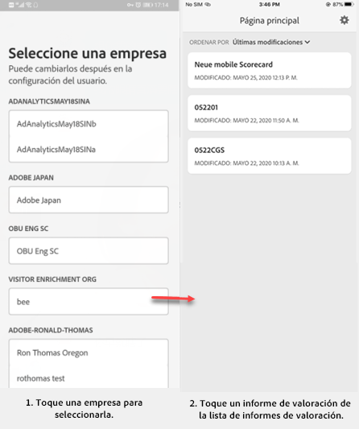
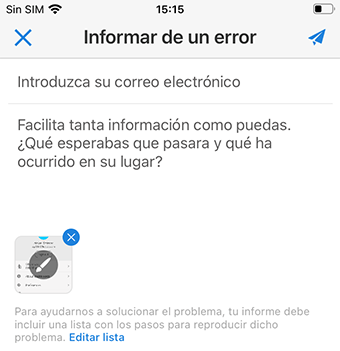

# paneles de Adobe Analytics: guía de inicio rápido del usuario ejecutivo

## Primeros pasos

Los paneles de Adobe Analytics ofrecen perspectivas de Adobe Analytics en cualquier momento y lugar.  La aplicación permite que los usuarios accedan mediante dispositivos móviles a informes de valoración intuitivos. Los informes de valoración son un conjunto de métricas clave y de otros componentes que se presentan en un diseño en mosaico. Los mosaicos se pueden pulsar para obtener desgloses e informes de tendencias más detallados. Los Paneles son compatibles con los sistemas operativos iOS y Android.

## Acerca de esta guía

Esta guía está pensada para ayudar a los usuarios ejecutivos a leer e interpretar cuadros de mandos en paneles de Analytics. La aplicación permite a los usuarios ejecutivos ver de forma rápida y sencilla en sus propios dispositivo móviles un amplio conjunto de datos de resumen importantes.

## Glosario de términos

| Término | Definición |
|--- |--- |
| Consumidor | Ejecutivo que ve métricas clave y datos de Analytics en un dispositivo móvil |
| Gestor de datos | Experto que busca y distribuye datos de Analytics y que configura los informes de valoración que verá el consumidor |
| Gestión de datos | Acto de crear o editar un informe de valoración móvil que contenga métricas, dimensiones y otros componentes relevantes para el cliente |
| Informe de valoración | Una vista de paneles que contiene uno o varios mosaicos |
| Mosaico | Representación de una métrica en una vista del informe de valoración |
| Desglose | Una vista secundaria a la que se puede acceder pulsando un mosaico del informe de valoración. Esta vista ofrece más información sobre la métrica que aparece en el mosaico y, opcionalmente, sobre dimensiones de desglose adicionales. |
| Intervalo de fecha | El intervalo de fechas principal para el sistema de informes de paneles |
| Intervalo de fecha de comparación | Intervalo de fecha que se compara con el intervalo de fecha principal |

## Configurar paneles en el dispositivo

Para utilizar los paneles de forma eficaz, deberá contar con la ayuda del curador de cuadro de mandos para configurarlos. En esta sección se proporciona información para ayudarle a configurar la aplicación con la ayuda de su gestor de datos.

### Obtener acceso

Para acceder a los cuadros de mandos en paneles, asegúrese de que:

* Tiene unas credenciales de inicio de sesión válidas para Adobe Analytics
* El gestor de datos ha creado correctamente los informes de valoración móviles y los ha compartido con usted

### Descargar e instalar paneles

Para descargar e instalar la aplicación, siga los pasos que correspondan al sistema operativo de su dispositivo.

**Para dispositivos iOS:**

1. Click the following public link (It is also available in Analytics under **Tools** > **dashboards**):

   [Vínculo de iOS](https://testflight.apple.com/join/WtXMQxlI): `https://testflight.apple.com/join/WtXMQxlI`

   Después de hacer clic en el vínculo, aparecerá la siguiente pantalla de Testflight:

   

2. En la pantalla, pulse el vínculo **Ver en App Store** para descargar la aplicación Testflight.

3. Después de instalar la aplicación Testflight, busque e instale paneles de Adobe Analytics en Testflight, como se muestra a continuación:

   

**Para dispositivos Android:**

1. Tap the following Play Store link on the user&#39;s device (It is also available in Analytics under **Tools** > **dashboards**):

   [Android](https://play.google.com/apps/testing/com.adobe.analyticsmobileapp): `https://play.google.com/apps/testing/com.adobe.analyticsmobileapp`

   Después de pulsar el enlace, seleccione “Convertirse en evaluador” en la siguiente pantalla:

   

2. Pulse el enlace **descargar en Google Play** en la siguiente pantalla:

   

## Usar paneles

Para utilizar paneles:

1. Inicie sesión en la aplicación. La pantalla de inicio de sesión aparecerá al iniciar paneles. Siga las indicaciones y use sus credenciales de Adobe Analytics. La aplicación es compatible con Adobe ID y con Enterprise ID/Federated ID.

   

2. Seleccione una empresa. After you sign into dashboards, the **Choose a company** screen appears. En esta pantalla se muestran las empresas de inicio de sesión a las que pertenece. Pulse el nombre de la empresa asociada con el informe de valoración compartido con usted.

3. A continuación, la lista informes de valoración mostrará todos los informes de valoración que se han compartido con usted. Pulse el informe de valoración que desee ver.

   

   *Nota: Si inicia sesión y ve un mensaje que indica que no se ha compartido nada, compruebe lo siguiente con su gestor de datos:*

   * *Puede iniciar sesión en la instancia correcta de Analytics*
   * *El informe de valoración se ha compartido con usted*

      

4. Examine cómo aparecen los mosaicos en el informe de valoración.

   

   Información adicional sobre los mosaicos:

   * La granularidad de los minigráficos depende de la longitud del intervalo de fecha:
   * Si se selecciona un día se muestra una tendencia horaria
   * Si se selecciona más de un día y menos de un año se muestra una tendencia diaria
   * Si se selecciona un año o más se muestra una tendencia semanal
   * La fórmula de la variación del valor porcentual es el total de la métrica (intervalo de fecha actual) – el total de la métrica (intervalo de fecha de comparación) / el total de la métrica (intervalo de fecha de comparación).
   * Puede arrastrar la pantalla hacia abajo para actualizar el informe de valoración.

5. Pulse un mosaico para mostrar el funcionamiento de un desglose detallado del mosaico.

   

6. Cambiar los intervalos de fecha del informe de valoración:

   

   *Nota: También puede cambiar los intervalos de fechas del mismo modo en la vista Desglosar que se muestra arriba.*

   Según el intervalo que pulse (**Día**, **Semana**, **Mes** o **Año**), verá dos opciones para los intervalos de fechas: o el intervalo de tiempo actual o el inmediatamente anterior. Pulse una de estas dos opciones para seleccionar el primer rango. En la lista **COMPARAR CON**, pulse una de las opciones que se muestran para comparar los datos de este periodo de tiempo con el primer intervalo de fecha seleccionado. Pulse **Listo** en la parte superior derecha de la pantalla. El campo **Intervalos de fecha** y los mosaicos del informe de valoración se actualizarán con los nuevos datos de comparación de los nuevos rangos seleccionados.

7. Obtener actualizaciones del informe de valoración. Si un informe de valoración no incluye todas las métricas o desgloses que le interesen, contacte con el equipo de Analytics para actualizar el informe de valoración. Una vez hecho, puede arrastrar el informe de valoración hacia abajo para actualizarlo, lo cual hará que se carguen los datos agregados recientemente.

8. Escribir comentarios. Para escribir comentarios:

   1. Puntee en el icono del usuario en la parte superior derecha de la pantalla paneles.
   2. En la pantalla **Mi cuenta**, pulse la opción **Comentarios**.
   3. Pulse para ver las opciones que existen para dejar comentarios.
   
   

**Para informar de un error**:

Pulse la opción y selecciona la subcategoría del error. En el formulario para informar de un error, escriba su dirección de correo electrónico en el campo superior y una descripción del error en el campo inferior. Al mensaje se adjunta automáticamente una captura de pantalla de la información de su cuenta, pero puede eliminarla si lo desea tocando la **X** de la imagen adjunta. También tiene la opción de grabar la pantalla, agregar más capturas de pantalla o adjuntar archivos. Para enviar el informe, pulse el icono del avión de papel en la parte superior derecha del formulario.

**Para sugerir una mejora**:

Pulse la opción y elija una subcategoría para la sugerencia. En el formulario de sugerencias, escriba su dirección de correo electrónico en el campo superior y una descripción del error en el campo inferior. Al mensaje se adjunta automáticamente una captura de pantalla de la información de su cuenta, pero puede eliminarla si lo desea tocando la **X** de la imagen adjunta. También tiene la opción de grabar la pantalla, agregar más capturas de pantalla o adjuntar archivos. Para enviar la sugerencia, pulse el icono del avión de papel en la parte superior derecha del formulario.

**Para hacer una pregunta**:

Pulse la opción y escriba su dirección de correo electrónico en el campo superior y su pregunta en el campo inferior. Al mensaje se adjunta automáticamente una captura de pantalla, pero puede eliminarla si lo desea tocando la **X** de la imagen adjunta. También tiene la opción de grabar la pantalla, agregar más capturas de pantalla o adjuntar archivos. Para enviar la pregunta, pulse el icono del avión de papel en la parte superior derecha del formulario.
