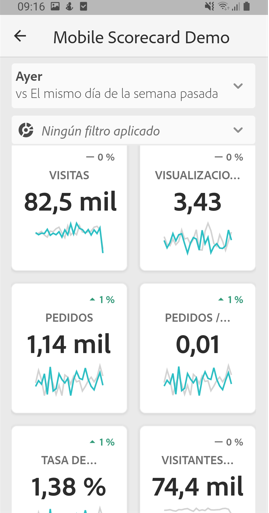
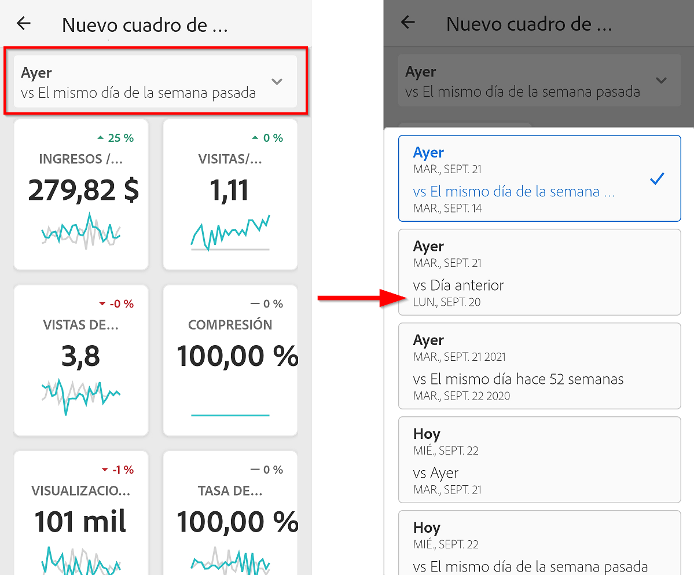
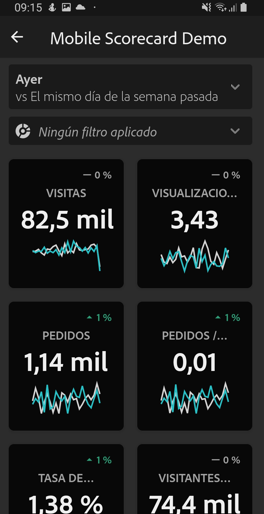
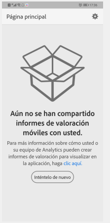
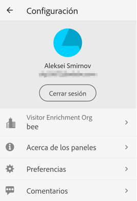

# Configure usuarios ejecutivos con la aplicación

En algunos casos, puede que los usuarios ejecutivos necesiten asistencia adicional para acceder a la aplicación y utilizarla. Esta sección presenta información que le ayudará a proporcionar esa asistencia.

## Comprobar que los usuarios de la aplicación pueden acceder a Adobe Analytics

1. Configure nuevos usuarios en el [Admin Console del Experience Cloud](/help/admin/admin-console/permissions/product-profile.md).

1. Para poder compartir los informes de valoración, debe conceder a los usuarios de la aplicación permisos para acceder a componentes de informe de valoración como Analysis Workspace, los grupos de informes en los que se basan los informes de valoración, así como segmentos, métricas y dimensiones.

## Requisitos previos del sistema de los usuarios de la aplicación

Para garantizar que los usuarios ejecutivos tengan acceso a sus informes de valoración en la aplicación, asegúrese de que:

* El requisito mínimo del sistema operativo móvil de sus dispositivos sea iOS versión 10 o posterior, o Android versión 4.4 (KitKat) o posterior
* Tengan unas credenciales de inicio de sesión válidas para Adobe Analytics.
* Ha creado correctamente informes de valoración móviles para ellos y ha compartido estos informes de valoración con ellos.
* Tienen acceso a los componentes que incluye el informe de valoración. Tenga en cuenta que puede seleccionar una opción al compartir los informes de valoración en **[!UICONTROL Compartir componentes incrustados]**.

## Ayuda a los ejecutivos descargar e instalar la aplicación

**Para usuarios ejecutivos con iOS:**

Haga clic en el siguiente vínculo (también está disponible en Analytics en **[!UICONTROL Herramientas]** > **[!UICONTROL Paneles de Analytics (aplicación móvil)]**) y siga las indicaciones para descargar, instalar y abrir la aplicación:

`[iOS link](https://apple.co/2zXq0aN)`

**Para usuarios ejecutivos con Android:**

Haga clic en el siguiente vínculo (también está disponible en Analytics en **[!UICONTROL Herramientas]** > **[!UICONTROL Paneles de Analytics (aplicación móvil)]**) y siga las indicaciones para descargar, instalar y abrir la aplicación:

`[Android link](https://bit.ly/2LM38Oo)`

Una vez descargada e instalada, los usuarios ejecutivos pueden iniciar sesión en la aplicación con sus credenciales de Adobe Analytics; la aplicación es compatible con Adobe ID y con Enterprise/Federated ID.

## Ayudar a los ejecutivos a acceder al informe de valoración

1. Haga que los usuarios ejecutivos inicien sesión en la aplicación.

   Aparece la pantalla **[!UICONTROL Choose a company]**. En esta pantalla se muestran las empresas de inicio de sesión a las que pertenece el usuario ejecutivo.

1. Haga que toquen el nombre de la empresa de inicio de sesión o de la organización de Experience Cloud que se aplica al informe de valoración compartido.

   A continuación, la lista informe de valoración muestra todos los informes de valoración que se han compartido con el ejecutivo en esa empresa de inicio de sesión.

1. Haga que ordenen esta lista por **[!UICONTROL Últimas modificaciones]**, si corresponde.

1. Haga que toquen el nombre del informe de valoración para verlo.

   

### Explicar la interfaz de usuario del informe de valoración

Explique al usuario ejecutivo cómo aparecen los mosaicos en los informes de valoración que comparte.

Información adicional sobre los mosaicos:

* La granularidad de los minigráficos depende de la longitud del intervalo de fecha:
* Si se selecciona un día se muestra una tendencia horaria
   * Si se selecciona más de un día y menos de un año, se muestra una tendencia diaria
   * Si se selecciona un año o más se muestra una tendencia semanal
   * La fórmula de la variación del valor porcentual es el total de la métrica (intervalo de fecha actual) – el total de la métrica (intervalo de fecha de comparación) / el total de la métrica (intervalo de fecha de comparación).
   * Puede arrastrar la pantalla hacia abajo para actualizar el informe de valoración.

1. Pulse un mosaico para mostrar el funcionamiento de un desglose detallado del mosaico.

   

   * Pulse cualquier punto de un minigráfico para ver los datos asociados a ese punto en la línea.

   * Se incluye una tabla para mostrar los datos de las dimensiones agregadas al mosaico. Pulse en la flecha hacia abajo para seleccionar dimensiones. Si no se ha agregado ninguna dimensión al mosaico, la tabla muestra los datos del gráfico.

1. Para cambiar los intervalos de fechas del cuadro de resultados, pulse el encabezado Fecha y seleccione la combinación de intervalo de fechas principal y de comparación que desee ver.

   

## Cambiar preferencias de aplicación

Para cambiar las preferencias, pulse la opción **[!UICONTROL Preferencias]** que se muestra arriba. En las preferencias, puede activar el inicio de sesión biométrico o puede establecer el modo oscuro de la aplicación, tal y como se muestra a continuación:

## Resolución de problemas

Si el usuario ejecutivo inicia sesión y ve un mensaje que indica que no se ha compartido nada:

* Es posible que el usuario ejecutivo haya seleccionado una instancia incorrecta de Analytics o
* Es posible que el informe de valoración no se haya compartido con el usuario ejecutivo.

Compruebe que el usuario ejecutivo puede iniciar sesión en la instancia correcta de Adobe Analytics y que se ha compartido el informe de valoración.

### Informar de un error

Pulse la opción y selecciona la subcategoría del error. En el formulario para informar de un error, escriba su dirección de correo electrónico en el campo superior y una descripción del error en el campo inferior. Al mensaje se adjunta automáticamente una captura de pantalla de la información de su cuenta, pero puede eliminarla si lo desea tocando la **X** de la imagen adjunta. También tiene la opción de grabar la pantalla, agregar más capturas de pantalla o adjuntar archivos. Para enviar el informe, pulse el icono del avión de papel en la parte superior derecha del formulario.

### Escribir comentarios

1. Pulse el icono de configuración en la parte superior derecha de la pantalla de la aplicación.
1. En la pantalla **[!UICONTROL Configuración]**, pulse la opción **[!UICONTROL Comentarios]**.
1. Pulse para ver las opciones que existen para dejar comentarios.

   

### Sugerir una mejora

Pulse la opción y elija una subcategoría para la sugerencia. En el formulario de sugerencias, escriba su dirección de correo electrónico en el campo superior y una descripción del error en el campo inferior. Al mensaje se adjunta automáticamente una captura de pantalla de la información de su cuenta, pero puede eliminarla si lo desea tocando la **X** de la imagen adjunta. También tiene la opción de grabar la pantalla, agregar más capturas de pantalla o adjuntar archivos. Para enviar la sugerencia, pulse el icono del avión de papel en la parte superior derecha del formulario.

### Formular una pregunta

Pulse la opción y escriba su dirección de correo electrónico en el campo superior y su pregunta en el campo inferior. Al mensaje se adjunta automáticamente una captura de pantalla, pero puede eliminarla si lo desea tocando la **X** de la imagen adjunta. También tiene la opción de grabar la pantalla, agregar más capturas de pantalla o adjuntar archivos. Para enviar la pregunta, pulse el icono del avión de papel en la parte superior derecha del formulario.

>[!IMPORTANT]
>
>Desde octubre de 2020, Adobe está implementando gradualmente una serie de mejoras para optimizar el rendimiento de la aplicación Paneles de Adobe Analytics. Estas mejoras se centran en el almacenamiento en caché de datos históricos de Analytics que se utilizan para rellenar informes de valoración con fechas (excluido el día actual). Estos datos se almacenarán en caché durante un máximo de 24 horas en una cuenta segura de almacenamiento público en la nube de Microsoft Azure. Póngase en contacto con el CSM si desea excluirse de estas funciones de mejora de rendimiento.
