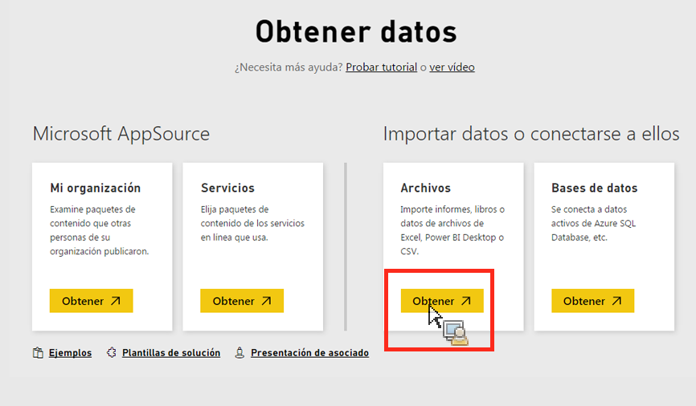

# Importación manual de datos a Power BI

Si quiere importar manualmente datos de Analytics en Power BI, siga las siguientes instrucciones.

1. En Power BI, haga clic en **[!UICONTROL Obtener datos]en la zona inferior izquierda de la pantalla.**
1. Under **[!UICONTROL Import or Connect to Data]** &gt; **[!UICONTROL Files]**, click **[!UICONTROL Get]**.

   

1. Haga clic en Archivo local.

   

1. Elija el archivo a cargar y haga clic en **[!UICONTROL Abrir]**.
1. Dentro de **[!UICONTROL ** Cargar el archivo Excel en Power BI], haga clic en **[!UICONTROL Cargar]**.

   

1. Debería aparecer el mensaje "Su archivo se ha cargado".

