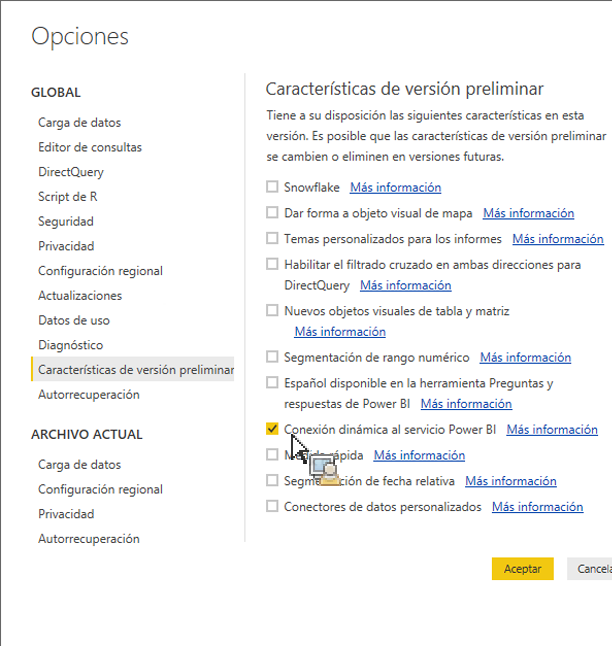

# Extraer activos publicados a Power BI Desktop

Explica cómo extraer activos publicados en Report Builder a Power BI Desktop

## Requisitos previos {#section_BDFDAE1E300B429FB6EBCB21AD1383A0}

* Debe tener instalada la versión más reciente de Power BI Desktop (versión de abril de 2017)
* Este proceso supone que ya ha publicado en el Servicio de Power BI tablas o solicitudes con el formato de Report Builder.

## Proceso {#section_CB03E6E1B066457EA0F6FC08FFF5EFDD}

En la actualización de abril de 2017 de Power BI Desktop, Microsoft incluyó la capacidad de conectar con conjuntos de datos en el Servicio de Power BI. Esta función le permite crear nuevos informes a partir de conjuntos de datos existentes que ya haya publicado en la nube. Puede aprovechar esta función para mejorar la colaboración y reducir los casos de esfuerzos duplicados en el equipo.

1. En Power BI Desktop, vaya a **[!UICONTROL Archivo]** > **[!UICONTROL Opciones y configuración]** > **[!UICONTROL Opciones]** > **[!UICONTROL Características de vista previa.]**
1. Habilite **[!UICONTROL Conexión dinámica al Servicio de Power BI]** y haga clic en **[!UICONTROL Aceptar]**. 

1. Reinicie Power BI Desktop.
1. Una vez que haya reiniciado el escritorio, vaya a **[!UICONTROL Inicio]** > **[!UICONTROL Obtener datos]** > **[!UICONTROL Más...]**.
1. Busque y seleccione **[!UICONTROL Servicio de Power BI]**.
1. En **[!UICONTROL Servicio de Microsoft Power BI]** > **[!UICONTROL Mi espacio de trabajo]**, seleccione el conjunto de datos que había publicado previamente desde Report Builder.

Para obtener más información, consulte esta [publicación en el blog de Microsoft](https://powerbi.microsoft.com/en-us/blog/connecting-to-datasets-in-the-power-bi-service-from-desktop/).
