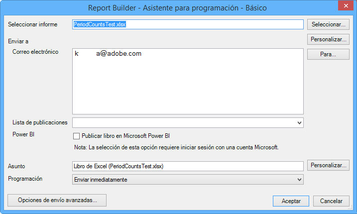
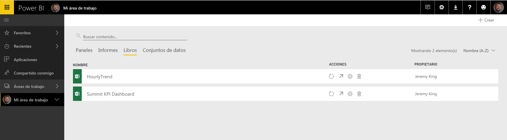
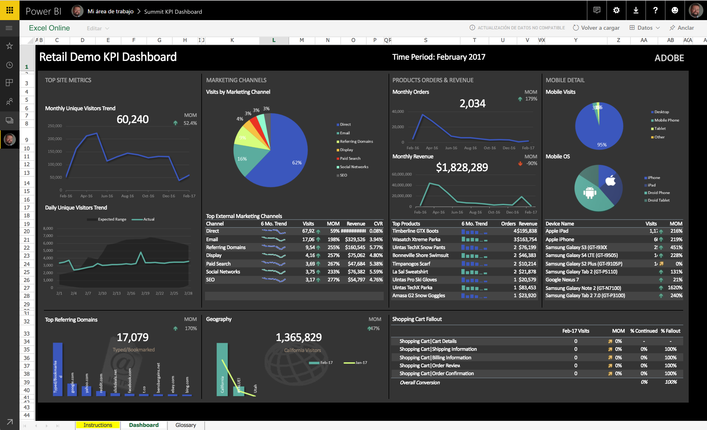
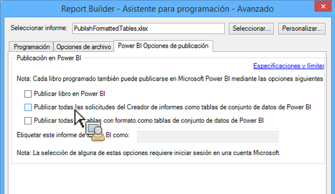
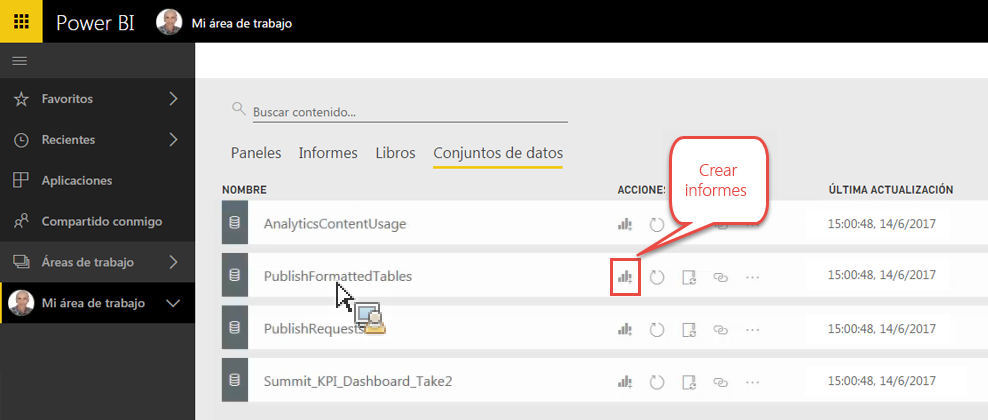
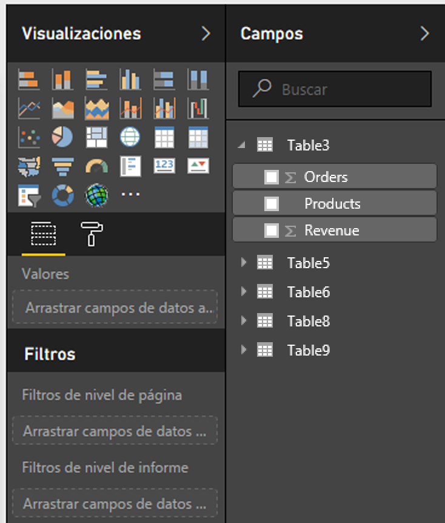
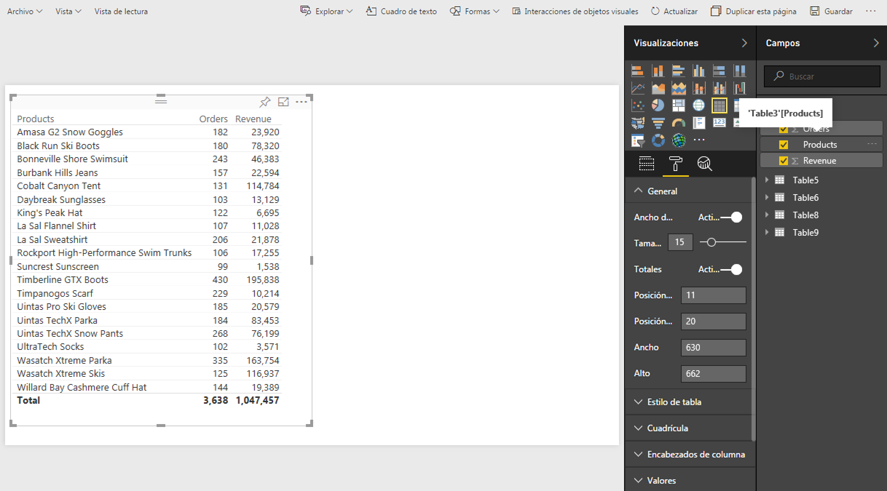
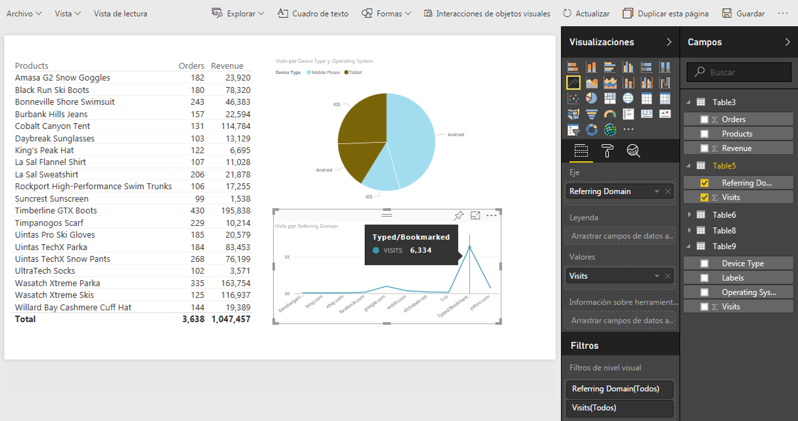
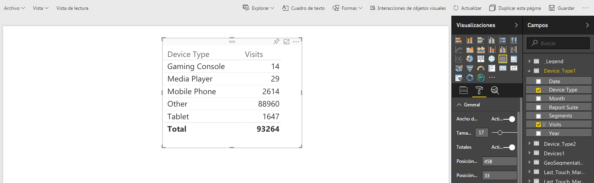
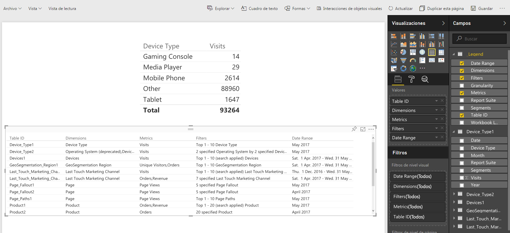

# Resumen de publicación en Power BI

Microsoft Power BI es un conjunto de tableros de análisis empresarial para analizar datos y compartir resultados. La integración de Adobe Analytics con Power BI le permite visualizar datos de Analytics de Report Builder dentro de Microsoft Power BI y compartirlos fácilmente dentro de su organización.

Anteriormente, el analista programaba el envío de libros de Report Builder mediante correo electrónico (o ftp). Ahora, las personas que usted determine pueden emplear sus cuentas de Power BI para obtener acceso a datos precisos y actualizados de su empresa mediante un entorno basado en web, disponible desde distintas plataformas y dispositivos.

Al combinar las capacidades de generación de Report Builder con las características de visualización de Power BI, la información se hace más accesible para todos los miembros de la organización. Power BI también le permite integrar Adobe Analytics con otras fuentes de datos (p. ej., puntos de venta, CRM) para descubrir datos, asociaciones y oportunidades únicas relativas a los clientes.

## Requisitos del sistema {#section_0B71092D853446F38FA36447DAC0D32B}

* Adobe Report Builder 5.5 [instalado](/help/analyze/report-builder/setup/t-install-arb.md)
* Cuenta Microsoft activa que le permita iniciar sesión en Power BI

## Publicar libro de trabajo en Power BI {#section_21CA66229EC240D49594A9A7D3FBA687}

Los libros programados son hojas de cálculo de Excel con formato, rellenas con datos de Adobe Analytics y enviadas de forma regular y programada.

**Publicar libro en Report Builder**

1. En Report Builder, genere y guarde un libro.
1. En la barra de herramientas de Report Builder, haga clic en **[!UICONTROL Programar]** > **[!UICONTROL Nuevo]**.

1. En el Asistente de programación básico, marque la casilla junto a **[!UICONTROL Publicar libro en Microsoft Power BI]**.

   

1. Especifique su correo electrónico y envíe inmediatamente, o especifique la frecuencia de la programación (cada día, cada hora, etc.).
1. Haga clic en **[!UICONTROL Aceptar]** para publicar.
1. A continuación, se le pedirá que inicie sesión en su cuenta Microsoft. Proporcione las credenciales.
1. El libro de Report Builder queda programado y se publica en Power BI.

   Con cada instancia programada, y después de que el proceso de programación de Report Builder actualice el libro con datos actualizados de Analytics, el libro se vuelve a publicar en Microsoft Power BI.

**Ver datos de un libro de Report Builder en Power BI**

1. En Power BI, haga doble clic en el libro dentro del menú [!UICONTROL Libros].

   

1. Ahora puede ver los datos del tablero del libro.  

1. También puede anclar un área de este libro para incluirla en cualquiera de sus tableros de Power BI.

## Publicar todas las tablas con formato de un libro como tablas de conjuntos de datos de Power BI {#section_7C54A54E75184DD6BAEF4ACCE241239A}

>[!NOTE]
>
>Si el libro contiene una macro, la opción “Publicar todas las tablas con formato de un libro como tablas de conjuntos de datos de Power BI” queda deshabilitada.

En vez de importar todo el libro, puede importar solo el contenido de todas las tablas con formato dentro del libro.

**Caso de uso**: tiene un libro de Excel que extrae datos de varias solicitudes de Report Builder y crea una tabla resumen con numerosas fórmulas. Puede importar únicamente la tabla resumen en Power BI y crear una visualización para ella.

**Publicar una tabla con formato en Report Builder**

1. En Report Builder, genere una tabla de datos que incluya una fila de encabezado, seguida por una fila de datos.
1. Seleccione la tabla y, a continuación, elija **[!UICONTROL Dar formato como tabla]** en el menú [!UICONTROL Inicio]. La tabla recibe un nombre predeterminado (Table 1, Table 2, etc.), pero puede cambiarlo desde el menú [!UICONTROL Diseño].

1. En la barra de herramientas de Report Builder, haga clic en **[!UICONTROL Programar]** > **[!UICONTROL Nuevo]**.

1. En el Asistente de programación básico, haga clic en **[!UICONTROL Opciones de programación avanzadas]**.
1. En [!UICONTROL Asistente de programación avanzado], en la pestaña **[!UICONTROL Opciones de publicación]**, marque la casilla junto a **[!UICONTROL Publicar todas las tablas con formato como tablas de conjuntos de datos de Power BI]**.

   

1. (Opcional) Puede personalizar el nombre del activo publicado en Power BI. Puede ser útil si utiliza el control de versiones como parte del nombre del libro (p. ej., milibro_v1.1.xlsx) y no quiere que el número de versión aparezca en el nombre del activo publicado en Power BI. Tiene la ventaja añadida de que el activo publicado no cambiará si el número de versión varía. (Vea aquí las [especificaciones](/help/analyze/report-builder/c-publish-power-bi/specifications-limits.md)).

**Ver los datos de tabla en Power BI**

1. En Power BI, vaya al menú **[!UICONTROL Espacios de trabajo]** > **[!UICONTROL Conjuntos de datos]**.

   

1. Seleccione el conjunto de datos que ha publicado y haga clic en el icono [!UICONTROL Crear informe] que hay junto a él. Fíjese en que las tablas aparecen como campos.

   

1. Seleccione una tabla y sus columnas asociadas.

   

1. En el menú [!UICONTROL Visualizaciones] puede seleccionar cómo se muestra una tabla en Power BI. Por ejemplo, podría presentar los datos como un gráfico de líneas:

   

1. A partir de aquí, puede crear visualizaciones a partir de esta tabla de conjunto de datos.

## Publicar todas las solicitudes de Report Builder como tablas de conjuntos de datos de Power BI {#section_0C26057C7DBB4068A643FDD688F6E463}

Puede convertir todas las solicitudes en tablas de conjuntos de datos y crear visualizaciones sobre ellas.

>[!IMPORTANT]
>
>Si el libro contiene más de 100 solicitudes, solo las 100 primeras se publicarán en Power BI. Además, solo se publicarán las 10 000 primeras filas de datos de cada solicitud publicada en Power BI. Por tanto, aunque estas solicitudes se enviarán correctamente siguiendo la programación, el ámbito de publicación en Power BI es limitado.

1. En Report Builder, abra o cree un libro que contenga solicitudes de Report Builder.
1. En la barra de herramientas de Report Builder, haga clic en **[!UICONTROL Programar]** > **[!UICONTROL Nuevo]**.

1. En el Asistente de programación básico, haga clic en **[!UICONTROL Opciones de programación avanzadas]**.
1. En el [!UICONTROL Asistente de programación avanzado], en la ficha **[!UICONTROL Opciones de publicación]**, marque la casilla junto a **[!UICONTROL Publicar todas las solicitudes de Report Builder como tablas de conjunto de datos de Power BI]** 

1. Haga clic en **[!UICONTROL Aceptar]**.

**Ver los datos de solicitud en Power BI**

Cada solicitud programada de Report Builder se publica como una tabla en el conjunto de datos. Cada tabla de solicitud recibe el nombre de la dimensión principal de la solicitud e incluye una columna [!UICONTROL Grupo de informes] y otra [!UICONTROL Segmentos].

1. En Power BI, vaya al menú **[!UICONTROL Espacios de trabajo]** > **[!UICONTROL Conjuntos de datos]**.

1. Seleccione la solicitud que ha publicado y haga clic en el icono [!UICONTROL Crear informe] que hay junto a ella.

   Fíjese en que las solicitudes aparecen como tablas en el menú [!UICONTROL Campos].

   

   >[!NOTE]
   >
   >Independientemente de cómo haya configurado el diseño en el libro de la solicitud de Report Builder (diseño dinámico, personalizado, algunas columnas invisibles), Report Builder siempre la publicará con el mismo formato bidimensional con una fila de encabezado: Fecha, Dimensiones, Métricas, Grupos de informes, Segmentos.

1. Fíjese también en que hay una tabla adicional llamada **[!UICONTROL Leyenda]**. Si saca una solicitud del contexto de Report Builder, puede ser difícil recordar qué significa. El propósito de la tabla Leyenda es, por ejemplo, mostrarle el nombre de cada solicitud bajo el ID de tabla. También puede añadir otras columnas Leyenda para obtener una visualización completa de la solicitud.

   

