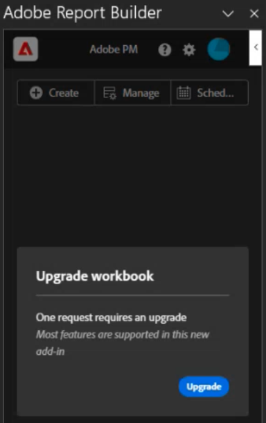

# Convertir libros de Report Builder heredados en bloques de datos

Como parte del cambio a una nueva tecnología de Report Builder, puede convertir rápidamente sus libros heredados actuales en libros basados en Javascript.

>[!IMPORTANT]
>
>Duplique cada libro y cambie el nombre de una versión antes de convertirlo. De este modo, aún tendrá una copia del libro original, en caso de que lo necesite.

>[!BEGINSHADEBOX]

Vea  [Convertir libros](https://video.tv.adobe.com/v/3446185?quality=12&learn=on&captions=spa){target="_blank"} para ver un vídeo de demostración.

>[!ENDSHADEBOX]

1. Configurar el nuevo Report Builder por [siguiendo estas instrucciones](/help/analyze/report-builder/report-builder-setup.md).

1. Abra Excel y haga clic en el icono Adobe Report Builder en la parte superior derecha.

1. Haga clic en **[!UICONTROL Iniciar sesión]** e inicie sesión en el Report Builder.

1. El complemento Report Builder detecta si este libro contiene [solicitudes de Report Builder heredadas](/help/analyze/legacy-report-builder/home.md).

   

1. Si se encuentran una o más solicitudes heredadas, haga clic en **[!UICONTROL Actualizar]** para actualizar un libro.

   >[!NOTE]
   >
   >Debe actualizar cada solicitud individualmente. La actualización masiva no es compatible.

1. Aparece una advertencia que le avisa de los cambios realizados en el libro si lo actualiza. También le insta a crear una copia de seguridad del libro heredado antes de continuar.

   

1. Haga clic en **[!UICONTROL Continuar]** para continuar con la actualización.

   Si la actualización se realiza correctamente, aparecerá el siguiente aviso de finalización:

   

1. (Opcional) Haga clic en **[!UICONTROL Descargar informe de actualización]**. Este informe contiene el estado de cada bloque de datos que se actualizó.

Ahora puede [administrar el bloque de datos](/help/analyze/report-builder/manage-reportbuilder.md).

## Funciones de Report Builder heredadas no admitidas en el nuevo Report Builder {#unsupported}

Al comparar la funcionalidad de un Report Builder heredado con la del nuevo complemento Report Builder, algunas funciones heredadas ya no están disponibles:

- Solicitudes en tiempo real

- Informes de ruta/abandonos

- Opción de FTP para informes programados

- Métricas de visitantes. Las siguientes métricas se convertirán en &quot;visitantes únicos&quot;, aunque el resultado del informe puede no ser una coincidencia exacta: `visitorshourly`, `visitorsdaily`, `visitorsweekly`, `visitorsmonthly`, `visitorsquarterly` y `visitorsyearly`. Esto también se aplica a `mobilevisitorshourly`, `mobilevisitorsdaily`, `mobilevisitorsweekly`, `mobilevisitorsmonthly`, `mobilevisitorsquarterly` y `mobilevisitorsyearly`.

## Programar un libro convertido {#schedule}

Ver [Programar un libro convertido](/help/analyze/report-builder/schedule-reportbuilder.md) en el artículo de programación.