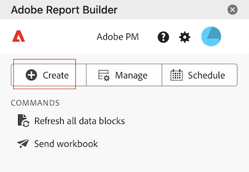
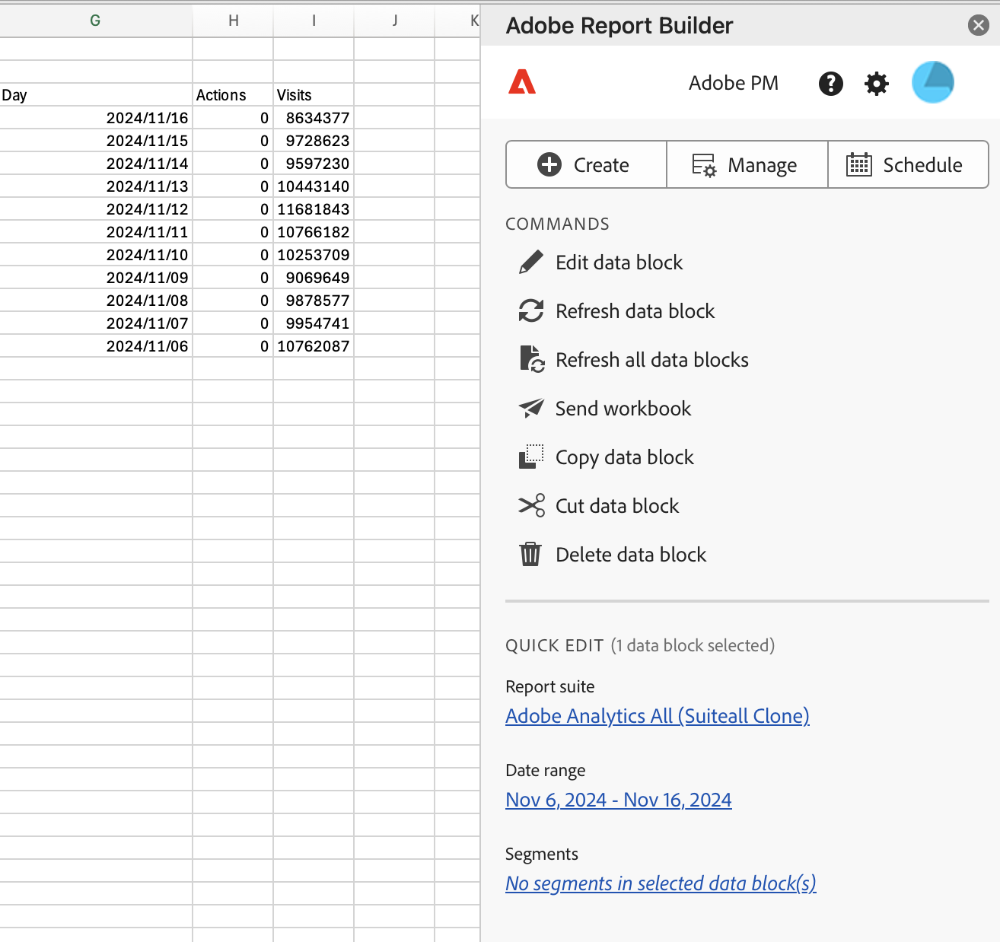

# Creación de un bloque de datos

Un *bloque de datos* es la tabla de datos creada por una sola solicitud de datos. Un libro de Report Builder puede contener varios bloques de datos. Cuando cree un bloque de datos, primero configúrelo y, a continuación, genérelo.

## Configuración del bloque de datos

Configure los parámetros iniciales del bloque de datos para la ubicación del bloque de datos, el grupo de informes y un intervalo de fechas.

1. Haga clic en **[!UICONTROL Crear]**.

   

1. Configure las variables **[!UICONTROL Ubicación del bloque de datos]**.

   La opción de ubicación del bloque de datos define la ubicación de la hoja de cálculo donde Report Builder añade los datos a la hoja de cálculo.

   Para especificar la ubicación del bloque de datos, seleccione una sola celda en la hoja de cálculo o introduzca una dirección de celda como a3, \\\$a3, a\\\$3 o sheet1!a2. La celda especificada marca la esquina superior izquierda del bloque de datos cuando se recuperan los datos.

1. Elija un **grupo de informes**.

   La opción de grupos de informes permite elegir un grupo de informes en un menú desplegable o hacer referencia a un grupo de informes desde una ubicación de celda.

1. Configure las variables **[!UICONTROL Intervalo de fechas]**.

   La opción Intervalo de fechas permite elegir un intervalo de fechas. Los intervalos de fechas pueden ser fijos o móviles. Para obtener información sobre las opciones de rango de datos, consulte [Seleccionar un intervalo de fecha](select-date-range.md).

1. Haga clic en **[!UICONTROL Siguiente]**.

   

   Después de configurar el bloque de datos, puede seleccionar dimensiones, métricas y segmentos para crear el bloque de datos. Las pestañas Dimensión, Métricas y Filtros se muestran encima del panel Generador de tablas.

## Generación del bloque de datos

Para generar el bloque de datos, seleccione los componentes del informe y, a continuación, personalice el diseño.

1. Añada dimensiones, métricas y filtros.

   Desplácese por las listas de componentes o utilice el campo **[!UICONTROL Buscar]** para localizar componentes. Arrastre y suelte los componentes en el panel Tabla o haga doble clic en un nombre de componente de la lista para añadirlo automáticamente al panel Tabla.

   Haga doble clic en un componente para añadirlo a una sección predeterminada de la tabla.

   - Los componentes de Dimensión se añaden a la sección Fila o a la sección Columna si ya tiene una dimensión en las columnas.
   - Los componentes de fecha se añaden a la sección Columna.
   - Los componentes de filtro se añaden a la sección Filtros.

   **Fecha de inicio como Dimension**

   Establezca **[!UICONTROL Start date]** como una dimensión para identificar claramente la fecha de inicio del bloque de datos. Esto resulta útil si tiene un informe programado regularmente que tiene un intervalo de fechas móvil o si tiene un intervalo de fechas no convencional y necesita ser claro en la fecha de inicio.

   {width="30%"}

1. Organice los elementos del panel Tabla para personalizar el diseño del bloque de datos.

   Arrastre y suelte los componentes en el panel Tabla para reordenarlos o haga clic con el botón derecho en el nombre de un componente y seleccione en el menú de opciones.

   Cuando se añaden componentes a la tabla, se muestra una vista previa del bloque de datos en la ubicación del bloque de datos en la hoja de cálculo. El diseño de la vista previa del bloque de datos se actualiza automáticamente a medida que se añaden, mueven o eliminan elementos de la tabla.

   

   **Mostrar u ocultar encabezados de fila y columna**

1. Haga clic en el icono **[!UICONTROL Configuración de tabla]**.

   {width="35%"}

1. Marque o desmarque la opción Mostrar encabezados de fila y columna. Los encabezados se muestran de forma predeterminada.

   **Ocultar o mostrar etiquetas de dimensión y encabezados de métrica**

1. Haga clic en el icono de puntos suspensivos en las dimensiones o en los encabezados de columna para mostrar la configuración.

   {width="35%"}

1. Haga clic en Ocultar o Mostrar para alternar las etiquetas de dimensión o los encabezados de columna. Todas las etiquetas se muestran de forma predeterminada.

1. Haga clic en **[!UICONTROL Finalizar]**.

   Se muestra un mensaje de procesamiento mientras se recuperan los datos de los análisis.

   

   Report Builder recupera los datos y muestra el bloque de datos completado en la hoja de cálculo.

   
