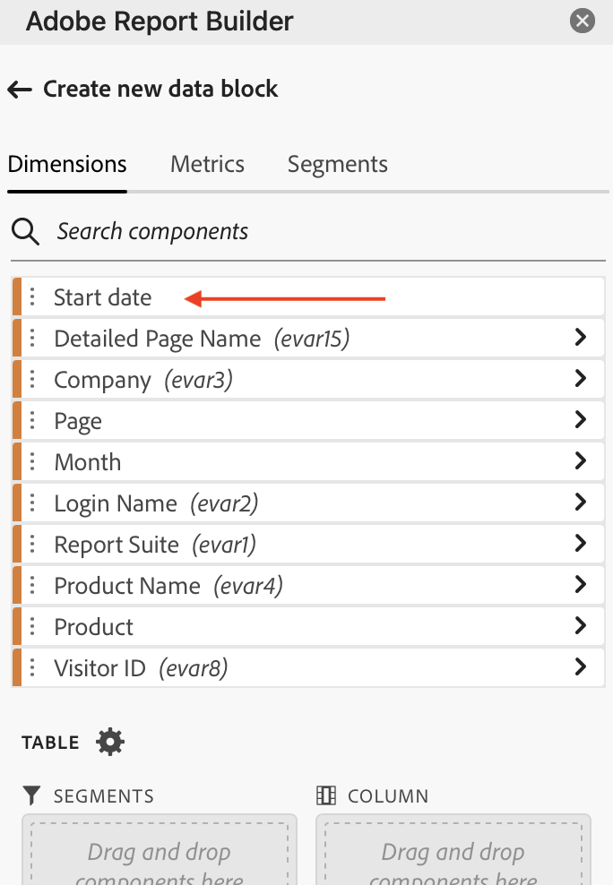

# Creación de un bloque de datos

Un *bloque de datos* es la tabla de datos creada por una sola solicitud de datos. Un libro de Report Builder puede contener varios bloques de datos. Cuando cree un bloque de datos, primero configúrelo y, a continuación, genérelo.

## Configuración del bloque de datos

Configure los parámetros iniciales del bloque de datos para la ubicación del bloque de datos, el grupo de informes y un intervalo de fechas.

1. Seleccione  **[!UICONTROL Crear]**.

   {zoomable="yes"}

1. Configure las variables **[!UICONTROL Ubicación del bloque de datos]**.

   La opción de ubicación del bloque de datos define la ubicación de la hoja de cálculo en la que Report Builder agrega los datos a la hoja de cálculo.

   Para especificar la ubicación del bloque de datos, seleccione una sola celda en la hoja de cálculo o escriba una dirección de celda, como `a3`, `\\\$a3`, `a\\\$3` o `sheet1!a2`. La celda especificada se convierte en la esquina superior izquierda del bloque de datos cuando se recuperan los datos.

   Use  para elegir una ubicación de bloque de datos de la celda seleccionada actualmente en la hoja.

1. Elija **[!UICONTROL grupos de informes]**.

   La opción Grupos de informes permite elegir un grupo de informes en un menú desplegable o hacer referencia a un grupo de informes desde una ubicación de celda.

   Seleccione  para crear un grupo de informes a partir de una celda.

1. Configure las variables **[!UICONTROL Intervalo de fechas]**.

   La opción **[!UICONTROL Intervalo de fechas]** le permite elegir un intervalo de fechas. Los intervalos de fechas pueden ser fijos o móviles.

   Seleccione **[!UICONTROL Calendario]** para elegir un intervalo de datos con  o ingrese un intervalo de fechas manualmente. Opcionalmente, puede elegir un ajuste preestablecido del menú desplegable **[!UICONTROL _Buscar ajustes preestablecidos_]**.

   Seleccione **[!UICONTROL Desde la celda]** para definir los datos de inicio y fin basados en una celda de la hoja actual.

   Para obtener información acerca de las opciones de intervalo de fechas, vea [Seleccionar un intervalo de fechas](select-date-range.md).

1. Seleccione **[!UICONTROL Siguiente]**.

   

   Después de configurar el bloque de datos, puede seleccionar dimensiones, métricas y segmentos para crear el bloque de datos. Las fichas **[!UICONTROL Dimensiones]**, **[!UICONTROL Métricas]** y **[!UICONTROL Segmentos]** se muestran encima del panel **[!UICONTROL Tabla]**.

## Generación del bloque de datos

Para generar el bloque de datos, seleccione los componentes del informe y, a continuación, personalice el diseño.

1. Agregue los componentes **[!UICONTROL Dimensiones]**, **[!UICONTROL Métricas]** y **[!UICONTROL Segmentos]**.

   Desplácese por las listas de componentes o use el campo  **[!UICONTROL _Buscar componentes_]** para localizar componentes. Arrastre y suelte los componentes en el panel [!UICONTROL Tabla] o seleccione un nombre de componente en la lista para agregar el componente al panel [!UICONTROL Tabla].

   Seleccione un componente para añadir el componente a una sección predeterminada de la tabla.

   - Los componentes de Dimension se agregan a la sección  **[!UICONTROL Row]** o a la sección  **[!UICONTROL Column]** si ya tiene una dimensión en las columnas.
   - Los componentes de fecha se han agregado a la sección  **[!UICONTROL Column]**.
   - Los componentes del segmento se han agregado a la sección  **[!UICONTROL Segmentos]**.
   - Los componentes de métricas se han agregado a la sección  **[!UICONTROL Valores]**.

1. Organice los elementos del panel Tabla para personalizar el diseño del bloque de datos.

   Arrastre y suelte los componentes de cada lista en el panel Tabla para reordenar los componentes o seleccione  y seleccione ,  Mover abajo y más para mover los componentes de una lista.

   Cuando se añaden componentes a la tabla, se muestra una vista previa del bloque de datos en la ubicación del bloque de datos en la hoja de cálculo. El diseño de la vista previa del bloque de datos se actualiza automáticamente a medida que se añaden, mueven o eliminan elementos de la tabla.

   

1. Si lo desea, establezca la **[!UICONTROL fecha de inicio]** como dimensión para identificar la fecha de inicio del bloque de datos. Añadir los datos de inicio como dimensión es útil si tiene un informe programado con regularidad que tiene un intervalo de fechas móvil. O si tiene un intervalo de fechas no convencional y necesita ser explícito sobre la fecha de inicio.

   

1. Si lo desea, puede mostrar u ocultar los encabezados de fila y columna. Para ello, haga lo siguiente:

   1. Seleccione el icono **[!UICONTROL Tabla]** configuración.

      

   1. Marque o desmarque la opción para **[!UICONTROL mostrar encabezados de fila y columna]**. Los encabezados se muestran de forma predeterminada.

1. De forma opcional, también puede ocultar o mostrar etiquetas de dimensión y encabezados de métrica. Para ello, haga lo siguiente:

   1. Seleccione  en la etiqueta de dimensión o en el encabezado de columna para mostrar el menú contextual.

      

   1. Seleccione  **[!UICONTROL Hide]** o  **[!UICONTROL Show]** para alternar la etiqueta de dimensión o el encabezado de columna. Todas las etiquetas se muestran de forma predeterminada.

1. Seleccione **[!UICONTROL Finalizar]** para finalizar la configuración del bloque de datos.

1. Se muestra un mensaje de procesamiento **[!UICONTROL #BUSY]** mientras se recuperan los datos del análisis.

   

1. Report Builder recupera los datos y muestra el bloque de datos completado en la hoja de cálculo.

   

>[!MORELIKETHIS]
>
>[Selección de un grupo de informes](select-report-suite.md)
>[Seleccione un intervalo de fecha](select-date-range.md)
>[Filtrar dimensiones](filter-dimensions.md)
>[Trabajar con segmentos](work-with-segments.md)
>

<!--

A *data block* is the table of data created by a single data request. A Report Builder workbook can contain multiple data blocks. When you create a data block, first configure the data block and then build the data block.

## Configure the data block

Configure the initial data block parameters for the data block location, report suite, and a date range.

1. Click **[!UICONTROL Create]**.

    

1. Set the **[!UICONTROL Data block location]**.

    The data block location option defines the worksheet location where report builder adds the data to your worksheet.

    To specify the data block location, select a single cell in the worksheet and click the icon next to **[!UICONTROL Data block location]**: 
    
    You can also enter a cell address such as a3, \\\$a3, a\\\$3 or sheet1!a2. The cell specified marks the upper-left corner of the data block when the data is retrieved.

1. Choose a **Report Suite**.

    The report suites option allows you to choose a report suite from a drop-down menu or to reference a report suite from a cell location.

1. Set the **[!UICONTROL Date range]**.

    The Date range option allows you to choose a date range. Date ranges may be fixed or rolling. For information about data range options, see [Select a Date Range](select-date-range.md).

1. Click **[!UICONTROL Next]**.

    

    After you configure the data block, you can select dimensions, metrics, and segments to build your data block. The Dimensions, Metrics, and Filters tabs are displayed above the Table builder pane.

## Build the data block

To build the data block, select report components, and then customize the layout.

1. Add Dimensions, Metrics, and Segments.

    Scroll the component lists or use the **[!UICONTROL Search]** field to locate components. Drag and drop components to the Table pane or double-click a component name in the list to automatically add the component to the Table pane.

    Double-click a component to add it to a default section of the table.

    - Dimension components are added to the Row section or to the Column section if you have a dimension already in the columns.
    - Date components are added to the Column section.
    - Segment components are added to the Segments section.

    **Start date as a Dimension**

    Set the **[!UICONTROL Start date]** as a dimension to clearly identify the start date of your data block. This is helpful if you have a regularly scheduled report that has a rolling date range or if you have an unconventional date range and you need to be clear on the start date.

    {width="30%"}

1. Arrange the items in the Table pane to customize the layout of your data block.

    Drag and drop components in the Table pane to reorder components or right-click a component name and select from the options menu.

    When you add components to the table, a preview of the data block is displayed at the Data block location in the worksheet. The layout of the data block preview automatically updates as you add, move, or remove items in the table.

    

    **Display or hide row and column headers**

1. Click the **[!UICONTROL Table settings]** icon.

    {width="35%"}

1. Check or uncheck the option to Display row and column headers. The headers are displayed by default.

    **Hide or show dimension labels and metric headers**

1. Click the ellipsis icon on either the dimensions or the column headers to display the settings.

    {width="35%"}

1. Click Hide or Show to toggle the dimension labels or column headers. All labels are displayed by default.

1. Click **[!UICONTROL Finish]**.

    A processing message is displayed while the analytics data is retrieved.

    Report Builder retrieves the data and displays the completed data block in the worksheet.

    

-->