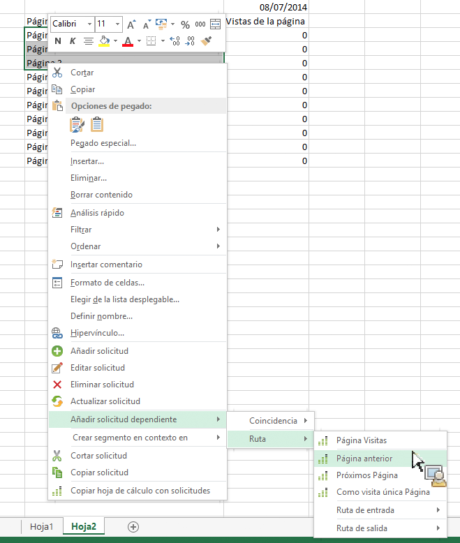

# Filtrar informes de ruta mediante la adición de solicitudes dependientes

Describe cómo crear informes de ruta con filtros predefinidos.

Informes y análisis de marketing ofrece algunos informes independientes que son informes de ruta principal con filtros predefinidos, como por ejemplo [!UICONTROL Sección del sitio siguiente] y [!UICONTROL Sección del sitio anterior], Sección del sitio de entrada y [!UICONTROL Sección del sitio de salida], o [!UICONTROL Sección única del sitio].

Report Builder does not offer these as standalone reports, but you can create them through the **[!UICONTROL Add dependent request]** &gt; **[!UICONTROL Path]** context menus. Están disponibles los siguientes informes:

* Ruta &gt; Página Visitas
* Ruta &gt; Ruta de entrada
* Ruta &gt; Ruta de salida
* Ruta &gt; Página siguiente
* Ruta &gt; Ruta de entrada &gt; Página siguiente
* Ruta &gt; Página anterior
* Ruta &gt; Ruta de salida &gt; Página anterior
* Ruta &gt; Ruta de entrada &gt; Como página de entrada
* Ruta &gt; Ruta de salida &gt; Como página de salida

1. Select multiple rows from an existing request, then right-click **[!UICONTROL Add Dependent Request]** &gt; **[!UICONTROL Path]**.

   (Tenga en cuenta que debe seleccionar al menos 3 filas si desea ver el elemento de menú **[!UICONTROL Visitas en el orden previsto de la página]).**

   

1. Select the predefined filter, for example **[!UICONTROL Previous Page]**.

   Aparece el Asistente para solicitudes con la métrica Página anterior ya seleccionada. 1. Siga perfeccionando la solicitud en el Asistente para solicitudes y genere su solicitud.
