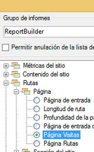
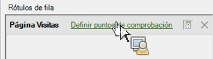

# Filtrado de un informe de abandonos mediante el Asistente para solicitudes

Describe los pasos involucrados en la aplicación de filtros a un informe de visitas en el orden previsto.

En este ejemplo se muestra el informe de visitas en el orden previsto de página.

1. En Report Builder de Adobe, haga clic en **[!UICONTROL Crear]** para abrir el Asistente para solicitudes.
1. Seleccione el grupo de informes adecuado.
1. En la vista de árbol de la izquierda, seleccione **[!UICONTROL Rutas]** > **[!UICONTROL Página]** > **[!UICONTROL Página Visitas]**.

   

1. Configure los [intervalos de fechas](/help/analyze/report-builder/data-requests/configuring-report-dates/custom-calendar.md) adecuados.
1. Haga clic en **[!UICONTROL Siguiente]**.
1. En el paso 2 del asistente, en **[!UICONTROL Rótulos de fila]**, haga clic en el vínculo **[!UICONTROL Definir puntos de comprobación]**. (En un informe de visitas en el orden previsto, siempre tiene que definir los elementos de ruta, a diferencia de en un informe de ruta, donde se aplica un patrón previamente).

   

1. Seleccione la opción **[!UICONTROL Filtro]**.

1. En el cuadro de diálogo **[!UICONTROL Definir puntos de comprobación de visitas en el orden previsto de sección del sitio]**, defina los puntos de comprobación entre un rango de celdas o de una lista. A continuación, haga clic en **[!UICONTROL Aceptar]**.
1. Decida si desea seleccionar de un rango de celdas o de una lista.
1. Si selecciona de una lista, haga clic en **[!UICONTROL Añadir]** para seleccionar los puntos de comprobación que desea añadir en la ruta de visitas en el orden previsto. Puede definir entre 3 y 8 puntos de comprobación. (Busque los elementos disponibles haciendo clic en **[!UICONTROL Más]**).

   Si desea información sobre cómo perfeccionar un filtro, consulte [Dimensiones de filtros](/help/analyze/report-builder/layout/c-filter-dimensions/filter-dimensions.md). 1. Mueva los **[!UICONTROL Elementos disponibles]** de la columna izquierda a la derecha, para ello selecciónelos y haga clic en la flecha naranja.
1. Haga clic en **[!UICONTROL Aceptar]** tres veces y, a continuación, haga clic en **[!UICONTROL Finalizar]**.

   El informe debería actualizarse en este momento.
