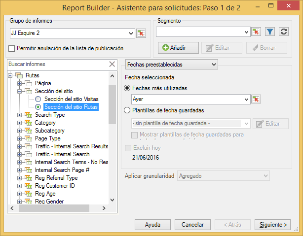
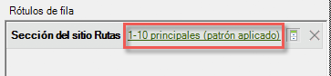
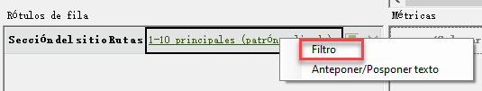
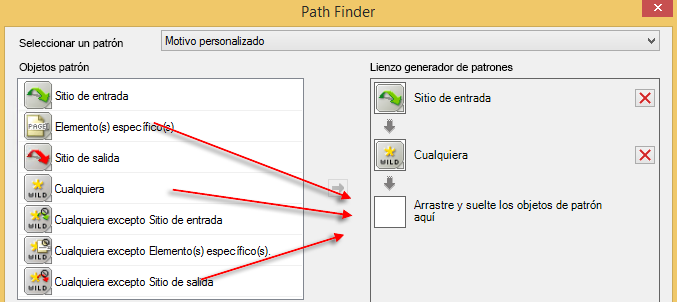
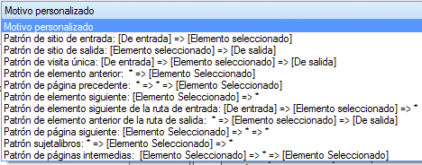
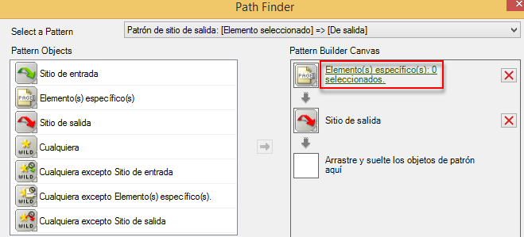
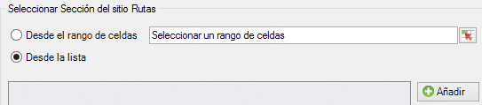

# Filtrado de un informe de rutas mediante el Asistente para solicitudes

Describe los pasos involucrados en la aplicación de filtros a un informe de ruta.

En este ejemplo se utilizan las rutas de sección del sitio.

1. En Report Builder de Adobe, haga clic en **[!UICONTROL Crear]** para abrir el Asistente para solicitudes.
1. Seleccione el grupo de informes adecuado.
1. En la vista de árbol a la izquierda, seleccione **[!UICONTROL Rutas]** > **[!UICONTROL Sección del sitio]** > **[!UICONTROL Sección del sitio Rutas]**.

   

1. Especifique las fechas adecuadas.
1. Haga clic en **[!UICONTROL Siguiente]**.
1. En el paso 2 del asistente, en **[!UICONTROL Rótulos de fila]**, haga clic en el vínculo **[!UICONTROL 1-10 principales (patrón aplicado)]**. En un informe de ruta, se aplica un patrón de forma predeterminada.

   

1. Seleccione la opción **[!UICONTROL Filtro]**.

   

1. En el cuadro de diálogo **[!UICONTROL Definir el patrón de la ruta de &quot;Rutas de sección del sitio&quot;]**, podrá especificar
   1. la clasificación inicial del primer informe.
   1. el número de entradas que desea que se muestren en este informe.
1. Haga clic en **[!UICONTROL Editar]** para definir un patrón de ruta.
1. Si desea un patrón personalizado, arrastre y suelte cualquier **[!UICONTROL Objeto de patrón]** de la lista izquierda en el **[!UICONTROL Lienzo generador de patrones]** a la derecha.

   

1. También puede seleccionar un patrón predefinido de la lista desplegable de **[!UICONTROL Seleccionar un patrón]** y modificarlo. A continuación verá los patrones disponibles:

   

   Algunos de estos patrones son específicos de Report Builder: patrón de elemento siguiente de la ruta de entrada, patrón de elemento anterior de la ruta de salida, patrón de elemento siguiente.
1. Para editar un patrón predefinido:
   1. Selecciónelo. Por ejemplo, seleccione el **[!UICONTROL Patrón de sitio de salida]**: 

   1. En este momento debería definir la ruta de la sección del sitio que sigue el usuario antes de salir. Haga clic en **[!UICONTROL Elemento(s) específico(s): 0 seleccionados]**. Puede definir esta ruta seleccionándola entre un rango de celdas (si edita una solicitud existente) o seleccionándola de una lista de secciones.
   1. Para seleccionar entre un rango de celdas de una solicitud anterior, seleccione **[!UICONTROL Desde el rango de celdas]** y haga clic en el icono de selector de celdas. A continuación, seleccione las celdas de un informe. 

   1. Para seleccionar entre una lista de secciones de sitio, seleccione **[!UICONTROL Desde la lista]** y haga clic en **[!UICONTROL Añadir]**.
   1. Para mover elementos desde la columna de **[!UICONTROL Elementos disponibles]** a la columna de **[!UICONTROL Elementos seleccionados]**, selecciónelos y haga clic en la flecha naranja. A continuación, haga clic en **[!UICONTROL Aceptar]**. 

   1. Para guardar el patrón que acaba de establecer, haga clic en **[!UICONTROL Guardar]**.
   1. Haga clic en **[!UICONTROL Aceptar]** tres veces y, a continuación, haga clic en **[!UICONTROL Finalizar]**. En este momento se genera la solicitud de ruta filtrada.
