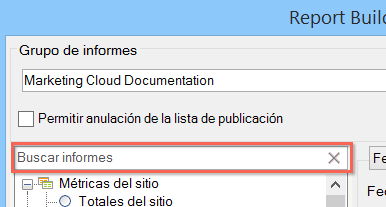

# Información general sobre tipos de informes

Se puede seleccionar el tipo de informe básico para la solicitud de datos, que puede ser Métricas del sitio, Contenido del sitio y Vídeo.

Solo se puede seleccionar un tipo de informe base para un rango de celdas de la hoja de cálculo. Si va a editar una solicitud creada anteriormente, puede modificar el tipo de informe en la ventana [!UICONTROL Asistente para solicitudes: Paso 1] sin necesidad de reconfigurar otros valores de la solicitud.

Puede buscar informes usando la barra de búsqueda de autocompletar. Una vez haya seleccionado un informe desde este control, la vista de árbol seleccionará automáticamente el nodo correspondiente.

