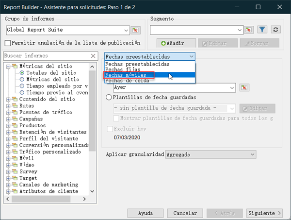
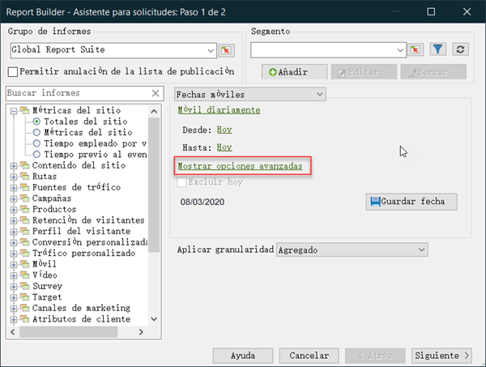
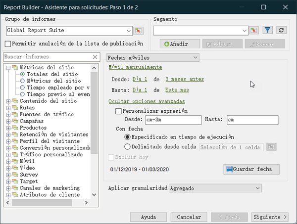

# Resumen de expresiones de fechas personalizadas

Se puede especificar un intervalo de fechas complejo mediante la creación de una expresión personalizada.

Se recomienda hacer referencia a un calendario al crear expresiones para especificar el número de semanas y días correctamente. Excel cuenta con distintas funciones incorporadas que permiten calcular el número de días, días laborables, meses y años entre fechas. Estas funciones se pueden utilizar en fórmulas para calcular otros intervalos como, por ejemplo, semanas y trimestres.

**Para activar expresiones personalizadas**

Este es un ejemplo que utiliza **[!UICONTROL Fechas móviles]**.

1. En el [!UICONTROL Asistente para solicitudes: Paso 1], en lugar de utilizar **[!UICONTROL Fechas preestablecidas]**, seleccione **[!UICONTROL Fechas móviles]**.

   

1. Cambie a móvil semanal, mensual, trimestral o anual. Observe cómo cambian las opciones siguientes.
1. Para obtener más opciones de personalización, haga clic en **[!UICONTROL Mostrar opciones avanzadas]**.

   

1. Por ejemplo, si cambia las fechas anteriores a móvil mensual desde el primer día de hace tres meses hasta el primer día de este mes, las fechas de la parte de opciones avanzadas se actualizarán para reflejar eso:

   

1. Active **[!UICONTROL Personalizar expresión]**. Al seleccionar opciones en **[!UICONTROL Fechas móviles]**, puede ver fácilmente la sintaxis de las expresiones de fecha personalizadas.

   

   Puede utilizar Opciones avanzadas para combinar expresiones de fecha personalizadas. Por ejemplo, si desea ver los datos del primer día del año hasta el final del último mes completo, puede introducir lo siguiente: `From: cy` `To: cm-1d`. En el asistente, esas fechas se muestran como 31/1/2020-1/2020.
