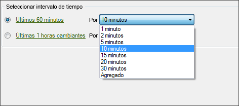

# Configuración de una solicitud en tiempo real

Los pasos describen cómo configurar las fechas de solicitud en tiempo real.

1. Asegúrese de que los informes en tiempo real están activados en las [Herramientas de administración](https://marketing.adobe.com/resources/help/en_US/reference/real_time_admin.html) de informes y análisis de marketing.
1. On the [!UICONTROL Request Wizard: Step 1], click **[!UICONTROL Real-Time Report]** &gt; **[!UICONTROL `<report type>`]**

   Por ejemplo, si selecciona un informe de tráfico. Cuando selecciona el tipo de informe en tiempo real, se muestran las opciones de [!UICONTROL Seleccionar intervalo de tiempo].

1. Seleccione un intervalo de tiempo en minutos o horas.

   

   Los informes en tiempo real están disponibles únicamente para las últimas 20 horas. Para la granularidad, tiene las opciones de seleccionar de granularidad de 1 minuto hasta 30 minutos.
1. Click **[!UICONTROL Next]** and continue [configuring the request layout](../../../../analyze/report-builder/layout/layout.md#concept_D66E1C2217E24E1F837AC064C61919DB).
