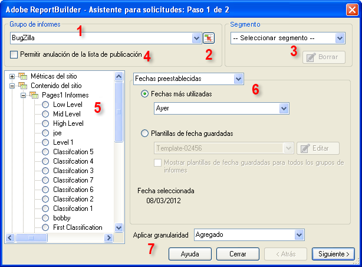

# Solicitudes de datos: Paso 1 del Asistente para solicitudes

En el formulario Asistente para solicitudes: Paso 1, se selecciona el grupo y el tipo de informes, así como los segmentos, y se configuran las fechas.

1. **[!UICONTROL Grupo de informes:]** lista de los grupos de informes que están a su disposición en función de sus credenciales de inicio de sesión. Consulte [Seleccionar grupos de informes](/help/analyze/report-builder/data-requests/selecting-report-suites/t-select-report-suites.md).

1. **Selector de rango:** permite seleccionar un ID de grupo de informes en una celda en Excel. Consulte [Seleccionar grupos de informes](/help/analyze/report-builder/data-requests/selecting-report-suites/t-select-report-suites.md).

1. **Segmento**: los segmentos son subconjuntos de datos o datos filtrados mediante reglas que se han creado. Los segmentos se basan en visitas individuales, visitas y visitantes. Consulte la [Guía de segmentación de Analytics](https://docs.adobe.com/content/help/es-ES/analytics/components/segmentation/seg-home.html) para obtener más información acerca de los segmentos.

   Por ejemplo, puede ejecutar un [!UICONTROL Informe de páginas] y, a continuación, aplicar el segmento Primeras visitas.

1. **Permitir anulación de la lista de publicación**: cuando se programa un informe, se puede seleccionar una lista de publicación para utilizarla en la distribución. Las listas de publicaciones se configuran en **[!UICONTROL Analytics]** > **[!UICONTROL Herramientas de administración]**. El grupo de informes de esta solicitud se reemplaza por el ID de grupo de informes asignado a cada destinatario incluido en la lista de publicación. Consulte [Permitir anulaciones de la lista de publicación](/help/analyze/report-builder/data-requests/allow-publishing-list-overrides.md).

1. **Tipo de informe**: especifica el informe base que se desea ejecutar en la solicitud de datos. Por cada solicitud se ejecuta un informe, y éste puede tener de una a varias dimensiones y métricas. La métrica y las dimensiones de un tipo de informe se muestran en la interfaz del [!UICONTROL Asistente para solicitudes: Paso 2]. Consulte [Seleccione Tipos de informes](/help/analyze/report-builder/data-requests/c-report-types/select-report-types.md).

1. **Intervalos de fechas**: define el lapso de tiempo abarcado por la solicitud. Existen distintos tipos de períodos de tiempo de solicitud como, por ejemplo, preestablecidos, fijos y móviles. El número máximo de períodos es 366. También puede seleccionar un intervalo de fechas especificado por una celda y guardar los intervalos de fechas como plantillas para su uso posterior.  Consulte [Configuración de fechas de informes](/help/analyze/report-builder/data-requests/configuring-report-dates/custom-calendar.md)

1. **Aplicar granularidad**: especifica el nivel de detalle basado en el tiempo que se incluye en el informe. Consulte [Granularidad](/help/analyze/report-builder/data-requests/configuring-report-dates/granularity.md).

## Resolución de problemas

A veces, el asistente para solicitudes aparece fuera de la pantalla, especialmente para los usuarios que se desplazan entre configuraciones del monitor. Por ejemplo, se utiliza una estación de acoplamiento en el trabajo y la pantalla del portátil en casa. Si vuelve a hacer clic en “Crear” mientras ya está abierto el asistente para solicitudes, aparece el siguiente error:

“Primero debe completar el proceso del asistente para solicitudes antes de iniciar uno nuevo”.

Si vuelve a mostrar el asistente para solicitudes en pantalla, se resuelve este problema.

1. Abra Microsoft Excel e inicie sesión en Report Builder.
2. Haga clic en [!UICONTROL Crear], que abre el asistente para solicitudes fuera de pantalla.
3. Presione `[Alt]` + `[Space]`.
4. Presione `[M]`.
5. Presione cualquiera de las teclas de flecha.
6. Mueva el ratón, que adjunta el asistente para solicitudes al cursor
7. Haga clic con el ratón para soltar el asistente de solicitudes en pantalla.
