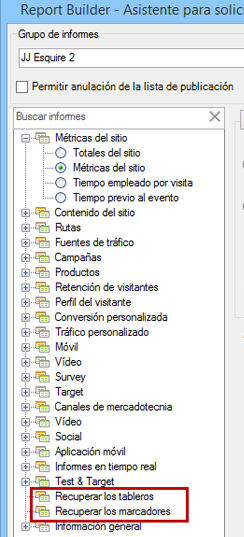

# Importación de informes marcados e informes del panel

Todos los informes marcados y los informes del tablero ahora se enumeran como dimensiones en el paso 1 del Asistente para solicitudes y pueden importarse como solicitudes del Creador de informes.

Cuando selecciona un informe marcado, el Asistente para solicitudes rellena todas las dimensiones y métricas que definen este informe marcado. El intervalo de fechas, la granularidad y el segmento seleccionado también se actualizan según el marcador seleccionado..

Este es el modo en el que el Paso 1 del Asistente para solicitudes muestra un tablero y sus informes breves:

When you click **[!UICONTROL Retrieve your Dashboards]** or **[!UICONTROL Retrieve your Bookmarks]**, your existing dashboard and/or bookmark data is retrieved and pasted in the worksheet.

> [!NOTE] En el Creador de informes, la lista de tableros y marcadores disponibles está limitada al usuario, pero también a los que se aplican al grupo de informes seleccionado en el Paso 1 del asistente. Por el contrario, en los informes y análisis de marketing obtiene acceso a todos los marcadores y tableros que le son accesibles, independientemente de qué grupos de informes utilicen dichos tableros y marcadores.

> [!NOTE] Solo se importan los datos, de modo que si el marcador contiene un gráfico o si el informe breve del tablero consiste únicamente en un gráfico, sólo se importan los datos que se utilizan para rellenar el gráfico.

Una vez que haya creado una solicitud mediante la importación de un informe breve del panel (o un marcador), la solicitud quedará asociada a la dimensión primaria del informe breve (o marcador). Como resultado, si edita la solicitud, la vista de árbol ya no selecciona el nodo de vista de árbol del informe breve del tablero (o nodo de marcador): selecciona su dimensión principal en su lugar.

El bookmarklet importado configurará adecuadamente el grupo de informes, el segmento seleccionado, la dimensión y las métricas seleccionadas con los mismos parámetros expuestos en el marcador Informes y análisis. 

>[!IMPORTANT]
>
>El intervalo de fechas se establecerá en el mismo intervalo de fechas, pero como un intervalo de fechas estático, incluso si este intervalo de fechas era un intervalo de fechas móvil en el marcador Informes y análisis.

