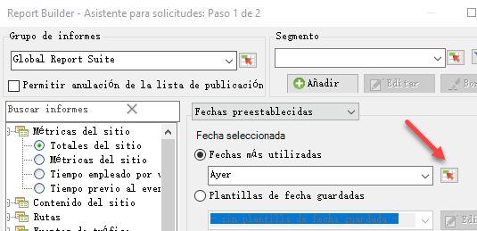
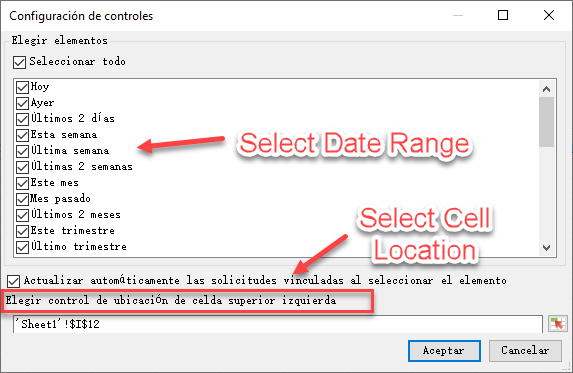
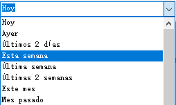
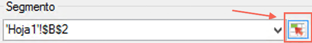
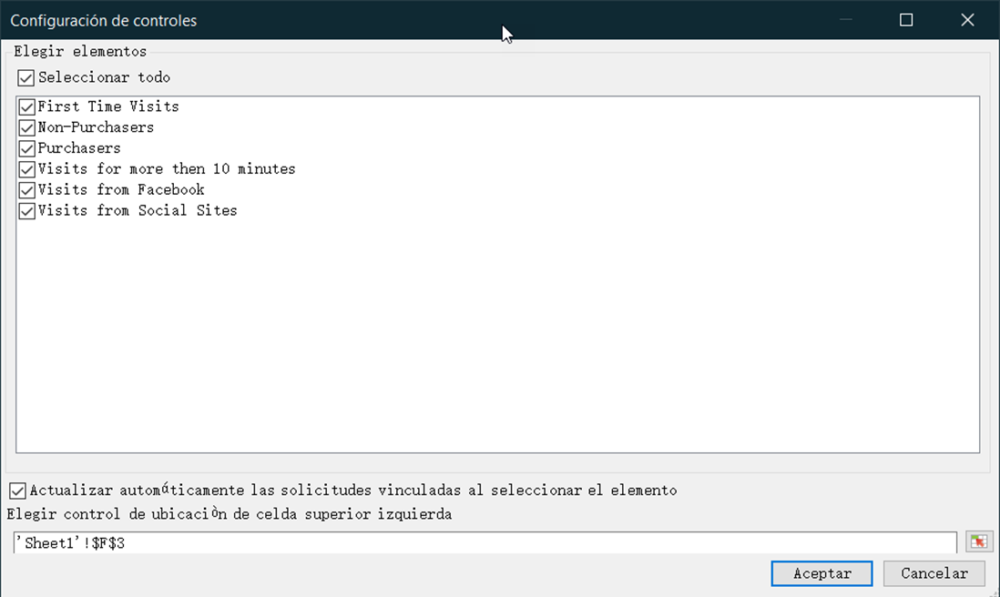
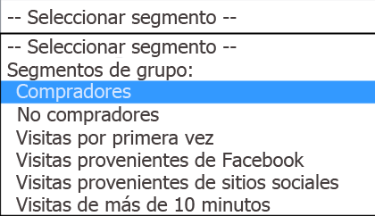

# Controles interactivos

Los controles interactivos le permiten editar segmentos e intervalos de fechas de una o más solicitudes directamente desde la hoja de cálculo. Esto le proporciona una mayor flexibilidad cuando actualiza las solicitudes de Report Builder.

Los controles interactivos se crearon en respuesta al flujo de trabajo común donde los analistas crean los libros y comparten estos libros con la organización de marketing. Los controles interactivos proporcionan a los especialistas en marketing la capacidad de modificar y actualizar las solicitudes sin tener que contar con conocimientos en profundidad de cómo funciona Report Builder. (Tenga en cuenta que para poder actualizar una solicitud, el receptor del libro debe ser un usuario de Report Builder). Estos controles funcionan en libros programados. Hay dos tipos de controles interactivos disponibles actualmente:

* Intervalo de fechas móvil
* Segmentos

>[!IMPORTANT]
>
>Debe tener Report Builder 5.0 instalado para que funcionen los controles interactivos. >
>* Si ejecuta Microsoft Excel en Windows pero ejecuta una versión anterior de Report Builder, o si no lo tiene instalado: puede cambiar el valor en el control interactivo pero no se actualizará en la solicitud asociada, ni se actualizarán los parámetros asociados a la solicitud.
>* Si ejecuta Excel en Mac y cambia el valor en el control provocará que se muestre el siguiente mensaje: “No se encuentra la macro &#39;Adobe.ReportBuilder.Bridge.FormControlClick.Event’”.

>

>[!IMPORTANT]
>
>No manipule el nombre del control. (Para ver el nombre, establezca el foco en el control y aparecerá el nombre de control directamente sobre la cuadrícula de Excel, en la esquina superior izquierda).

## Implementar el control de intervalo de fechas interactivo {#section_39B228F2D2C44985863D31424C953280}

1. En el paso 1 del Asistente para solicitudes, seleccione, por ejemplo, el informe **[!UICONTROL Página]**.
1. Junto al menú desplegable de **[!UICONTROL Fechas más utilizadas]**, haga clic en el icono **[!UICONTROL Configuración de controles]**:

   

1. En el cuadro de diálogo Configuración de controles, seleccione todos los elementos de intervalo de fechas que desee mostrar en el control interactivo. Además, especifique la ubicación de la celda superior izquierda del control.

   

1. Tenga en cuenta la opción para “Actualizar automáticamente las solicitudes vinculadas al seleccionar el elemento”.

   * Si esta opción está activada, se actualizan todas las solicitudes que utilizan este control.
   * Si no está activada, los parámetros de solicitud asociados se actualizan, pero la solicitud no se actualiza.

1. Haga clic en **[!UICONTROL Aceptar]**. Aparece el control en la ubicación de la celda que haya especificado:

   

1. Ahora puede cambiar el intervalo de fechas y la solicitud se actualizará con ese intervalo de fechas.
1. También puede copiar la solicitud y hacer clic con el botón derecho para utilizar una de las dos opciones de Pegar solicitud:

   * **[!UICONTROL Pegar solicitud]** > **[!UICONTROL Utilizar celda de entrada absoluta]**. Esto significa que la solicitud copiada señalará al mismo control de fecha interactivo que la solicitud original.

   * **[!UICONTROL Pegar solicitud]** > **[!UICONTROL Utilizar celda de entrada relativa]**. Esto significa que la solicitud copiada señalará a su propio control.

      >[!NOTE]
      >
      >Puede utilizar la función de control nativa de Microsoft Excel de cortar/copiar/pegar. Report Builder reconoce automáticamente los controles recientemente añadidos.

## Implementar el control de segmento interactivo {#section_5003D3F724644280BF1BCD6E1B0CB784}

Implementar el control de segmento interactivo es similar a implementar el control de intervalo de fechas.

1. En el paso 1 del Asistente para solicitudes, junto a la lista desplegable de **[!UICONTROL Segmento]**, seleccione el icono de Configuración de controles del segmento:

   

1. En el cuadro de diálogo Configuración de controles del segmento, seleccione los segmentos que desee incluir en la lista desplegable. Además, especifique la ubicación de la celda superior izquierda del control.

   

1. El nuevo control interactivo ahora aparecerá en el libro:

   

