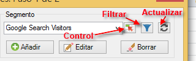
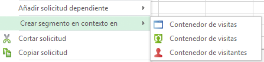
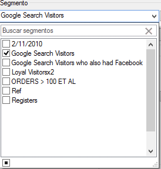
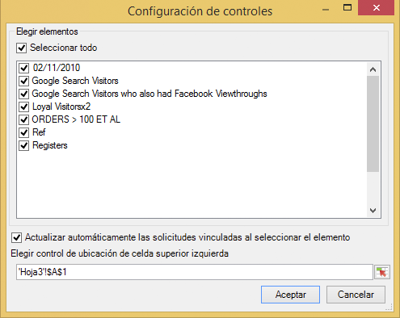
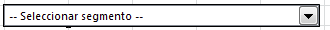
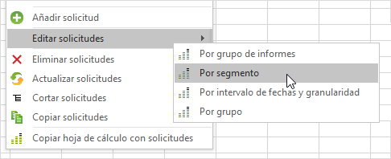

# Administrar segmentos

Cómo añadir, editar, aplicar y filtrar los segmentos de Adobe Analytics en el Creador de informes.

El Creador de informes incluye un panel de segmentación en el paso 1 del Asistente para solicitudes que le permite crear y administrar segmentos.

## Añadir o editar segmentos {#section_B2BC136F9A53498D90C7C2ECC5DB892B}

>[!NOTE]
>
>Para agregar o editar segmentos, la interfaz de segmentos del Creador de informes inicia el Generador de segmentos de Analytics en una ventana de Microsoft Internet Explorer. Su sesión del Creador de informes permanecerá activa. Otros exploradores que no sean Internet Explorer no son compatibles con esta operación.

1. En el panel de segmento del paso 1 del Asistente para solicitudes, haga clic en **[!UICONTROL Añadir]**.
1. Se inicia una ventana de Internet Explorer que abre la interfaz del Creador de segmentos de Analytics. Para obtener información acerca de cómo crear segmentos, consulte [https://marketing.adobe.com/resources/help/es_ES/analytics/segment/](https://marketing.adobe.com/resources/help/en_US/analytics/segment/).
1. Una vez que haya definido y guardado el segmento, vuelva al Asistente para solicitudes.
1. Haga clic en el icono de actualizar para actualizar la lista de segmentos.

>[!IMPORTANT]
>
>Esta lista se almacena en caché y el segmento recién creado no aparecerá a menos que realice una actualización.

## Crear segmentos en contexto {#section_6DD2C663B2854469AA1075438F907678}

Es posible que tenga combinaciones específicas de dimensiones de informe que desee convertir en un segmento. Puede crear estos segmentos desde la interfaz del Creador de informes. Por ejemplo, seleccione algunas páginas de un resultado de solicitud de Página y cree un segmento basado en esos valores.

1. Seleccione los elementos de resultado del informe que desee convertir en un segmento.
1. Haga clic con el botón derecho para seleccionar **[!UICONTROL Crear segmento en contexto en]y especifique el contenedor derecho (Contenedor de visita, Contenedor de visitas, Contenedor de visitantes).**

   

   Si desea información acerca de los contenedores, consulte la [Guía de segmentación](https://marketing.adobe.com/resources/help/en_US/analytics/segment/).

1. Se iniciará la interfaz de usuario del creador de segmentos en Internet Explorer. La interfaz de usuario del creador de segmentos se iniciará con el contenedor y el filtro que haya especificado.
1. Añada un nombre y una descripción al segmento y, a continuación, guárdelo.
1. Vuelva al Creador de informes y haga clic en el icono Actualizar para actualizar la lista de segmentos.
1. Ahora está listo para aplicar este segmento.

## Buscar y aplicar segmentos {#section_CACA269B48E94CFD91C2D5A15E9C77B7}

Cualquier segmento que se haya creado en Informes y análisis, Análisis específicos, el Creador de informes o el Almacén de datos aparecerá en esta lista de segmentos. Para actualizar la lista, haga clic en el icono Actualizar ( .

Puede aplicar uno o varios segmentos a una solicitud determinada. Esto incluye segmentos secuenciales.

1. Go to the **[!UICONTROL Segment]** drop-down list and click the small down arrow in the **[!UICONTROL Choose Segment]**box to display all the segments.

   

1. Marque los segmentos que desee aplicar.

>[!NOTE]
>
>Tanto si es administrador como si no, en el Creador de informes podrá ver solo los segmentos que posee y los que se han compartido con usted. (En la interfaz de usuario de Informes y análisis de marketing, el administrador puede ver todos los segmentos de la organización).

## Filtrar segmentos {#section_376E986D3E684999A7CDB08E53854159}

Para **filtrar** segmentos haga clic en el icono filtrar:  

Los filtros disponibles incluyen:

| Nombre del filtro | Descripción |
|---|---|
| Etiquetas | Le permite filtrar los segmentos con etiquetas específicas. Tenga en cuenta que los filtros de etiqueta utilizan el operador AND. Si marca dos etiquetas, el panel derecho muestra los segmentos etiquetados con **ambas** etiquetas. |
| Propietarios | Le permite filtrar segmentos por el propietario. Tenga en cuenta que los filtros de Propietario utilizan el operador OR. Si marca dos propietarios, el panel de la derecha muestra los segmentos que son propiedad de **uno** de los propietarios. |
| Otros filtros &gt; Solo el *nombre del grupo de informes* | If you apply the "Only *report suite name*" filter in the Segment Builder in [!DNL marketing reports & analytics], and then display the Advanced Filter in [!DNL report builder], the Advanced filter will display the segment for the selected report suite only. |
| Otros filtros &gt; Míos | Muestra todos los segmentos de su propiedad. |
| Otros filtros &gt; Compartidos conmigo | Muestra todos los segmentos que otros comparten con usted. |
| Otros filtros &gt; Favoritos | Muestra todos los segmentos que haya marcado como Favoritos. |
| Otros filtros &gt; Aprobados | Muestra todos los segmentos aprobados oficialmente. |

## Añadir un control de segmento a un libro {#section_E3E5149A8464441FA5445A98DBD520AC}

Añadir un control de segmento le permite conmutar segmentos dentro de un libro en lugar de tener que ir al Asistente para solicitudes.

1. Click the Control icon ( ) next to the segment drop-down.

   

1. Marque todos los segmentos que desee que aparezcan en el control de segmentos o marque **[!UICONTROL Seleccionar todo]**.
1. Tenga en cuenta la opción para **[!UICONTROL Actualizar automáticamente las solicitudes vinculadas al seleccionar el elemento]**.

   * Si esta opción está activada, se actualizan todas las solicitudes que utilizan este control.
   * Si no está activada, los parámetros de solicitud asociados se actualizan, pero las solicitudes no se actualizan.

1. Especifique la ubicación de la celda superior izquierda del control de segmentos.
1. Haga clic en **[!UICONTROL Aceptar]y aparecerá el control de segmento en la ubicación especificada.**

   

## Actualizar la lista de segmentos {#section_22E4A86789444B4A998532396B476EFB}

Any time you add a new segment or edit an existing one, you should click the Refresh icon (  to refresh the cached list of segments.

## Gestionar segmentos entre solicitudes {#section_C3D63FCBE1A94369A319243313B03C93}

Antes de la versión 5.4, el Creador de informes permitía a los usuarios cambiar segmentos en varias solicitudes. No obstante, este proceso siempre sustituía los segmentos que ya existían. Los usuarios que deseen añadir un nuevo segmento para cada solicitud no podrán hacerlo, ya que al añadir el segmento se eliminaría el conjunto de segmentos previo ya asignado a cada solicitud.

El Creador de informes 5.4 permite añadir, eliminar, reemplazar y reemplazar todos los segmentos dentro de varias solicitudes.

1. Seleccione varias solicitudes en un libro.
1. Right-click and select **[!UICONTROL Edit Requests]** &gt; **[!UICONTROL By Segment]**.

   

1. En el cuadro de diálogo Editar grupo, seleccione una de las cuatro opciones:

   | Opción | Descripción |
   |---|---|
   | Añadir segmento | Permite elegir uno o más segmentos para añadirlos a la lista de segmentos actuales. |
   | Reemplazar segmentos | Permite elegir los segmentos que se reemplazarán por uno o más segmentos. |
   | Reemplazar todos los segmentos por | Permite elegir uno o más segmentos para reemplazar por ellos los segmentos actuales. |
   | Eliminar segmentos | Permite eliminar los segmentos de las solicitudes. |

