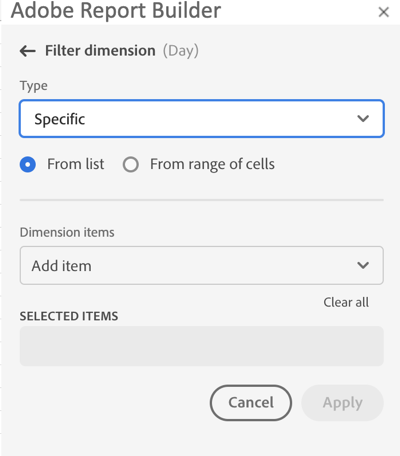
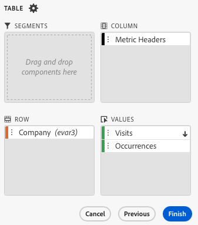
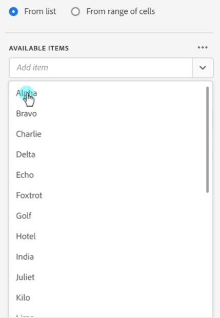

# Filtrar dimensiones

De forma predeterminada, cada elemento de dimensión de la tabla devuelve los 10 elementos principales para esa dimensión.

Para cambiar los elementos de dimensión devueltos para cada dimensión:

1. Seleccione una celda en el bloque de datos.

1. Seleccione  **[!UICONTROL Editar bloque de datos]** en el panel **[!UICONTROL Comandos]**.

1. Seleccione **[!UICONTROL Siguiente]** para mostrar la ficha **[!UICONTROL Dimensiones]**.

1. Seleccione  junto al nombre de un componente en la tabla.

   {zoomable="yes"}

1. Seleccione **[!UICONTROL Filtrar dimensión]** en el menú emergente para mostrar el panel **[!UICONTROL Filtrar dimensión]**.

1. Seleccione **Más popular** o **Específico** como **[!UICONTROL Tipo]**.

   {zoomable="yes"}

1. Seleccione las opciones adecuadas en función del [tipo de filtro](#filter-type) elegido.

1. Seleccione **[!UICONTROL Aplicar]** para agregar el filtro.

1. Report Builder muestra una notificación para confirmar el filtro añadido.

Para mostrar los filtros aplicados, pase el puntero por encima de una dimensión. Las dimensiones con filtros aplicados muestran un icono de filtro  junto al nombre de la dimensión.

## Cambio del filtro y el orden

Aparece  o  junto a la métrica utilizada para filtrar y ordenar el bloque de datos. La dirección de la flecha indica si la métrica se ordena en orden ascendente o descendente.

Para cambiar el criterio de ordenación:

- Seleccione  o  junto a la métrica para alternar el criterio de ordenación.

Para cambiar la métrica utilizada para filtrar y ordenar el bloque de datos:

1. Pase el puntero por encima del componente de métrica deseado en el Generador de tablas para ver las opciones adicionales.

2. Seleccione  para la métrica preferida.

   {zoomable="yes"}

## Tipo de filtro

Existen dos maneras de filtrar los elementos de dimensión: [Más popular](#most-popular) y [Específico](#specific-filtering)

### **[!UICONTROL El más popular]**

La opción **[!UICONTROL Más popular]** le permite filtrar dinámicamente elementos de dimensión en función de los valores de las métricas. El más popular devuelve los elementos de dimensión de mayor clasificación en función de los valores de las métricas. De forma predeterminada, se muestran los 10 primeros elementos de dimensión, ordenados por la primera métrica añadida al bloque de datos.

{zoomable="yes"}

#### Opciones de página y filas

Utilice los campos **[!UICONTROL Página]** y **[!UICONTROL Filas]** para dividir los datos en grupos secuenciales o páginas. Esta función le permite extraer en el informe valores de fila clasificados que no sean los valores más altos. Y es especialmente útil para extraer datos que superen el límite de 50 000 filas.

El valor predeterminado de la página es `1` y de las filas es `10`. Estos valores predeterminados implican que cada página tiene 10 filas de datos. La página 1 devuelve los 10 elementos principales, la página 2 devuelve los 10 elementos siguientes, etc.

En la tabla siguiente se muestran ejemplos de valores de página, fila y el resultado.

| Página | Fila | Output |
|------|--------|----------------------|
| 1 | 10 | Primeros 10 elementos |
| 2 | 10 | Elementos 11 a 20 |
| 1 | 100 | Primeros 100 elementos |
| 2 | 100 | Elementos 101 a 200 |
| 2 | 50 000 | Elementos 50 001 a 100 000 |

En la tabla siguiente se muestran los valores mínimo y máximo de página y filas.

|       | Valores mínimos | Valores máximos |
|-------|---------------:|---------------:|
| Página de inicio | 1 | 50 millones |
| Número de filas | 1 | 50 000 |

#### Incluir “Sin valor”

En Customer Journey Analytics, algunas dimensiones recopilan una entrada *Sin valor*. La configuración **[!UICONTROL Incluir &quot;Sin valor&quot;]** le permite excluir estos valores de los informes. Por ejemplo, puede crear una clasificación como la de Nombre del producto basada en la clave SKU del producto. Si no se ha configurado un SKU de producto específico con su clasificación de nombre de producto específica, su valor de nombre de producto se establece en *Ningún valor*.

**[!UICONTROL Incluir &quot;Sin valor&quot;]** está seleccionado de forma predeterminada. Anule la selección de esta opción para excluir las entradas sin valor.

#### Filtrado por criterios

Puede filtrar los elementos de dimensión en función de si se cumplen todos los criterios o alguno.

Para definir criterios de filtrado:

1. Seleccione un operador en el menú desplegable del operador. De forma predeterminada **[!UICONTROL Contiene la frase]** seleccionada

   {zoomable="yes"}

1. Introduzca un término de búsqueda.

1. Seleccione  **[!UICONTROL Agregar fila]** para confirmar la selección y agregar otro elemento de criterio.

1. Seleccione  para quitar un elemento de criterio.

Puede incluir hasta 10 elementos de criterio.

### **[!UICONTROL específico]**

La opción **[!UICONTROL Specific]** le permite crear una lista fija de elementos de dimensión para cada dimensión. Utilice el tipo de filtro **[!UICONTROL Específico]** para especificar los elementos de dimensión exactos que se incluirán en el filtro. Puede seleccionar elementos de una lista o de un rango de celdas.

{zoomable="yes"}

#### De la lista

1. Seleccione la opción **[!UICONTROL De la lista]** para buscar y seleccionar elementos de dimensión.

   Al seleccionar la opción **De la lista**, la lista **[!UICONTROL Elementos de Dimension]** se rellena con elementos de dimensión ordenados por número de eventos.

   {zoomable="yes"}

1. Escriba un término de búsqueda en  **[!UICONTROL _Agregar elemento_]** para buscar en la lista.

1. Para buscar un elemento no incluido en los últimos 90 días de datos, seleccione **[!UICONTROL Mostrar elementos de los últimos 6 meses]** para ampliar la búsqueda. Después de cargar los datos de los últimos 6 meses, Report Builder actualiza el vínculo a **[!UICONTROL Mostrar elementos de los últimos 18 meses]**.

1. Para eliminar un elemento de la lista **[!UICONTROL Elementos seleccionados]**, seleccione .

1. Para mover un elemento en la lista **[!UICONTROL Elementos seleccionados]**, arrastre y suelte el elemento o seleccione  para mostrar el menú contextual y seleccione entre las opciones de movimiento.

1. Seleccione **[!UICONTROL Aplicar]**.

Report Builder actualiza la lista para mostrar el filtro específico que ha aplicado.

#### Desde el rango de celdas

Seleccione la opción **Desde el rango de celdas** para elegir un rango de celdas que contenga la lista de elementos de dimensiones que desea que coincidan.

{zoomable="yes"}

Cuando seleccione un rango de celdas, tenga en cuenta las restricciones siguientes:

- El rango debe tener al menos una celda.
- El rango no puede tener más de 50 000 celdas.
- El rango debe estar en una sola fila o columna sin interrupciones.

La selección puede contener celdas vacías o con valores que no coinciden con un elemento de dimensión específico.

### Filtrado rápido de una dimensión

Para filtrar una dimensión para la que actualmente no se aplica ningún filtro:

1. Seleccione  para una dimensión. Por ejemplo, **[!UICONTROL canal de interacción]**.

1. Seleccione dos veces elementos de dimensión para agregarlos al filtro. También puede seleccionar uno o más elementos de dimensión y arrastrar y soltar la selección en la sección  **[!UICONTROL Row]**.

   {zoomable="yes"}

<!--

By default, each dimension item in the table returns the top 10 items for that dimension.

To change the dimension items returned for each dimension

1. Click **[!UICONTROL Manage]** and select a data block from the list.

   

1. Click **[!UICONTROL Edit data block]** in the COMMANDS panel.

1. Click **[!UICONTROL Next]** to display the Dimensions tab.

1. Click the **...** icon next to a component name in the table.

    

1. Select **[!UICONTROL Filter dimension]** in the pop-up menu to display the **[!UICONTROL Filter dimension]** pane.

1. Select **[!UICONTROL Most popular]** or **[!UICONTROL Specific]**.

    

1. Select appropriate options based on the filter type chosen.

1. Click **[!UICONTROL Apply]** to add the filter.

    Report Builder displays a notification to confirm the added filter.

To display applied filters, hover over a dimension. Dimensions with applied filters display a filter icon to the right of the Dimension name.

## Filter Type

There are two ways to filter dimension items: Most popular and Specific.

## Most popular

The [!UICONTROL Most popular] option allows you to dynamically filter dimension items based on metric values. [!UICONTROL Most popular] filtering returns the highest ranked dimension items based on metric values. By default, the first 10 dimensions items are listed, sorted by the first metric added to the data block.

 

### Page and Rows options

Use the **Page** and **Rows** fields to divide data into sequential groups or pages. This allows you to pull ranked row values other than the top-most values into your report. This feature is especially useful for pulling data beyond the 50,000 row limit.

#### Page and Rows defaults

- Page = 1
- Rows = 10

The Page and Rows default settings identify that each page has 10 rows of data. Page 1 returns the top 10 items, page 2 returns the next 10 items, and so on.

The table below lists examples of page and row values and the resulting output.

| Page | Row    | Output               |
|------|--------|----------------------|
| 1    | 10     | Top 10 items         |
| 2    | 10     | Items 11-20          |
| 1    | 100    | Top 100 items        |
| 2    | 100    | Items 101-200        |
| 2    | 50,000 | Items 50,001-100,000 |

#### Minimum and maximum values

- Starting page: Min = 1, Max: 50 million
- Number of rows: Min = 1, Max: 50,000

### Include "No value"

In Adobe Analytics, some dimensions collect a "no value" entry. This filter allows you to exclude these values from reports. For example, you can create a classification such as the Product Name classification based on the Product SKU key. If a specific product SKU has not been set up with its specific Product Name classification, its Product Name value is set to "no value".

Include "**No value**" is selected by default. Deselect this option to exclude entries with no value.

### Filter by Criteria

You can filter dimension items based on whether all criteria are met or if any criteria are met.

To set filtering criteria

1. Select an operator from the drop-down list.

    

1. Enter a value into the search field.

1. Click **[!UICONTROL Add row]** to confirm the selection and add another criteria item.

1. Click the delete icon to remove a criteria item.

    You can include up to 10 criteria items.

### Change the filter and sort order

An arrow appears next to the metric used to filter and sort the data block. The direction of the arrow indicates whether the metric is sorted greatest to least or least to greatest.

To change the sort direction, click the arrow next to the metric.

To change the metric used to filter and sort the data block,

1. Hover over the desired metric component in the Table builder to display additional options.

2. Click the arrow on the preferred metric.

   

## Specific filtering

The Specific option allows you to create a fixed list of dimension items for each dimension. Use the **[!UICONTROL Specific]** filtering type to specify the exact dimension items to include in your filter. You can select items from a list or from a range of cells.

### From list

1. Select the **[!UICONTROL From list]** option to search for and select dimension items.

    When you select the **[!UICONTROL From list]** option, the list is populated with dimension items with the most events first.

    

    The **[!UICONTROL Available items]** list is ordered from dimension items with the most events to those with the least.

1. Enter a search term in the **[!UICONTROL Add item]** field to search the list.

1. To search for an item not included in the last 90 days of data, click **[!UICONTROL Show items for the last 6 months]** to extend the search.

    

    After data from the past 6 months loads, Report Builder updates the link to **[!UICONTROL Show items for last 18 months]**.

1. Select a dimension item.

    Selected dimension items are automatically added to the **[!UICONTROL Selected items]** list.

    

    To delete an item from the list, click the delete icon to remove the item from the list.

    To move an item in the list, drag and drop the item or click ... to display the move menu.

    

1. Click **[!UICONTROL Apply]**

    Report Builder updates the list to show the specific filtering you applied.

### From range of cells

Select the **[!UICONTROL From range of cells]** option to choose a range of cell that contain the list of dimensions items to match.

 

When you select a range of cells, consider the following restrictions:

- The range must have at least one cell.
- The range can't have more than 50,000 cells.
- The range must be in a single uninterrupted row, or column.

Your selection can contain empty cells or cells with values that don't match with a specific dimension item.

### From the Dimensions tab in the Table builder

From the **[!UICONTROL Dimensions]** tab, click the chevron icon next to a dimension name to view the list of dimension items.

 

You can drag and drop items onto the **[!UICONTROL Table]** or double-click an item name to add it to the **[!UICONTROL Table]** builder.

-->