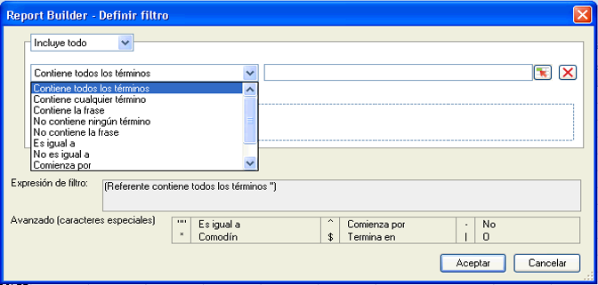

# Resumen del filtrado de dimensiones

Es posible filtrar las dimensiones que se añadan a la cuadrícula Rótulos de fila. Los filtros limitan los datos devueltos por las solicitudes y se pueden aplicar desde los diseños personalizados y de tabla dinámica. Cuando se configura el filtro de dimensiones desde el diseño de tabla dinámica, se puede especificar además el número de entradas de la celda.

El formulario del filtro seleccionado se completa según el elemento y la métrica que estén seleccionados en la solicitud de Report Builder.

## Definir filtro: valores y caracteres especiales {#section_15840216A4044C40974945FAA435AD93}

Información sobre filtros en el panel **[!UICONTROL Filtros más populares]** > **[!UICONTROL Definir filtro]**.

Las tablas que aparecen a continuación contienen ejemplos e información sobre filtros:

<table id="table_8AC3A26FF02143DBA949B30F2A46CF11"> 
 <thead> 
  <tr> 
   <th colname="col1" class="entry"> Filtro </th> 
   <th colname="col02" class="entry"> Descripción </th> 
   <th colname="col2" class="entry"> Ejemplo de filtro </th> 
   <th colname="col3" class="entry"> Resultados de coincidencias </th> 
  </tr> 
 </thead>
 <tbody> 
  <tr> 
   <td colname="col1"> 
Contiene todos los términos 
 </td> 
   <td colname="col02"> 
Contiene todos los valores delimitados por espacios, en cualquier orden. 
 </td> 
   <td colname="col2"> 
a b c 
 </td> 
   <td colname="col3"> 
Devuelve como resultado  a b c y  b a c, etc. 
 </td> 
  </tr> 
  <tr> 
   <td colname="col1"> 
Contiene cualquier término 
 </td> 
   <td colname="col02"> 
Contiene al menos uno de los filtros (delimitados por espacios). 
 </td> 
   <td colname="col2"> 
A B C 
 </td> 
   <td colname="col3"> 
Devuelve como resultado  A1,  B2,  C3, pero no  D4. 
 </td> 
  </tr> 
  <tr> 
   <td colname="col1"> 
Contiene la frase 
 </td> 
   <td colname="col02"> 
Contiene el filtro de búsqueda y, posiblemente, otros términos. 
 </td> 
   <td colname="col2"> 
abc 
 </td> 
   <td colname="col3"> 
Devuelve como resultado  abc y  abc def. 
 </td> 
  </tr> 
  <tr> 
   <td colname="col1"> 
No contiene ningún término 
 </td> 
   <td colname="col02"> 
Devuelve todos los resultados excepto los que contienen alguno de los valores introducidos. 
 </td> 
   <td colname="col2"> 
a b c 
 </td> 
   <td colname="col3"> 
Devuelve como resultado  d e f pero no  c d e f. 
 </td> 
  </tr> 
  <tr> 
   <td colname="col1"> 
No contiene la frase 
 </td> 
   <td colname="col02"> 
Devuelve todos los resultados excepto los que contienen la frase especificada. 
 </td> 
   <td colname="col2"> 
abc 
 </td> 
   <td colname="col3"> 
Excluye  abc,  abc def y coincide con  def 
 </td> 
  </tr> 
  <tr> 
   <td colname="col1"> 
Es igual a 
 </td> 
   <td colname="col02"> 
Devuelve una coincidencia exacta. 
 </td> 
   <td colname="col2"> 
abc 
 </td> 
   <td colname="col3"> 
  abc es el único resultado devuelto. 
 </td> 
  </tr> 
  <tr> 
   <td colname="col1"> 
No es igual a 
 </td> 
   <td colname="col02"> 
Devuelve todos los resultados excepto los que coinciden exactamente con lo que ha escrito. 
 </td> 
   <td colname="col2"> 
a 
 </td> 
   <td colname="col3"> 
No devuelve como resultado  a. 
 
Coincide con  a b c. 
 
Coincide con  abc. 
 </td> 
  </tr> 
  <tr> 
   <td colname="col1"> 
Comienza con 
 </td> 
   <td colname="col02"> 
Devuelve los resultados que comienzan con un valor específico. 
 </td> 
   <td colname="col2"> 
abc 
 </td> 
   <td colname="col3"> 
Devuelve como resultado  abcd pero no  1abc 
 </td> 
  </tr> 
  <tr> 
   <td colname="col1"> 
Finaliza con 
 </td> 
   <td colname="col02"> 
Devuelve los resultados que finalizan con el valor especificado. 
 </td> 
   <td colname="col2"> 
xyz 
 </td> 
   <td colname="col3"> 
Coincide con  wxyz pero no con  wxyz0 
 </td> 
  </tr> 
  <tr> 
   <td colname="col1"> 
Avanzado (caracteres especiales) 
 </td> 
   <td colname="col02"> 
Permite usar caracteres de expresiones regulares: 
 
 <code> "", ^, -, *, $, | </code> 
 </td> 
   <td colname="col2"> 
"^Página*principal$" | deportes 
 </td> 
   <td colname="col3"> 
 Define un filtro que empieza por  Inicio y, a continuación, busca cero o más caracteres y termina con Página. 
 
Además, cualquier página con  deportes. 
 
Varios ejemplos de coincidencias: 
 
    <ul id="ul_72D76C5AFEAF405E8A0E4E3C604D10AE"> 
     <li id="li_4D490059B667450DA8A0103167C7B391">Página principal </li> 
     <li id="li_1351619156274092AEB2771D882AD357">Página y (otros caracteres) principal </li> 
     <li id="li_940EAA99A8CF49308E8471065EB317B1">Página de deportes </li> 
     <li id="li_50A895F14A454BE9BF06EE0F07F99B3B">Deportes principal </li> 
     <li id="li_F3CE0D07941D4C2485D2DE0B73E00677">deportes </li> 
     <li id="li_E84C15C061824A5D922D9900392F2996">xyz deportes abc </li> 
    </ul> </td> 
  </tr> 
 </tbody> 
</table>

<table id="table_8BBB06C8860745DEA41B39673699DC0F"> 
 <thead> 
  <tr> 
   <th colname="col1" class="entry"> Caracteres especiales </th> 
   <th colname="col2" class="entry"> Finalidad </th> 
   <th colname="col3" class="entry"> Notas </th> 
  </tr> 
 </thead>
 <tbody> 
  <tr> 
   <td colname="col1"> " </td> 
   <td colname="col2"> Es igual a </td> 
   <td colname="col3"> 
No es necesario anteponer un carácter de escape si no se combina con otras comillas. Por ejemplo, Pantalla de 17" no es una frase. 
 </td> 
  </tr> 
  <tr> 
   <td colname="col1"> * </td> 
   <td colname="col2"> Comodín </td> 
   <td colname="col3"> 
Igual que el asterisco de una expresión regular. 
 </td> 
  </tr> 
  <tr> 
   <td colname="col1"> ^ </td> 
   <td colname="col2"> Comienza con </td> 
   <td colname="col3"> </td> 
  </tr> 
  <tr> 
   <td colname="col1"> $ </td> 
   <td colname="col2"> Finaliza con </td> 
   <td colname="col3"> </td> 
  </tr> 
  <tr> 
   <td colname="col1"> - </td> 
   <td colname="col2"> No </td> 
   <td colname="col3"> </td> 
  </tr> 
  <tr> 
   <td colname="col1"> | </td> 
   <td colname="col2"> O </td> 
   <td colname="col3"> 
Solo se puede usar en el filtro  Filtro avanzado (caracteres especiales). 
 </td> 
  </tr> 
 </tbody> 
</table>
