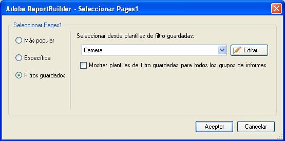

# Filtros guardados

Se pueden guardar filtros u otros parámetros en Report Builder y utilizarlos en otras hojas de cálculo o libros. Estos parámetros se guardan en Analytics para garantizar que estén disponibles para otros usuarios de Report Builder en otros equipos.

Los filtros se guardan en el formulario [!UICONTROL Elegir página] conforme se crea el filtro. Para ver un ejemplo de este procedimiento, consulte [Filtros específicos](/help/analyze/report-builder/layout/c-filter-dimensions/t-specific-filters.md).

