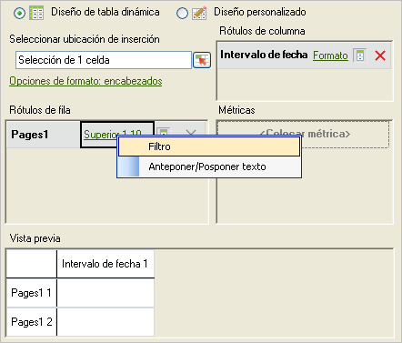

# Filtros específicos

Filtros que aplican términos de dimensión específicos.

Se puede buscar en elementos de dimensión específicos mediante la creación de un filtro que coincida con criterios exactos. Por ejemplo, puede crear el siguiente tipo de filtro: página en [!DNL homepage.htm], [!DNL contact_us.html], [!DNL corporate_info.html].

**Para crear un filtro específico**

1. Cree o edite una solicitud y avance en el [!UICONTROL Asistente para solicitudes: Paso 2].

   

1. En el [!UICONTROL Asistente para solicitudes: Paso 2], haga clic en el vínculo situado junto a la dimensión en la cuadrícula y, a continuación, seleccione **[!UICONTROL Filtro]**.

   

1. Active **[!UICONTROL Específico]** y después active una de las siguientes opciones:

   * **Desde el rango de celdas:** permite seleccionar datos de celdas. Puede seleccionar:
   * **Todas las celdas del rango:** permite asignar todas las celdas del rango. El texto descriptivo explica cuántos grupos de celdas se deben seleccionar. Para asignar varios grupos de celdas, presione la tecla Ctrl conforme realice las sucesivas selecciones. Si el rango que se debe asignar solo contiene una celda, esta es la única opción disponible.
   * **Primera celda del rango:** solo es necesario seleccionar la celda superior izquierda del rango y, a continuación, elegir una dirección para los datos. Asimismo, si la solicitud tiene varios períodos, se selecciona la dirección de los mismos y si desea omitir un número establecido de celdas entre los períodos.
   * **Desde la lista:** permite seleccionar datos desde una lista en la que se puede añadir información.
1. Si activa **[!UICONTROL Desde la lista]**, seleccione cualquier elemento disponible de la lista, o bien haga clic en **[!UICONTROL Añadir]**.

   Al hacer clic en **[!UICONTROL Agregar]**, el formulario [!UICONTROL Seleccionar de la lista] muestra una lista de elementos de dimensión disponibles para el intervalo de fechas de la solicitud actual, limitado a los primeros 10.000 elementos. Se puede buscar entre estos elementos o hacer clic en **[!UICONTROL Más...]**, con lo que muestra el [!UICONTROL formulario de búsqueda] para crear una búsqueda más detallada de dimensiones.
1. En [!UICONTROL Seleccionar desde lista], haga clic en **[!UICONTROL Aceptar]**.
1. En el formulario [!UICONTROL Seleccionar página], guarde el filtro específico si lo desea y, a continuación, haga clic en **[!UICONTROL Aceptar]**.
