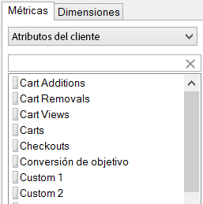
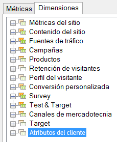

# Atributos del cliente

Los atributos del cliente se almacenan en un nuevo tipo de elemento denominado VisAttr, que puede configurarse como dimensión o como métrica.

Para obtener más información sobre cómo cargar atributos de cliente, consulte la ayuda de [Experience Cloud](https://experienceleague.adobe.com/docs/core-services/interface/customer-attributes/attributes.html).

* Si está configurado como métrica, VisAttr se expone como “dimensión” y como métrica.

    

* Es compatible con el mismo desglose que un eVar (todo se puede desglosar).
* VisAttr es compatible con todas las métricas eVar.
* VisAttr como métrica es compatible con la clasificación por categorías o “bucketization”, (como el Tiempo transcurrido en el sitio: 0 a 30, 31 a 60, etc.).
* VisAttr está disponible como una dimensión de segmentación.
