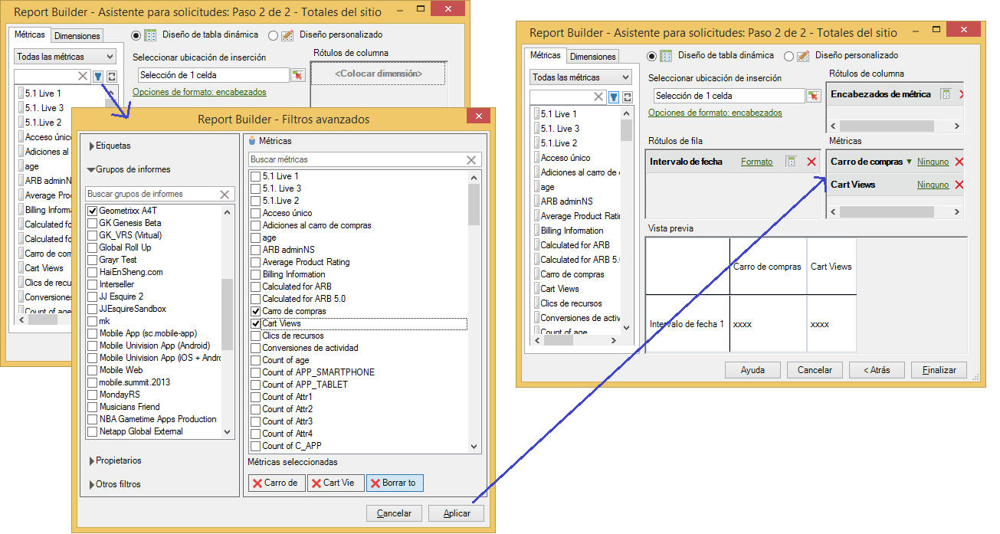

# Métricas calculadas

Report Builder 5.2 es compatible con las métricas calculadas unificadas de Adobe Analytics. Entre otras innovaciones, ahora las métricas calculadas tienen un identificador global, de modo que ya no están restringidas a un grupo de informes.

>[!NOTE]
>
>Los libros de trabajo existentes pueden apuntar a solicitudes con identificadores de métricas antiguas. Al usar Report Builder 5.2, dichos identificadores de métricas antiguas se convertirán en identificadores globales nuevos. Si comparte el libro de trabajo con un usuario de Report Builder 5.1 u otra anterior, dicho usuario no podrá consultar las métricas calculadas.

Para obtener más información acerca de cómo crear y administrar métricas calculadas con los nuevos Creador de métricas calculadas y Administrador, consulte la guía [Métricas calculadas](https://docs.adobe.com/content/help/es-ES/analytics/components/calculated-metrics/cm-overview.html).

En el paso 2 del Asistente de solicitudes, puede filtrar y aplicar métricas calculadas.

## Filtrar métricas calculadas {#section_376E986D3E684999A7CDB08E53854159}

Para **filtrar** métricas calculadas, haga clic en el icono Filtrar:  

  El cuadro de diálogo Filtros avanzados se rellena con métricas calculadas y estándar.

Los filtros disponibles incluyen:

| Nombre del filtro | Descripción |
|---|---|
| Etiquetas | Le permite filtrar métricas calculadas con etiquetas específicas. Tenga en cuenta que los filtros de etiqueta utilizan el operador AND. Si marca dos etiquetas, el panel derecho muestra las métricas etiquetadas con **ambas** etiquetas. |
| Grupos de informes | Si aplica el filtro “Solo el *nombre del grupo de informes*” en el Creador de métricas calculadas, en [!DNL Reports & Analytics] y, a continuación, muestra el Filtro avanzado en [!DNL Report Builder], el Filtro avanzado solo mostrará las métricas calculadas correspondientes al informe seleccionado. |
| Propietarios | Le permite filtrar métricas por propietario. Tenga en cuenta que los filtros de Propietario utilizan el operador OR. Si marca dos propietarios, en el panel de la derecha se muestran las métricas que son propiedad de **uno** de los propietarios. |
| Otros filtros > Aprobados | Muestra todos los segmentos oficialmente métricas aprobadas. |
| Otros filtros > Favoritos | Muestra todas las métricas que haya marcado como Favoritas. |
| Otros filtros > Míos | Muestra todas las métricas que le pertenecen. |
| Otros filtros > Compartidos conmigo | Muestra todas las métricas que otros comparten con usted. |

## Aplicar métricas calculadas {#section_DF5CF349460A45FDA4B6E6BB8B52F18E}

Cuando haya seleccionado los filtros, haga clic en **[!UICONTROL Aplicar]** para aplicarlos en la solicitud. Las métricas seleccionadas se agregarán al diseño del informe.

