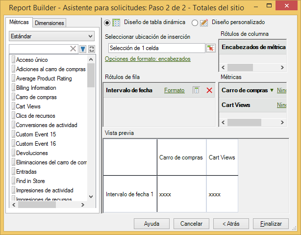

# Combinación de las métricas de tráfico y comercio en la misma solicitud

Ahora puede combinar estos dos tipos de métricas en la misma solicitud, en lugar de tener que crear solicitudes independientes.

Las métricas de tráfico y comercio ahora se muestran en la misma categoría de métrica en el paso 2 del Asistente para solicitudes. Anteriormente, estas métricas estaban separadas en la categoría de comercio y la categoría de tráfico.

La nueva categoría agrupada se denomina **[!UICONTROL Estándar]**.

