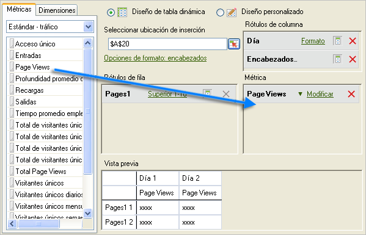
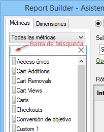
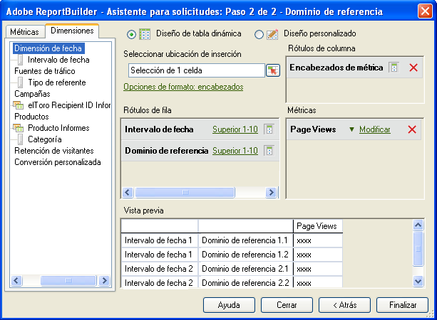

# Agregar métricas y dimensiones

Pasos para agregar métricas y dimensiones a una solicitud.

1. [Cree la solicitud de datos](/help/analyze/report-builder/data-requests/data-requests.md) en el [!UICONTROL Asistente para solicitudes: Paso 1] y, a continuación, haga clic en **[!UICONTROL Siguiente]**.
1. En el [!UICONTROL Asistente para solicitudes: Paso 2], haga doble clic en las métricas o arrástrelas a la ubicación que desee.

   

   Cuando se añaden métricas, éstas no se eliminan de la ficha [!UICONTROL Métrica], ya que las métricas pueden aparecer varias veces en una solicitud. Por ejemplo, se puede mostrar el subtotal de la métrica junto con cada valor. Sin embargo, la lista de las métricas disponibles cambia cada vez que se añade o se elimina una dimensión.

   Solo se pueden añadir métricas a la sección de diseño [!UICONTROL Métrica]. Las métricas se añaden al diseño de la [!UICONTROL etiqueta de columna] como [!UICONTROL encabezados de métrica]. Si se mueve un [!UICONTROL encabezado de métrica] de un [!UICONTROL diseño de columna] a un [!UICONTROL diseño de fila], se mostrará allí y se utilizará como una métrica para desglose.

   Tenga en cuenta que se muestra una barra de búsqueda en la pestaña Métricas, justo encima de la lista Métrica.

   

   Recuerde:

   * A medida que introduce un término de búsqueda, la lista se actualizará automáticamente para mostrar solo las métricas cuyas etiquetas coincidan con el término de búsqueda.
   * Las coincidencias no distinguen entre mayúsculas y minúsculas y son equivalentes a una búsqueda &quot;contiene&quot;.
   * Las búsquedas de palabras completas u otros indicadores de búsqueda especial (comienza con, termina con, AND, OR, etc.) no son compatibles.

      El Término de búsqueda se borrará al salir del Asistente para solicitudes (p.ej., al hacer clic en Finalizar o Cancelar), al volver al Paso 1 del Asistente para solicitudes o al cambiar la categoría de Métrica.

      El término de búsqueda no se borrará en los siguientes casos:

   * Al arrastrar y soltar (o hacer doble clic) en uno de los elementos de métrica en la lista, de modo que se agregue al Panel de Métricas Diseño de tabla dinámica/Diseño personalizado.
   * Al eliminar un elemento de métrica del Panel de Métricas Diseño de tabla dinámica/Diseño personalizado.
   * Al hacer clic en la ficha Dimensiones y, a continuación, volver a la ficha Métricas.
   * Al invocar otros subformularios (modales o sin modo) que al salir, vuelven al Paso de 2 del Asistente para solicitudes. Varios ejemplos de estos formularios son

      * Formularios de filtro de dimensión
      * Formularios de formato de rango de fecha
      * Formularios de opciones de formato
      * Formularios de anteponer/posponer texto
      * Formularios de ubicación del rango de salida

1. (Opcional) Para clasificar una solicitud por métrica, simplemente haga clic en la etiqueta de métrica.
1. Añada las dimensiones del mismo modo en que se agregan las métricas.

En la ficha [!UICONTROL Dimensiones], el sistema muestra las dimensiones que se desglosan en cualquier informe base seleccionado en el Paso 1 y en la configuración del grupo de informes, o que son una clasificación de ellos. Cuando se coloca una dimensión en las cuadrículas de diseño, esta se elimina de la vista de árbol y se vuelve a calcular la lista de las dimensiones restantes disponibles.

La dimensión [!UICONTROL Fecha] se añade automáticamente. Las dimensiones de fecha disponibles cambian según la granularidad seleccionada en el [!UICONTROL Asistente para solicitudes: paso 1]. (Los valores válidos son:

    * Hora
    * Día
    * Semana
    * Mes
    * Año
    * Intervalo de fecha (cuando no se especifica granularidad)

1. Modifique las métricas y las dimensiones configurando las [opciones y los filtros de formato](/help/analyze/report-builder/layout/t-format-display-headers.md).
1. Haga clic en **[!UICONTROL Finalizar]**.
En el ejemplo siguiente, las dimensiones están relacionadas con la métrica [!UICONTROL Página]. En este caso, la dimensión [!UICONTROL Dominio de referencia] crea un informe de desglose entre [!UICONTROL Página] y [!UICONTROL Dominio de referencia]. La ficha [!UICONTROL Dimensión] solo se actualiza con dimensiones que se pueden añadir a un informe de desglose.

