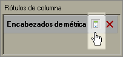

# Ocultar o mostrar encabezados

Este procedimiento describe cómo se pueden ocultar o mostrar los encabezados.

Haga clic en **[!UICONTROL Ocultar/Mostrar]** en el [!UICONTROL diseño de tabla dinámica] o [!UICONTROL diseño personalizado] en el formulario del [!UICONTROL Asistente para solicitudes: Paso 2].

