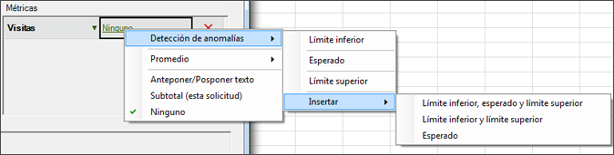
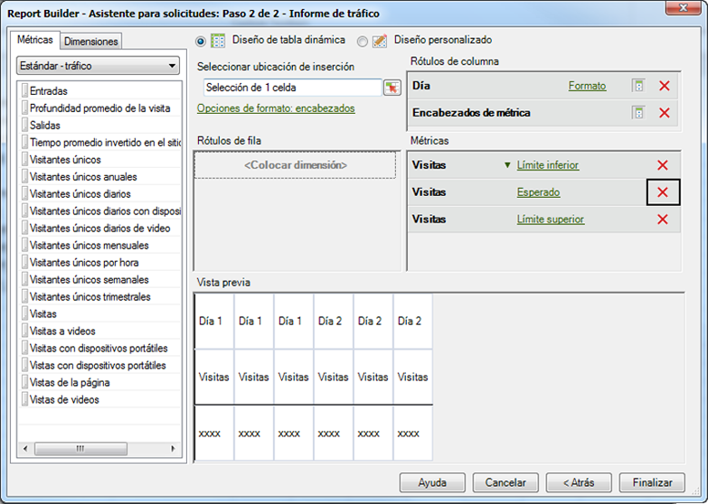

# Configure una solicitud de detección de anomalías

Los pasos describen cómo crear una solicitud de detección de anomalías en el Creador de informes.

1. Seleccione un informe de tendencias, como por ejemplo el informe **Métricas del sitio** &gt; **[!UICONTROL Tráfico]**.
1. En el menú [!UICONTROL Aplicar granularidad]**, seleccione[!UICONTROL Día]**.

   >[!NOTE]
   >
   >The [!UICONTROL Anomaly Detection] menu is available only when you select Day granularity. Los 30 días previos de datos se utilizan como período de prueba de datos estadístico, independientemente del intervalo de fechas que haya seleccionado.

1. After configuring date ranges, click **[!UICONTROL Next]**.

   Resultado 1. On the Request Wizard: Step 2 of 2, add a metric, such as **[!UICONTROL Visits]**.

   Resultado 1. For the added metric, click the **[!UICONTROL None]** link.

   

1. Select **[!UICONTROL Anomaly Detection]** &gt; **[!UICONTROL `<selection>`]**.

   

   Cuando selecciona una de estas opciones, el sistema crea copias de Detección de anomalías de la métrica original. Por ejemplo, en la métrica Visitas, la métrica de límite inferior de visitas se añade al grupo de [!UICONTROL Métrica].
1. Click **[!UICONTROL Finish]** and select the cell for output to Excel.

   See [Anomaly Detection](../../../analyze/analysis-workspace/virtual-analyst/c-anomaly-detection/anomaly-detection.md#concept_9476D6C093334B1A8044AE63835BDBE7) for definitions.
