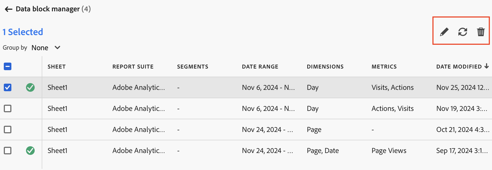

# Administrar bloques de datos

Puede ver y administrar todos los bloques de datos de un libro mediante [!UICONTROL Administrador de bloques de datos]. El [!UICONTROL administrador de bloques de datos] proporciona capacidades de búsqueda, filtrado y ordenación que le permiten localizar bloques de datos específicos. Después de seleccionar uno o más bloques de datos, puede editar, eliminar o actualizar los bloques de datos seleccionados.

## Ver bloques de datos

Para ver una tabla que enumera todos los bloques de datos de un libro, seleccione  **[!UICONTROL Manage]**.

{zoomable="yes"}

El **[!UICONTROL administrador de bloques de datos]** muestra una tabla con todos los bloques de datos presentes en un libro.

{zoomable="yes"}

Puede usar  para seleccionar qué columnas desea mostrar.

## Ordenar bloques de datos

Puede ordenar la tabla de bloques de datos por una columna mostrada. Por ejemplo, puede ordenar bloques de datos por grupos de informes, segmentos, intervalos de fechas y otras variables.

Para ordenar la tabla de bloques de datos, seleccione un encabezado de columna. Seleccione el mismo encabezado de columna para invertir el orden.

## Buscar bloques de datos

Utilice el campo  **[!UICONTROL _Buscar_]** para localizar cualquier elemento en la tabla de bloques de datos. Por ejemplo, puede buscar métricas contenidas en los bloques de datos o en el grupo de informes. También puede buscar fechas que aparezcan en las columnas de intervalo de fechas, fecha de modificación o fecha de última ejecución.

## Editar bloques de datos

Puede editar grupos de informes e intervalos de fechas para bloques de datos. O los segmentos aplicados a bloques de datos.

Por ejemplo, puede reemplazar un segmento existente con un nuevo segmento en uno o más bloques de datos.

1. Seleccione los bloques de datos que desea actualizar. Puede seleccionar la casilla de verificación de nivel superior para seleccionar todos los bloques de datos o puede seleccionar bloques de datos individuales.

   {zoomable="yes"}

1. Seleccione  para mostrar la ventana **[!UICONTROL Edición rápida]**.

   {zoomable="yes"}

1. Seleccione un vínculo para actualizar grupos de informes, intervalos de fechas o segmentos. En **[!UICONTROL Edición rápida]** - **[!UICONTROL Segmentos]** puede agregar, quitar o actualizar los segmentos de los bloques de datos seleccionados.

   {zoomable="yes"}

## Actualizar bloques de datos

Seleccione  para actualizar la tabla de bloques de datos.

Para comprobar si un bloque de datos se ha actualizado, consulte el icono de estado de la actualización:

- Un bloque de datos actualizado correctamente muestra .

- Un bloque de datos que no se pudo actualizar muestra .

## Eliminar bloques de datos

Para eliminar uno o varios bloques de datos:

1. Seleccione uno o varios bloques de datos.
1. Seleccione .
1. Seleccione **[!UICONTROL Eliminar]** en el cuadro de diálogo **[!UICONTROL Eliminar bloque de datos]** o **[!UICONTROL Cancelar]** para cancelar la eliminación.

## Agrupar bloques de datos

Puede agrupar bloques de datos mediante el menú desplegable **[!UICONTROL Agrupar por]** o puede seleccionar un título de columna.

Para ordenar los bloques de datos por columna, seleccione el título de la columna. Para agrupar bloques de datos por grupos, seleccione un nombre de grupo en el menú desplegable **[!UICONTROL Agrupar por]**. Por ejemplo, la captura de pantalla siguiente muestra bloques de datos agrupados por grupo de informes.

Puede utilizar la agrupación para seleccionar rápidamente bloques de datos para los que desea modificar un elemento común, como un segmento.

{zoomable="yes"}

<!--

# Manage Data Blocks in Report Builder

You can view and manage all data blocks in a workbook using the Data Block Manager. The Data Block Manager provides search, filter, and sort capabilities that allow you to quickly locate specific data blocks. After selecting one or more data blocks, you can edit, delete, or refresh the selected data blocks.

## View Data Blocks

Click **Manage** to view a list of all data blocks in a workbook.

The Data Block Manager lists all data blocks present in a workbook. 

## Sort the Data Blocks list

You can sort the data block list by a displayed column. For example, you can sort the data block list by report suites, segments, date range, and other variables.

To sort the data block list, click a column heading.

## Search the Data Block list

Use the Search field to locate anything in the data block table. For example, you could search for metrics contained in the data blocks or report suite. You can also search for dates appearing in the date range, date modified, or last run date columns.

## Edit Data Blocks

You can edit the report suite, date range, or the segments applied to one or more data blocks.

For example, you can replace an existing segment with a new segment in one or more data blocks.

1. Select the data blocks that you want to update. You can select the top-level check box to select all data blocks or you can select individual data blocks.

   

1. Click the edit icon to display the Quick edit window.

   

1. Select a segment link to update report suites, date ranges, or segments.

   

## Refresh Data Blocks

Click the refresh icon to refresh the data blocks in the list.

To verify if a data block is refreshed, view the refresh status icon. 

A successfully refreshed data block displays a checkmark in a green circle: . 

A data block that has failed to refresh displays a warning icon: .This makes it easy to identify if any data blocks have errors.

## Delete a Data Block

1. Select a data block in the Data Block manager. 
1. Click the trash can icon to delete the selected data block.

## Group Data Blocks

You can group data blocks using the **Group by** drop-down menu or you can click a column title. To sort data blocks by column, click the column title. To group data blocks by groups, select a group name from the **Group by** drop-down menu. For example, the screenshot below shows data blocks grouped by Sheet. It shows data blocks grouped by Sheet1 and Sheet2.  This is useful, for example, in the segment-replacing use case. If you have multiple segments applied to each data block, it is helpful to create a group containing all the data blocks that you want to replace. Then you can easily select and edit them all at once.

## Modify the Data Block Manager view

You can modify which columns are visible in the Data Block Manager window.

Click the column list  icon to select which columns are listed in the Data Block Manager. Select a column name to display the column. Deselect the column name to remove the column from view.

-->