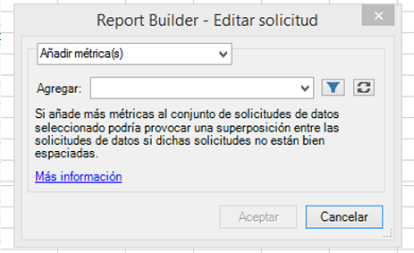
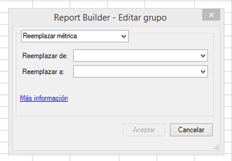
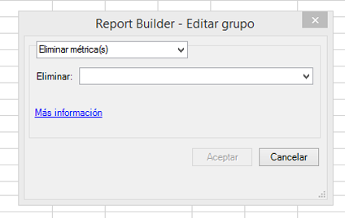

# Editar métricas en varias solicitudes

La función Editar métricas en varias solicitudes permite agregar, eliminar o reemplazar métricas fácilmente en una solicitud preexistente o en un grupo de solicitudes.

## Agregación de métricas {#section_3FBDA9668039404895059618D70FCBCD}

Tenga en cuenta que

* Solo pueden agregarse métricas a solicitudes de diseño de tabla dinámica. Si alguna de las solicitudes seleccionadas es un diseño personalizado, no es posible agregar métricas. El motivo es que Report Builder no sabe en qué parte de la hoja de cálculo colocar la nueva métrica, ya que el diseño es personalizado.
* Por lo tanto, si únicamente ha seleccionado solicitudes de diseño personalizado, la opción **[!UICONTROL Agregación de métricas]** no está disponible.
* La agregación de métricas aumenta el tamaño de una solicitud y puede provocar que se solape con otra. Asegúrese de que su solicitud tenga espacio suficiente alrededor para permitir la agregación de métricas.
* Si la métrica agregada ya está presente en una de las solicitudes seleccionadas, no se agregará a esa solicitud.

Para agregar una o más métricas:

1. Seleccione una o más solicitudes en Excel y haga clic con el botón derecho para seleccionar **[!UICONTROL Editar métricas]**. También puede hacer clic en **[!UICONTROL Administrar]** > **[!UICONTROL Editar varios]** > `<choose metric>` > **[!UICONTROL Editar grupo]** para seleccionar el grupo de solicitudes que quiere modificar.
1. Seleccione **[!UICONTROL Agregar métricas]** y elija las que le interesan.

   

1. Actualice la solicitud para ver los datos reales. Hasta que actualice, verá los datos sin conexión.

## Reemplazo de métricas {#section_D773AAC7B30C4FBEBDB66B203C217818}

Tenga en cuenta que

* Solo se permiten sustituciones 1:1, no 1:muchos o muchos:1.
* Si la métrica seleccionada para ser reemplazada no está presente en una de las solicitudes seleccionadas, esta no varía.
* La nueva métrica se colocará en la misma ubicación que la sustituida. Esto implica lo siguiente:

   * **En un diseño de tabla dinámica**: si una solicitud de diseño de tabla dinámica genera fecha, visita, visitantes y únicos diarios, y “visitantes” se sustituye por “ingresos”, el diseño de solicitud actualizado será fecha, visita, ingresos, únicos diarios.
   * **En un diseño personalizado**: si la métrica “visitantes” se mostraba en la celda F11, el diseño de solicitud actualizado mostrará “ingresos” en la misma celda F11.

* Si se aplicaba alguna operación a la métrica sustituida (media, texto preanexado, texto posanexado, microchart), se aplicará también a la nueva métrica.

Para reemplazar una métrica:

1. Seleccione una o más solicitudes en Excel y haga clic con el botón derecho para seleccionar **[!UICONTROL Editar métricas]**. También puede hacer clic en **[!UICONTROL Administrar]** > **[!UICONTROL Editar varios]** > **`<choose metric>`** > **[!UICONTROL Editar grupo]** para seleccionar el grupo de solicitudes que quiere modificar.

1. Seleccione **[!UICONTROL Reemplazar métrica]**.

   

1. Seleccione qué métrica quiere reemplazar y por cuál.
1. Actualice la solicitud. Hasta que actualice, verá los datos sin conexión.

## Eliminación de métricas {#section_D3CD5BAC7670416593B633B2B8423C60}

Tenga en cuenta que

* Si cualquiera de las métricas seleccionadas para ser eliminadas no está presente en una de las solicitudes seleccionadas, esta no varía.
* En un diseño de tabla dinámica, eliminar una métrica hace que el diseño cambie para las métricas ubicadas después de la métrica eliminada.

   **Ejemplo**: si una solicitud de diseño de tabla dinámica genera fecha, visitas, visitantes y únicos diarios, y se elimina “visitas”, el diseño de solicitud actualizado mostrará fecha, visitantes, únicos diarios.

Para eliminar métricas:

1. Seleccione una o más solicitudes en Excel y haga clic con el botón derecho para seleccionar **[!UICONTROL Editar métricas]**. También puede hacer clic en **[!UICONTROL Administrar]** > **[!UICONTROL Editar varios]** > **`<choose metric>`** > **[!UICONTROL Editar grupo]** para seleccionar el grupo de solicitudes que quiere modificar.

1. Seleccione **[!UICONTROL Eliminar métricas]**.

   

1. Seleccione una o más métricas a eliminar de una solicitud.
1. Actualice la solicitud. Hasta que actualice, verá los datos sin conexión.

