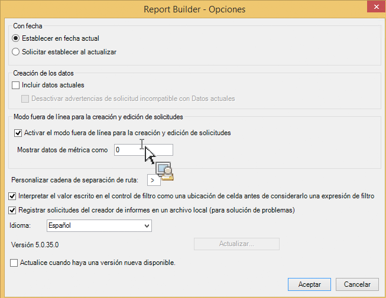
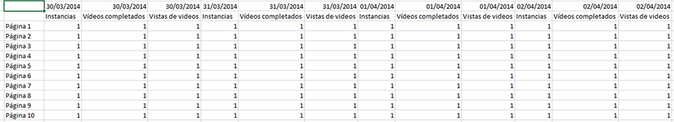

# Modo sin conexión para crear y editar solicitudes

El modo sin conexión devuelve datos de marcador de posición para acelerar el proceso de creación y edición de solicitudes.

Cuando crea o edita una nueva solicitud, se realizan llamadas de la API de informes para recuperar la respuesta. Esto hace que el proceso de creación de solicitudes sea más lento ya que tiene que esperar para que se devuelvan los datos antes de pasar al siguiente paso. El modo sin conexión devuelve solo datos del marcador de posición, por lo que no se tiene que realizar ninguna llamada de la API.

Para activar el modo sin conexión:

1. Haga clic en **[!UICONTROL Opciones]en el menú del Creador de informes.**

   

1. Active la casilla junto a **[!UICONTROL Activar el modo fuera de línea para la creación y edición de solicitudes]**.
1. En el campo **[!UICONTROL Mostrar los datos de métrica como], introduzca los datos del marcador de posición que desee que se devuelvan en su solicitud.** Por ejemplo, introduzca "1".
1. Haga clic en **[!UICONTROL Aceptar]**.
1. Ahora cree y ejecute su solicitud (en modo sin conexión) mediante el Asistente para solicitudes.
1. Su solicitud con "1" como datos de marcador de posición tendrán un aspecto como este:

   

   >[!IMPORTANT]
   >
   >Asegúrese de desactivar el modo sin conexión antes de ejecutar las solicitudes con datos reales. Para ello, simplemente vuelva a **[!UICONTROL Opciones]y elimine la marca de activación.**

