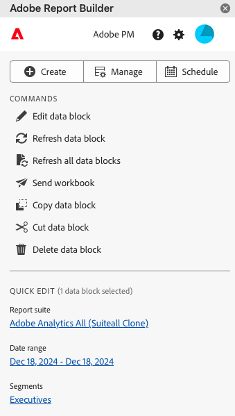

# Report Builder Hub

Utilice Report Builder Hub para crear, actualizar, eliminar y administrar bloques de datos.

El concentrador de Report Builder contiene los botones Crear y Administrar, la lista de COMANDOS y los paneles de EDICIÓN RÁPIDA.




## Botones Crear, Administrar y Programar

Utilice los botones Crear, Administrar y Programar para crear nuevos bloques de datos, administrar los existentes o programar bloques de datos.

## Panel COMANDOS

Utilice el panel COMANDOS para acceder a comandos compatibles con las celdas seleccionadas o con una acción anterior.

### Comandos

| Comandos mostrados | Disponible cuando... | Finalidad |
|------|------------------|--------|
| Creación del bloque de datos | Se seleccionan una o más celdas en el libro. | Se utiliza para crear un bloque de datos |
| Edición del bloque de datos | El rango de celdas o celdas seleccionados forman parte de un solo bloque de datos. | Se utiliza para editar un bloque de datos. |
| Actualización del bloque de datos | La selección contiene al menos un bloque de datos. El comando solo actualizará los bloques de datos de la selección. | Se utiliza para actualizar uno o más bloques de datos. |
| Actualización de todos los bloques de datos | El libro contiene uno o más bloques de datos. | Se utiliza para actualizar TODOS los bloques de datos del libro |
| Enviar libro |   | Envíe un libro según una programación. |
| Copia del bloque de datos | La celda o el rango de celdas seleccionado forma parte de uno o más bloques de datos. | Se utiliza para copiar un bloque de datos. |
| Eliminación del bloque de datos | El rango de celdas o celdas seleccionados forman parte de un solo bloque de datos. | Se utiliza para eliminar un bloque de datos. |

## Panel EDICIÓN RÁPIDA

Cuando se seleccionan uno o varios bloques de datos en una hoja de cálculo, Report Builder muestra el panel EDICIÓN RÁPIDA. Puede utilizar el panel EDICIÓN RÁPIDA para cambiar parámetros en un solo bloque de datos o para cambiar parámetros en varios bloques de datos al mismo tiempo.


Los cambios realizados con las secciones Edición rápida se aplican a todos los bloques de datos seleccionados.

### Grupos de informes

Los bloques de datos extraen datos de un grupo de informes seleccionado. Si se seleccionan varios bloques de datos en una hoja de cálculo y no se extraen datos del mismo grupo de informes, el vínculo **Grupos de informes** muestra *Varios*.

Al cambiar el grupo de informes, todos los bloques de datos de la selección adoptan el nuevo grupo de informes. Los componentes del bloque de datos coinciden con el nuevo grupo de informes en función del ID, por ejemplo, ```evars```). Si no se encuentra un componente en un bloque de datos, se muestra un mensaje de advertencia y el componente se elimina del bloque de datos.

Para cambiar el grupo de informes, seleccione un nuevo grupo de informes en el menú desplegable.


### Intervalo de fechas

**[!UICONTROL Intervalo de fechas]** muestra el intervalo de fechas para los bloques de datos seleccionados. Si se seleccionan varios bloques de datos con varios intervalos de fechas, el vínculo **[!UICONTROL Intervalo de fechas]** muestra *Múltiple*.

### Filtros

El vínculo **Filtros** muestra una lista resumida de los filtros utilizados por los bloques de datos seleccionados. Si se seleccionan varios bloques de datos con varios filtros aplicados, el vínculo **Filtros** muestra *Varios*.
