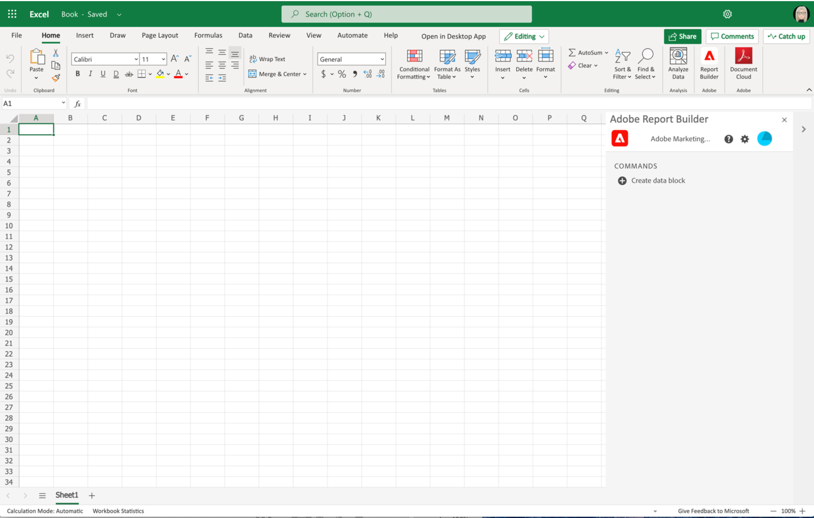

# Configuración de Report Builder

Puede acceder rápidamente a Report Builder mediante el menú Complemento de Excel.

## Requisitos

Report Builder para Adobe Analytics es compatible con los siguientes sistemas operativos y exploradores web.

### macOS

- macOS versión 10.x o posterior
- Todas las versiones de Microsoft Excel

### Windows

- Windows 10, versión 1904 o posterior
- Excel versión 2106 o posterior

  Todos los usuarios de Excel de escritorio de Windows deben instalar Microsoft Edge Webview2 para utilizar el complemento. Para instalar el controlador:

   1. Vaya a <https://aka.ms/webview2installer>.
   1. Seleccione y descargue el instalador independiente Evergreen.
   1. Siga las instrucciones de instalación.

### Web Office

- Admite todos los exploradores y versiones

## Complemento de Excel de Report Builder

Debe instalar el complemento de Excel de Report Builder para utilizar Report Builder para Adobe Analytics. Una vez instalado el complemento de Excel de Report Builder, puede acceder a Report Builder desde un libro de Excel abierto.

### Descarga e instalación del complemento de Report Builder

Para descargar e instalar el complemento de Report Builder

1. Inicie Excel y abra un nuevo libro.

1. Seleccione **[!UICONTROL Insertar]** > **[!UICONTROL Obtener complementos]**.

1. En el cuadro de diálogo Complementos de Office, seleccione la pestaña Tienda.

1. Busque &quot;Report Builder&quot; y haga clic en **[!UICONTROL Agregar]**.

1. En el cuadro de diálogo Términos de licencia y política de privacidad, haga clic en **[!UICONTROL Continuar]**.

**Si no se muestra la pestaña Tienda**

1. En Excel, seleccione Archivo > Cuenta > Administrar configuración.

1. Marque la casilla junto a “Habilitar experiencias conectadas opcionales”.

1. Reinicie Excel.

**Si su organización bloquea el acceso a la Microsoft Store**

Póngase en contacto con su equipo de TI o de seguridad para solicitar la aprobación del complemento de Report Builder. Una vez concedida la aprobación, en el cuadro de diálogo Complementos de Office, seleccione la pestaña Administración administrada.

Después de instalar el complemento de Report Builder, el icono de Report Builder se muestra en la cinta de Excel debajo de la pestaña Inicio.

## Inicio de sesión en Report Builder

Después de instalar el complemento de Report Builder for Excel para su plataforma operativa o explorador, siga estos pasos para iniciar sesión en Report Builder.

1. Abra un libro de Excel.

1. Haga clic en el icono de Report Builder para iniciar Report Builder.

1. En la barra de herramientas de Adobe Report Builder, haga clic en **[!UICONTROL Iniciar sesión]**.

   

1. Introduzca la información de la cuenta de Adobe Experience ID. La información de la cuenta debe coincidir con las credenciales de Adobe Analytics.

   

Después de iniciar sesión, el icono de inicio de sesión y la organización aparecen en la parte superior del panel

## Cambio de organizaciones

La primera vez que inicie sesión, iniciará sesión en la organización predeterminada asignada a su perfil.

1. Haga clic en el nombre de la organización que se muestra cuando inicia sesión.

1. Seleccione una organización de la lista de organizaciones disponibles. Solo aparecen en la lista las organizaciones a las que tiene acceso.

   

## Cerrar sesión

Puede cerrar la sesión de Report Builder desde el perfil de usuario.

1. Guarde los cambios en los libros abiertos.

1. Haga clic en el icono de avatar para mostrar su perfil de usuario.

   

1. Haga clic en **Cerrar sesión**.
